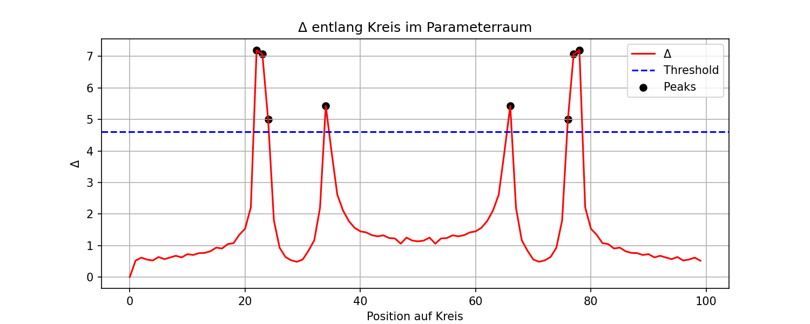
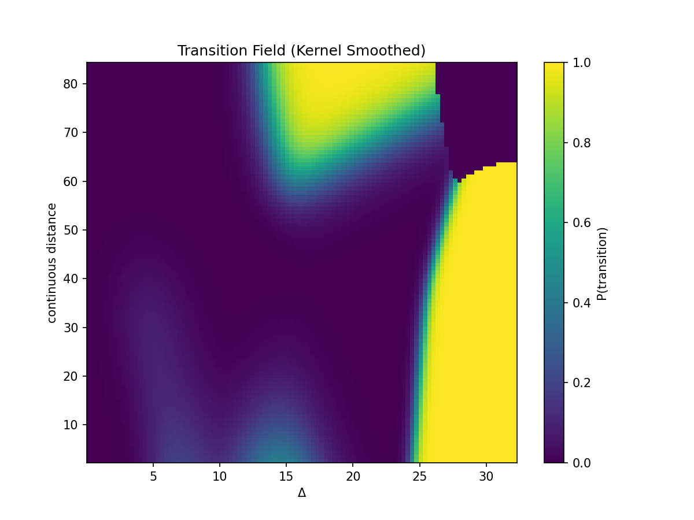
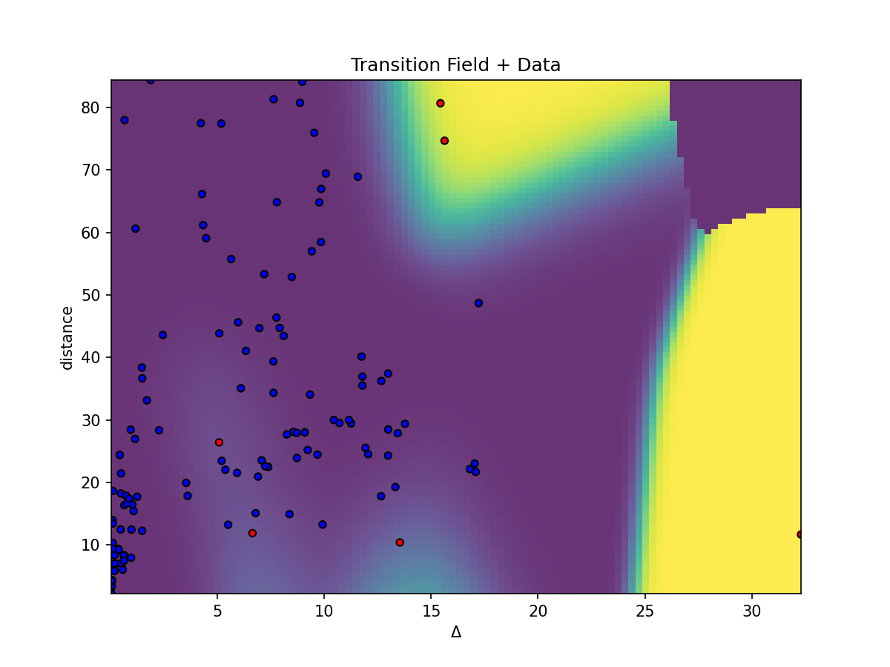

# 🧪 NEXAH — Fractal Transition Validation (Building Log)

Path:  
RESEARCH/VALIDATION/fractal_tests/

---

## 🎯 Goal

Investigate whether structural transitions in Julia dynamics:

- are detectable via frame-to-frame change (Δ)  
- correlate with parameter-space position  
- form a structured transition field  

---

# 🧩 Phase 1 — Δ Detection

## 📊 Output



---

## 🔍 Observation

- Δ shows sharp peaks along parameter paths  
- Peaks align with structurally sensitive regions  

---

# 🔁 Phase 2 — Random Path Sampling

## 📊 Output


---

## 🔍 Observation

- Δ peaks persist across random paths  
- Distribution is heavy-tailed  
- Peaks are not path-dependent  

---

# 🧠 Phase 3 — Topology Check

## 📊 Output


---

## 🔍 Observation

- Most Δ peaks do NOT result in persistent structural change  
- Structures often revert after disturbance  

→ Δ peak ≠ transition  

---

# 🔺 Phase 4 — Transition Behavior

## 🔍 Observation

- Majority of events are reversible variations  
- True structural transitions are rare  

---

# 🧭 Phase 5 — Transition Path

## 📊 Outputs


---

## 🔍 Observation

- Transition occurs at localized Δ spikes  
- Structural collapse visible in area  
- Transition is path-dependent but reproducible  

---

# 📊 Phase 6 — Transition Probability (Δ only)

## 📊 Outputs


---

## 🔍 Observation

- Transition rate ~2–3%  
- Δ alone is not predictive  

---

# 🌐 Phase 7 — Continuous Distance Integration

## 📊 Output


---

## 🔍 Observation

- Structure emerges in (Δ, distance)  
- Transitions cluster in specific regions  

---

# 🔬 Phase 8 — Clean Transition Field

## 📊 Outputs





---

## 🔍 Observation

- Stable transition field emerges  
- Clear directional structure visible  
- Not random distribution  

---

# 📐 Phase 9 — Field Fit

## 📊 Output


---

## 🔍 Observation

- Transition boundary approximates linear separation  
- Requires 2D interpretation (Δ + distance)  

---

# 📦 Outputs

All visuals stored in:

```
scripts/outputs/
```

Key files:

- transition_field_clean.png  
- transition_field_overlay.png  
- transition_field_fit.png  
- transition_map_continuous.png  
- transition_probability_data.csv  

---

# 🧠 Process Summary

```
Δ detection  
→ peak extraction  
→ topology comparison  
→ transition filtering  
→ probability estimation  
→ 2D field reconstruction  
→ boundary estimation  
```

---

# ⚠️ Notes

- Early heatmaps unstable (overflow artifacts)  
- Histogram binning produced misleading structure  
- Kernel smoothing required for stability  
- Sampling limited (random paths)  

---

# 📌 Status

- internally consistent  
- empirically reproducible  
- exploratory but stable  

---

**End of Building Log**
