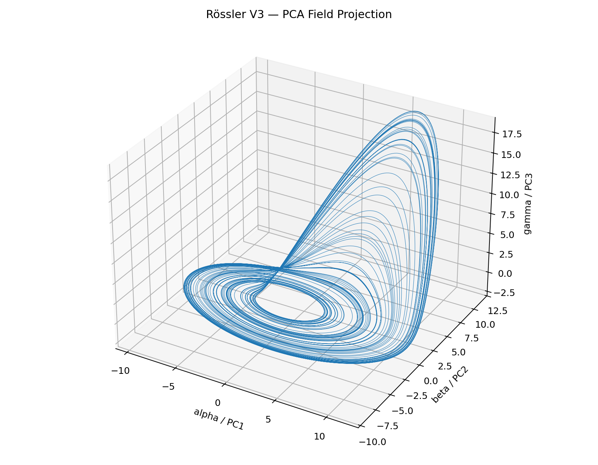
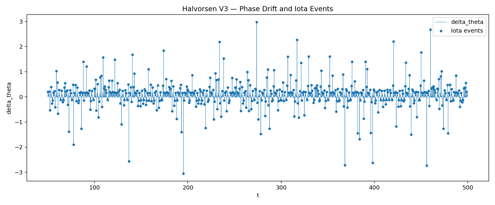

# NEXAH FIELD_LAYER — Building Log  
## Field Projection Experiments: Lorenz → Rössler → Halvorsen → Kuramoto

Status: **Experimental phase completed / core finding stabilized**

---

## 1. Goal

This experiment series tests whether a common FIELD_LAYER representation can extract comparable transition structure from different dynamical systems.

Systems explored:

- Lorenz
- Rössler
- Halvorsen
- Kuramoto oscillator network

Core pipeline:

```text
dynamics
→ PCA field projection
→ phase coordinate θ
→ phase drift Δθ
→ regime classification
→ Iota event detection
→ sweep / boundary extraction
```

No symbolic interpretation was used in the final analysis.  
Focus: **data, structure, measurability**.

---

## 2. Core Method

For each system, state trajectories are projected into a PCA-aligned field coordinate system:

```text
x → (alpha, beta, gamma)
```

Phase is defined in the transverse plane:

```text
θ = arctan2(gamma, beta)
```

The main observable is:

```text
Δθ = phase drift
```

Regimes:

```text
Theta : low drift / baseline
Tao   : positive organized drift
Dao   : negative organized drift
Iota  : high drift event
```

---

## 3. Early V3 Results

### Rössler V3

Key result:

```text
Iota ≈ 8.00 %
transition_rate ≈ 0.00309
iota_event_count = 139
```




---

### Halvorsen V3

Key result:

```text
Iota ≈ 8.00 %
transition_rate ≈ 0.01056
iota_event_count = 475
```




---

## 4. Kuramoto V3

Initial V3 result at K = 1.8:

```text
r_mean ≈ 0.8115
Iota ≈ 8.00 %
transition_rate ≈ 0.00456
```


---

## 5. V3 Limitation

```text
iota_quantile = 0.92 → forced ~8%
```

Conclusion:

```text
V3 Iota was NOT a true physical measure.
```

---

## 6. V4 / V5 Correction

```text
Iota = mean(|Δθ|) + k * std(|Δθ|)
```

→ dynamic, data-driven threshold


---

## 7. V6 Master Sweep

Sweep:

```text
K ∈ [0.5, 3.0]
```

Key outputs:

- r_mean vs K  
- drift_std vs K  
- transition_rate vs K  
- Lyapunov vs K  


---

## 8. Core Finding

```text
Synchronization and internal stability separate.
```

---

## 9. Phase Boundary (V7 / V8)


---

## 10. Critical Points

```json
{
  "onset": 2.32,
  "max_drift": 2.55,
  "max_events": 2.77
}
```

---

## 11. Final Interpretation

```text
incoherent
→ synchronized
→ synchronized + drift-active
→ high-transition regime
```

---

## 12. Final Statement

```text
FIELD_LAYER reveals internal structure inside synchronization.
```

---

## 13. Scripts

```text
scripts/kuramoto_master_v6.py
scripts/kuramoto_phase_boundary_v8.py
```

---

## 14. Status

```text
Experimental phase completed
Core finding stabilized
```
