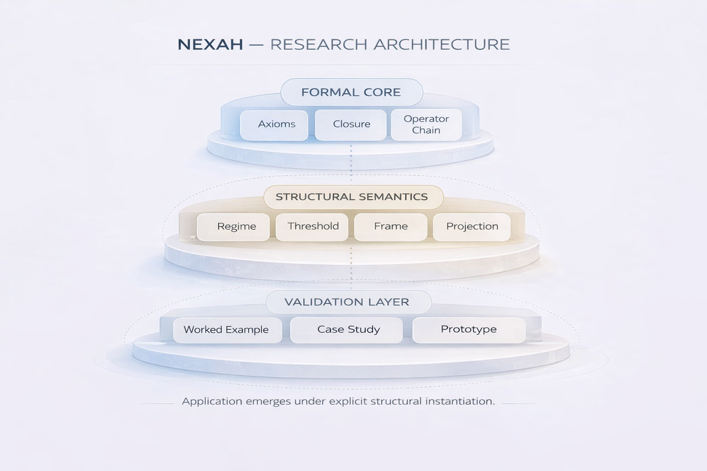
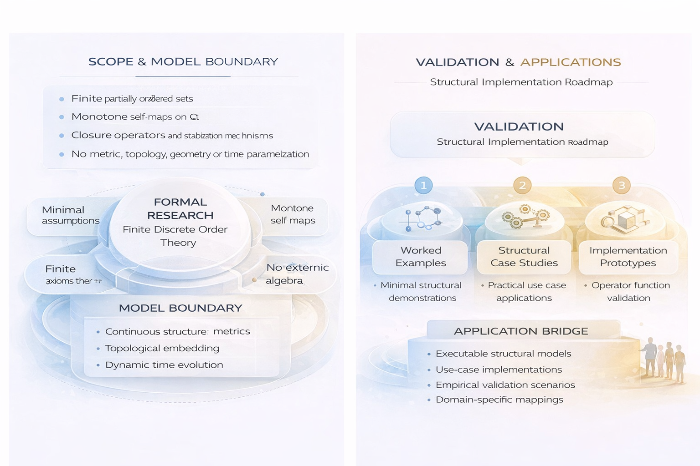

# NEXAH Research



This section contains the **formal and structural foundations** of the NEXAH framework.

The research layer defines the **minimal theoretical structure** required for modeling complex systems using order-theoretic operators and stabilization mechanisms.

NEXAH does not introduce a new mathematical ontology.  
Instead, it reorganizes known principles from **finite order theory and monotone operator systems** into a framework suitable for structural system modeling.

---

# Scope of the Research Layer

The current formal basis operates under strict structural constraints.

The framework assumes:

- finite partially ordered sets (Q, ⪯)
- monotone self-maps on Q
- closure operators and stabilization mechanisms
- discrete structural transitions
- no metric or geometric structure

The framework explicitly excludes:

- metric geometry
- topology
- continuous time dynamics
- physical interpretation

All results remain strictly within **finite discrete order theory**.

---

# Formal Core

The research layer establishes the structural operator system underlying NEXAH.

Key elements include:

- minimal assumptions (A0–A4)
- closure structure Γ
- regime transition operator Δ
- stabilization projection Ω
- frame compatibility conditions
- fixpoint geometry and basin partitions

These operators define the **structural dynamics of finite system models**.

Phase I–II of the formal system have been consolidated and internally validated under finite-order constraints.

---

# Model Boundary

The current framework guarantees the following properties:

- stabilization under extensivity + finiteness
- existence of fixpoints
- operator compatibility hierarchy
- filtration structure
- non-redundant operator chain

The framework does **not claim**:

- continuous structure
- metric geometry
- topological embedding
- physical dynamics
- temporal evolution models

Any extension beyond finite order systems requires additional assumptions.

---



---

# Validation Strategy

The research layer provides the **formal structural foundation** of the framework.

Validation must occur through **applied system modeling**.

Evaluation criteria include:

- structural clarity
- operator minimality
- non-redundant operator chains
- applicability to system models
- interpretability under explicit frames

Validation proceeds through:

1. minimal worked examples  
2. structural case studies  
3. operator implementations in the engine  

---

# Research to Application Transition

The NEXAH architecture separates formal theory from application layers.

The research layer provides:

- operator definitions
- structural semantics
- stabilization guarantees
- frame compatibility

The application layers provide:

- executable system models
- domain mappings
- empirical test cases
- simulation environments

Applications are implemented in:

```
APPLICATIONS/
```

Experimental simulations and system exploration occur in:

```
BUILDER_LAB/
EXPLORATION_HUB/
```

The research layer therefore defines the **structural core**, while the surrounding layers demonstrate its applicability.

---

# Research Status

Current status:

Phase I–II formally consolidated.

The operator system and minimal structural framework are defined and internally consistent under finite-order constraints.

Next stage:

Applied validation through system models and simulation environments.

---

**NEXAH Research Layer**

Formal structural foundations for system navigation in finite dynamical frameworks.
