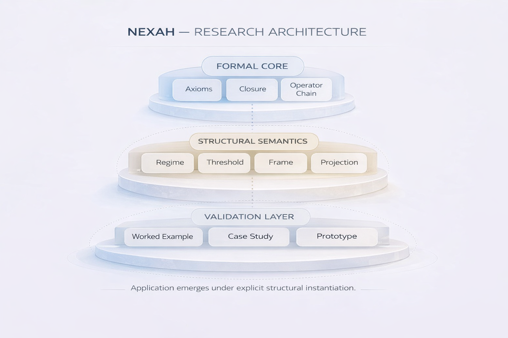

# 🧠 NEXAH — Research (Foundational Layer)



This module contains the **foundational theory and structural origin** of the NEXAH system.

It represents the **starting point** of the entire project:

> a minimal attempt to describe **stability, transitions, and organization**  
> using the simplest possible structural rules.

---

# 🧭 Position in NEXAH

The Research Layer sits at the **base of the system hierarchy**:

```text
RESEARCH (Foundation)
        ↓
FRAMEWORK (Interpretation)
        ↓
ENGINE / DISCOVERY (Extraction)
        ↓
FIELD_LAYER (Geometry)
        ↓
NAVIGATOR (Control & Navigation)
```

---

# 🧱 Structure of This Module

This research module is organized into:

- **FOUNDATION** → axioms, operators, theoretical core  
- **APPLIED_CASES** → concrete structural examples and interpretations  
- **HISTORY** → evolution of ideas and development stages  
- **visuals** → diagrams and conceptual models  

---

# 🔬 What This Layer Is

This layer is deliberately:

- **minimal**
- **discrete**
- **structural**

It is built using basic concepts from:

- finite partially ordered sets (Q, ⪯)  
- monotone operators  
- closure structures  
- simple stabilization rules  

It does **not** use:

- geometry  
- continuous time  
- metrics  
- physical assumptions  

---

# 🔑 Core Ideas (A0–A4)

The foundation rests on a small set of axioms (A0–A4).

From these, three key operators emerge:

- **Γ (Gamma)** → closure structure  
- **Δ (Delta)** → regime transition operator  
- **Ω (Omega)** → stabilization projection  

Together they describe:

- how systems move between structural regimes  
- how stability can emerge  
- how transitions occur **without external goals or rewards**

---

# 🧠 Key Insight

> Stability and transition do not require geometry, energy, or control.

They can emerge purely from:

> **order, closure, and structural relationships**

---

# 🔗 Relation to the Rest of NEXAH

The Research Layer is the **root of all higher layers**.

From here:

- the **FRAMEWORK** introduces interpretation (coherence, risk)  
- the **ENGINE / DISCOVERY** extracts structure from real dynamics  
- the **FIELD_LAYER** builds geometric and continuous representations  
- the **NAVIGATOR** enables movement and control  

---

# 🔬 Empirical Findings

The abstract structural principles defined in this layer  
have been empirically investigated in the FIELD_LAYER.

Key observations include:

- transitions as structured, multi-phase processes  
- emergence of geometric transition channels  
- reduction of continuous dynamics to discrete state structures  
- existence of energy-like landscapes governing motion  
- convergence toward a dominant attractor  

👉 Full results:

→ [Core Findings (V1–V40)](./core_findings.md)

> These findings represent a first empirical validation  
> of the structural principles defined in A0–A4.

---

## Important

The Research Layer:

- does **not depend** on any later layers  
- remains valid independently of geometry or dynamics  

All higher layers are:

> **extensions of this minimal structural core**

---

# 🧪 Applied Perspective

The `APPLIED_CASES/` section demonstrates:

- how abstract structure maps to real systems  
- how regimes, transitions, and stabilization appear in practice  
- how discrete ideas connect to dynamic behavior  

---

# 🧠 Development History

The `HISTORY/` section contains:

- earlier iterations (v1–v6)  
- evolving interpretations  
- experimental directions  

It documents:

> how the system evolved from abstraction → structure → field

---

# 🚧 Current Status

- ✅ Core axioms (A0–A4) defined  
- ✅ Operators (Γ, Δ, Ω) established  
- ✅ Structural consistency validated  

---

## Next Steps

- connect discrete operators to geometric FIELD_LAYER  
- validate against real-world systems (e.g. power grids)  
- clarify mapping from theory → computation  

---

# 🔥 Final Insight

The NEXAH Research Layer shows that:

> complex system behavior can emerge from extremely simple structural rules

Everything else in NEXAH:

- geometry  
- fields  
- control  
- navigation  

is built on top of this foundation.

---

# 🧠 Summary

The Research Layer is:

- not an application  
- not a simulation  
- not a field model  

It is:

> a **minimal structural foundation for understanding transitions and stability**

---

**NEXAH Research Layer**  
From structure → to system → to navigation  

**Last Updated:** April 2026  
© Thomas K. R. Hofmann
