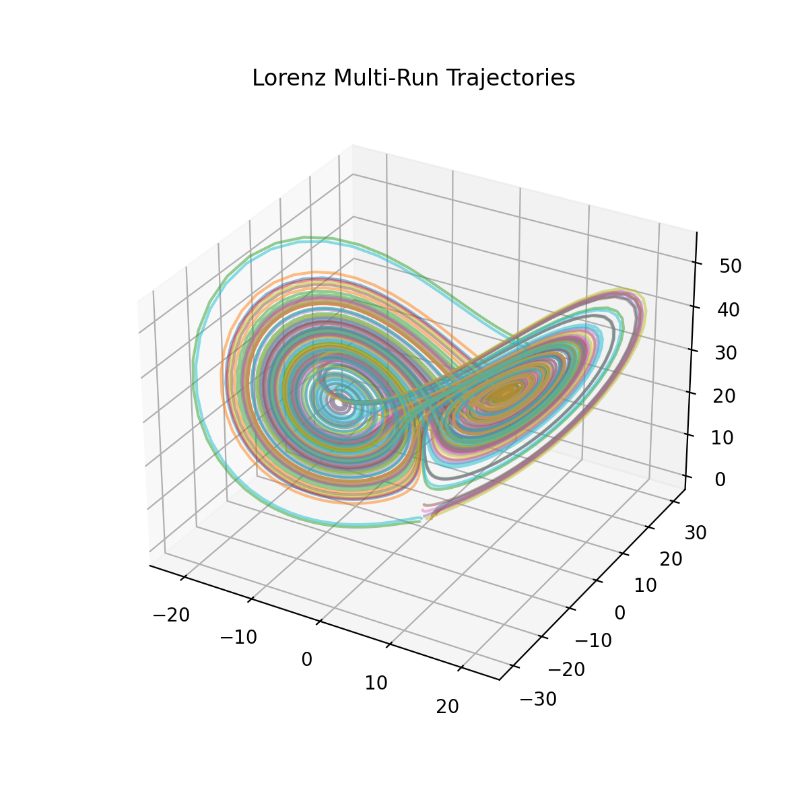
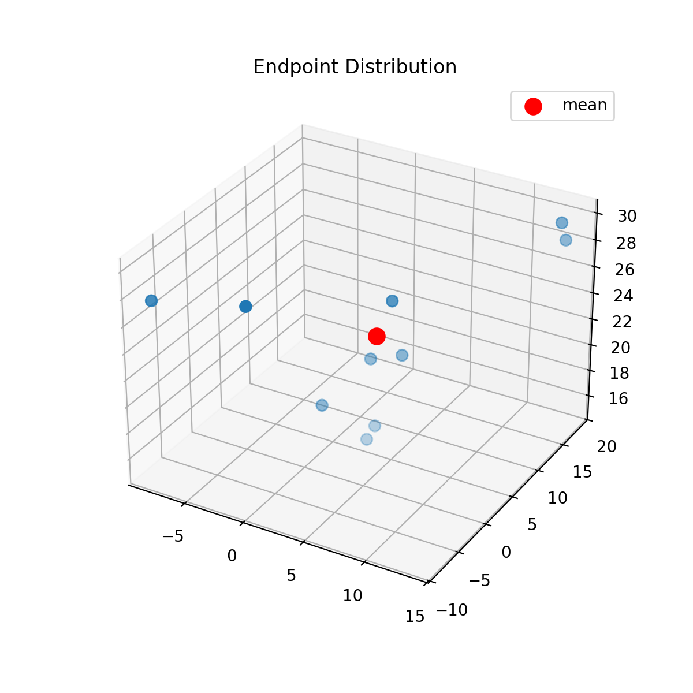
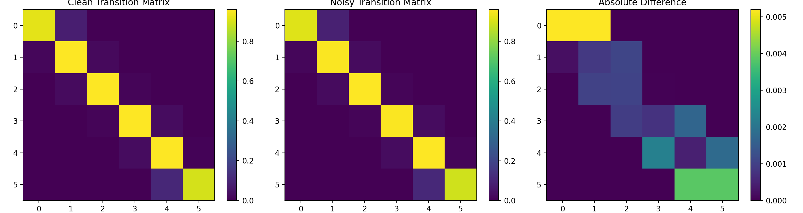
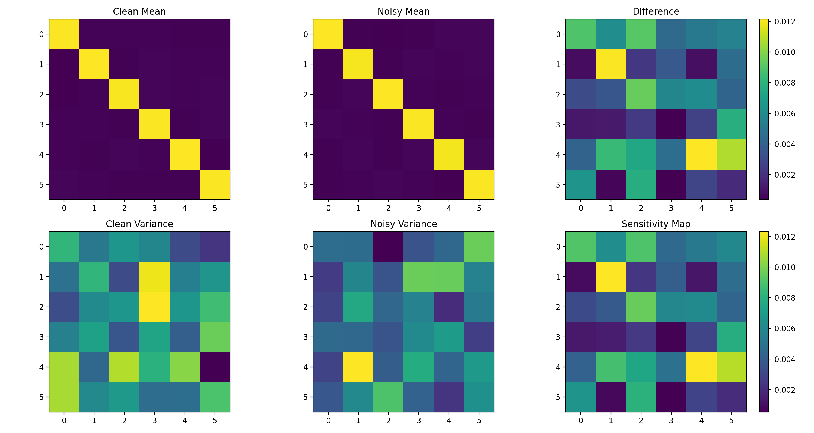
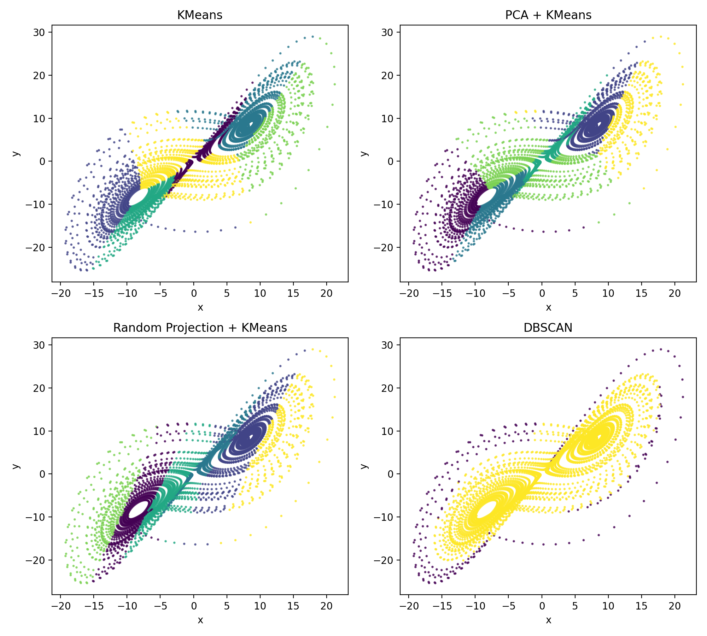
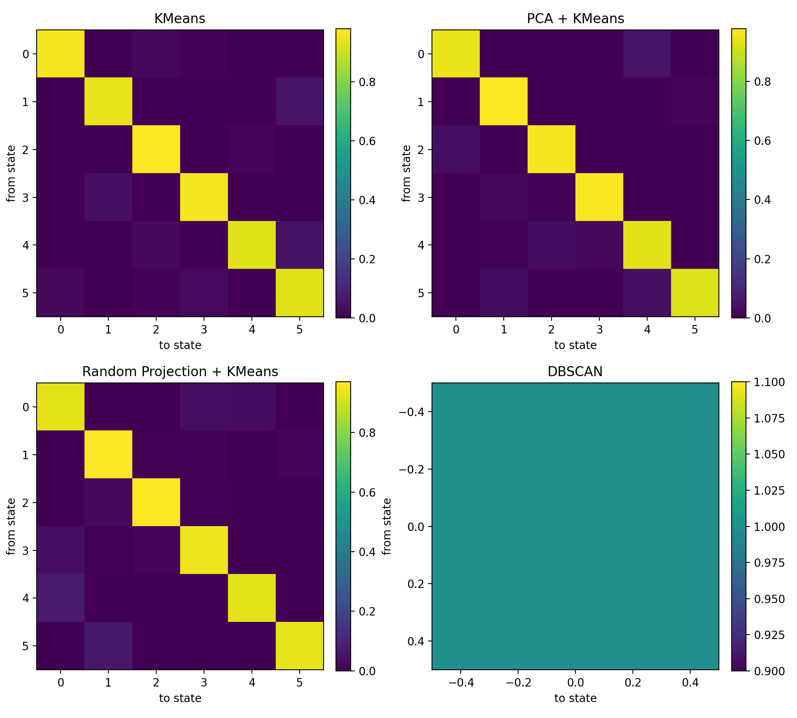
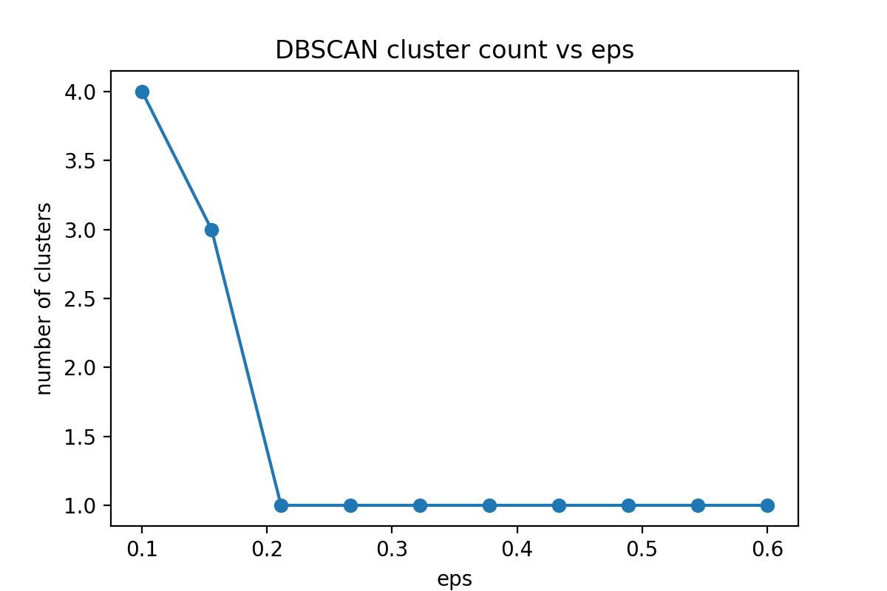
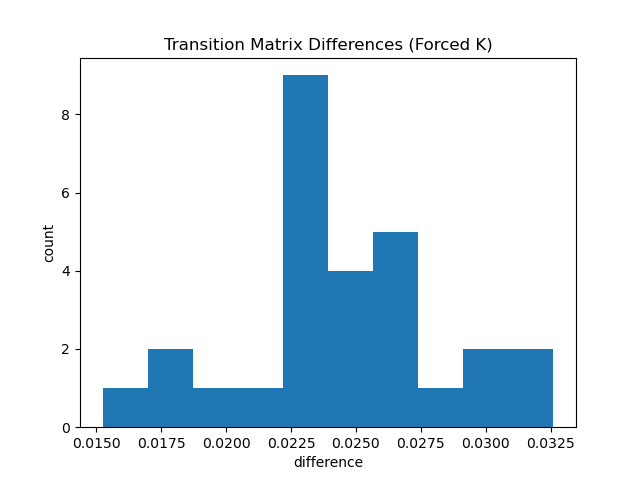
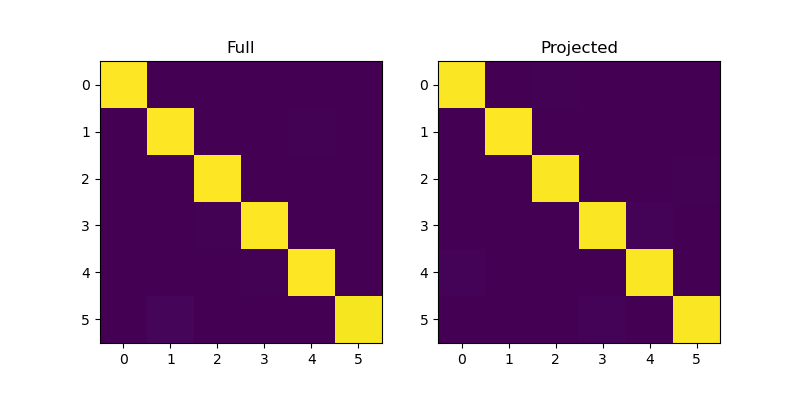

# 🔬 NEXAH — Validation Summary (Lorenz System)

**System:** Lorenz  
**Phase:** Initial Validation Series  
**Status:** Active (multi-run + noise + transition validation)

---

# 🧪 1. Multi-Run Validation

**Script:** `run_lorenz_multirun_validation.py`  
**Runs:** 10  

## Results

- Mean endpoint distance: **9.7892**  
- Std deviation: **5.9301**  
- Attractor stability: **MEDIUM**

## Visual Evidence

  


## Interpretation

- Trajectories diverge (expected for chaotic systems)  
- Endpoints remain bounded within attractor region  
- Global structure is preserved across runs  

---

# 🌫️ 2. Noise Robustness (Trajectory Level)

**Script:** `run_lorenz_noise_validation.py`  
**Runs:** 10  
**Noise level:** 1.0  

## Results

**Clean:**
- Mean distance: **9.7892**
- Std: **5.9301**

**Noisy:**
- Mean distance: **10.4864**
- Std: **4.9895**

## Visual Evidence

  


## Interpretation

- Noise shifts endpoints slightly  
- No structural collapse observed  
- Attractor geometry remains stable  

---

# 🔁 3. Transition Stability under Noise

**Script:** `run_transition_noise_validation.py`  
**Runs:** 10  
**Noise level:** 1.0  

## Results

- Mean transition difference: **0.0008**

## Visual Evidence



## Interpretation

- Clean vs noisy matrices visually similar  
- Differences are small and localized  
- Transition structure remains intact  

---

# 🧭 4. Transition Sensitivity (Grid Partition)

**Script:** `run_transition_sensitivity_map.py`  
**Runs:** 20  
**Noise level:** 1.0  

## Results

- Mean difference: **0.001060**  
- Mean noisy variance: **0.000022**

## Visual Evidence


## Interpretation

- Transition probabilities are highly stable  
- Low global sensitivity  
- Local amplification in specific regions  

---

# 🧩 5. Transition Sensitivity (Real Partition)

**Script:** `run_transition_sensitivity_real_partition.py`  
**Runs:** 20  
**Noise level:** 1.0  
**Clusters:** 6  

## Results

- Mean difference: **0.004940**  
- Mean noisy variance: **0.000223**

## Visual Evidence



## Interpretation

- Higher sensitivity than grid partition  
- Real partitions introduce irregular boundaries  
- Increased local variance  

BUT:

structure remains stable across runs  

---

# 🧬 6. Partition Invariance (Multi-Method Test)

**Script:** `run_multi_partition_invariance_test.py`  

## Methods

- KMeans  
- PCA + KMeans  
- Random Projection + KMeans  
- DBSCAN  

## Results

- KMeans vs PCA + KMeans: **0.014032**  
- KMeans vs Random Projection + KMeans: **0.017065**  
- PCA + KMeans vs Random Projection + KMeans: **0.012935**

(DBSCAN excluded due to collapse)

## Visual Evidence





## Interpretation

- Different partition methods produce **similar transition matrices**  
- Structure is not tied to a specific embedding or projection  
- DBSCAN collapses to 1 cluster → no discrete states detected  

---

# 🧪 7. DBSCAN Geometry Sweep

**Script:** `run_dbscan_sweep.py`  

## Results

- Low eps → multiple clusters (fragmentation)  
- Intermediate eps → transient structure  
- High eps → single cluster (collapse)  

## Visual Evidence

  


## Interpretation

- No stable discrete clustering exists  
- System behaves as a **continuous geometric object**  

---

# 🔁 8. Transition Invariance under Geometric Masking (Forced K)

**Script:** `run_dbscan_transition_forced_k.py`  
**Clusters (forced):** 6  

## Results

- Mean transition difference: **~0.02–0.03**

## Visual Evidence



## Interpretation

- DBSCAN changes geometry (valid regions, density support)  
- KMeans imposes artificial partitions  

BUT:

- Transition matrices remain stable  
- Differences are small (~2–3%)  

---
---

# 🔬 9. Cross-System Validation (Rössler System)

**Script:** `run_rossler_validation_suite.py`  
**Runs:** 10  
**Noise level:** 1.0  
**Clusters:** 6  

## Results

- Mean endpoint distance: **1.9498**  
- Std deviation: **1.9233**  
- Partition invariance difference: **0.002724**

## Visual Evidence

  
  
  


## Interpretation

- Rössler system shows **bounded divergence** under multi-run  
- Noise perturbs trajectories but **preserves global spiral structure**  
- Transition matrix exhibits **strong diagonal dominance**  
- Partition invariance difference is **extremely low (~0.0027)**  

---

## Comparative Insight (Lorenz vs Rössler)

- Lorenz:
  - higher divergence  
  - multi-lobe attractor  
  - higher partition variance (~0.01–0.02)

- Rössler:
  - smoother spiral geometry  
  - lower divergence  
  - significantly stronger structural invariance  

---

## Key Finding

```text
Transition structure stability is not system-specific.
```

**Observed in:**

- Lorenz ✔  
- Rössler ✔  

---

**Interpretation**

- Transition dynamics persist across qualitatively different attractor geometries  
- Stability emerges from underlying flow structure, not system-specific artifacts  
- Systems with different topology still exhibit stable transition structure  

---

**Implication**

```text
The stability of transition structure is a general property
of continuous dynamical systems.
```

---

# 🧠 GLOBAL OBSERVATIONS

Across all tests:

- High variation at trajectory level (chaotic behavior)  
- Stable structure at geometric level  
- Transition dynamics are:
  - reproducible  
  - noise-robust  
  - partition-invariant  
  - geometrically constrained  

---

# 🔑 CORE INSIGHT

```text
Dynamics are unstable at the trajectory level

BUT

stable at the structural level
```

---

# 🔥 EXTENDED INSIGHT

```text
Clustering is not stable.

Transition structure is.
```

# ✅ CONCLUSION

- Structure is **reproducible across runs**  
- Structure is **robust under noise**  
- Structure is **independent of partition method**  
- No natural discrete state system exists (DBSCAN result)

**THEREFORE:**

- Stability is **geometric, not point-based**  
- Transitions are **intrinsic to system dynamics**  
- Transition structure reflects **underlying flow geometry, not discretization**

---

# ⚠️ VALIDATION STATUS

Level: PRELIMINARY → STRONG EMPIRICAL  
Confidence: MEDIUM → HIGH (Lorenz only)

---

# 🔜 NEXT STEPS

- increase runs (30–50)  
- validate on additional systems (Rössler, Duffing, etc.)  
- test control layer reproducibility  
- extend to IEEE system  

---

**NEXAH Validation Layer**  
Initial Lorenz Validation Series  
© Thomas K. R. Hofmann · 2026
