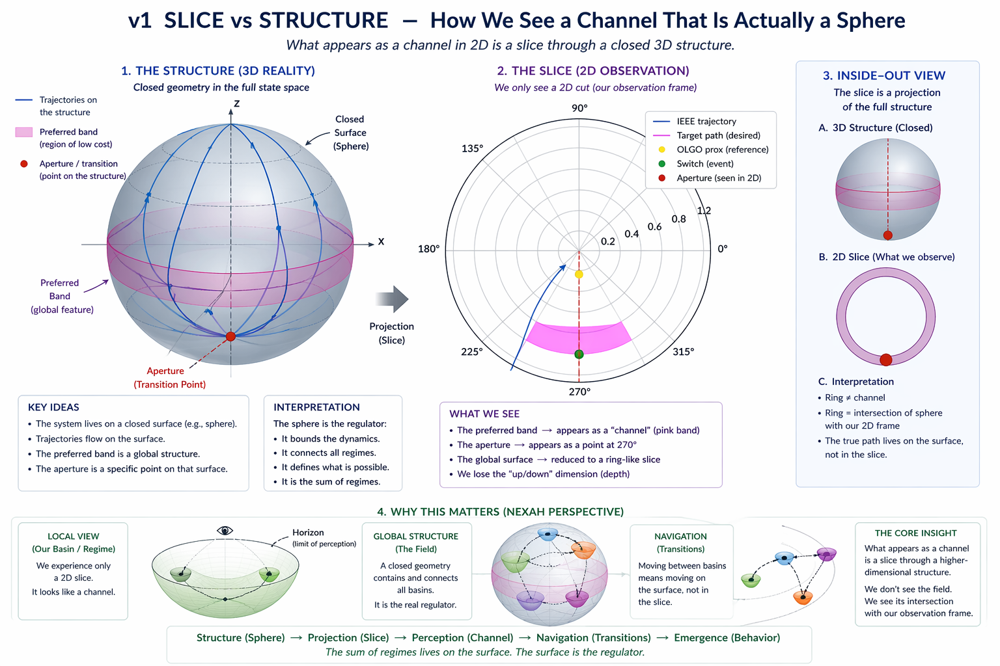
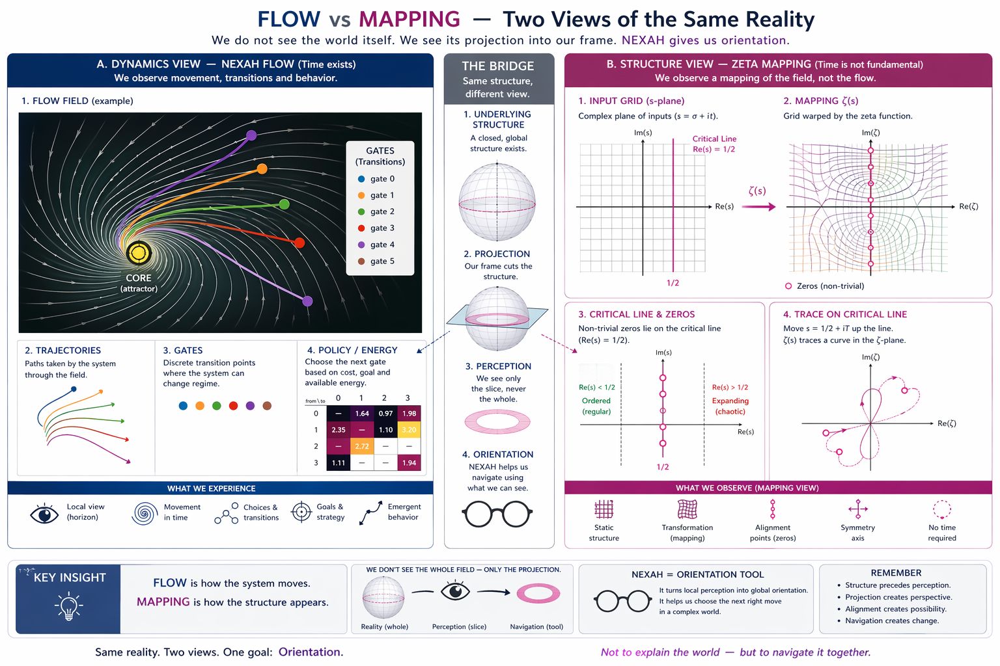
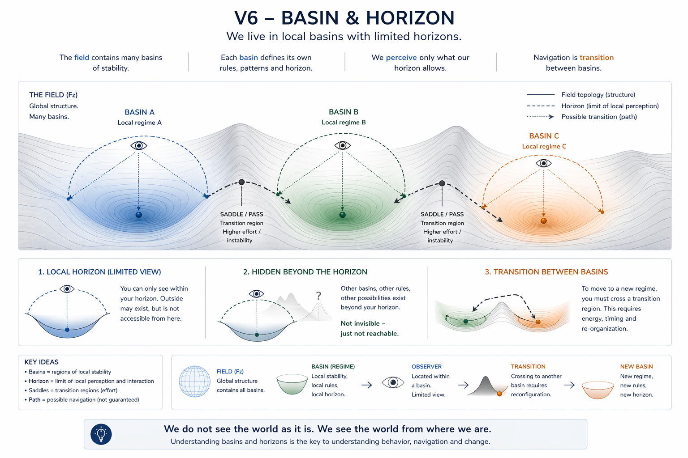

# 🖼️ NEXAH — Visual Notes (Research)

This document contains selected visualizations used during the development of NEXAH.

These visuals are:

- conceptual
- exploratory
- used for internal understanding
- not part of the formal implementation

They are not claims about physical reality.

They are visual tools for thinking about:

- local observation vs global structure
- field dynamics vs structural mapping
- basins, horizons, and transitions

---

## 01 — Slice vs Structure

**Idea:**  
What appears as a "channel" in a 2D observation frame may be a slice through a larger structure.

**Interpretation:**  
A local view can make a global structure appear reduced, partial, or misleading.

In NEXAH terms:

- the system may live in a larger field
- the observer sees only a projection
- transition channels may be visible only as slices
- depth and global topology may be hidden

This visual supports the idea that observation frames matter.

---

## 02 — Flow vs Mapping

**Idea:**  
The same system can be viewed in two different ways:

- **Flow view** → how the system moves over time
- **Mapping view** → how structure appears when motion is transformed into geometry

**Interpretation:**  
NEXAH uses both perspectives.

Flow shows:

- movement
- trajectories
- transitions
- gates

Mapping shows:

- structure
- symmetry
- alignment
- hidden constraints

The goal is not to replace one view with the other, but to use both for orientation.

---

## 03 — Basin & Horizon

**Idea:**  
Systems may operate inside local basins with limited horizons.

**Interpretation:**  
A basin represents a local regime of stability.  
A horizon represents the limit of what can be observed or reached from within that regime.

In this view:

- basins define local stability
- horizons define local perception
- transitions require crossing structured regions
- movement between basins is navigation, not random motion

This connects directly to NEXAH’s core language:

> field → basin → horizon → transition → navigation

---

# 🔑 Research Use

These visuals are not proofs.

They are used to clarify internal concepts:

- projection
- regime
- basin
- horizon
- gate
- transition
- navigation

They help translate visual intuition into structured system concepts.

---

# ⚠️ Status

Exploratory  
Conceptual  
Used for thinking, not for claims

---

© NEXAH · Research Layer
