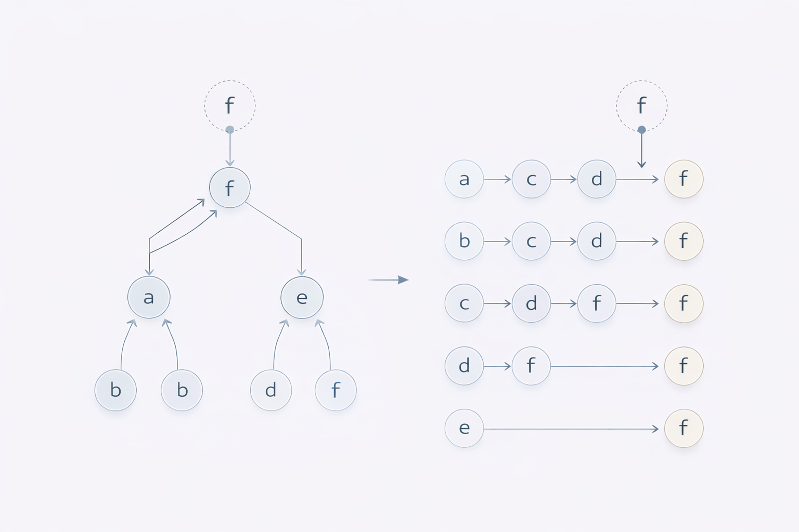

# Worked Example 01 — Finite Stabilization under Regime Operator

---

## 1. Setup

Let \( (Q, \preceq) \) be a finite partially ordered set.

Assume a monotone operator:

\[
\Delta : Q \rightarrow Q
\]

with:

- Monotonicity:  
  \( x \preceq y \Rightarrow \Delta(x) \preceq \Delta(y) \)

- Extensivity:  
  \( x \preceq \Delta(x) \)

- Finiteness of \(Q\)

No metric.  
No topology.  
No time parameterization.

Pure discrete order structure.

---

## 2. Iterative Regime Application

Define the iteration:

\[
x_{n+1} = \Delta(x_n)
\]

Because \(Q\) is finite and \(\Delta\) is extensive and monotone:

- The sequence is ascending
- No infinite strictly increasing chain exists
- Stabilization must occur

Therefore:

\[
\exists n : \Delta(x_n) = x_n
\]

---

## 3. Fixpoint Interpretation

The stabilized element satisfies:

\[
x^* = \Delta(x^*)
\]

This defines a structural fixpoint.

In NEXAH terms:

- META: partial order structure
- ARCHY: regime operator \(\Delta\)
- NEXAH: explicit identification of stabilization frame

---

## 4. Basin Partition

Different initial elements may converge to different fixpoints.

Thus:

- The operator induces basin partition
- Stabilization geometry emerges
- No additional structure required

---

## 5. Structural Meaning

This example demonstrates:

- Operator non-redundancy
- Guaranteed stabilization under finite constraints
- Explicit regime-induced structure
- Applicability without ontological extension

It is a minimal proof-of-concept for regime theory.

---

Status: First validated discrete stabilization example.
