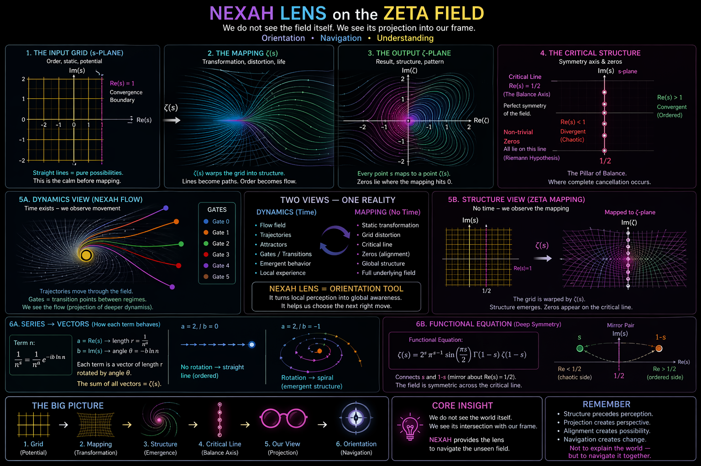

# 🧠 NEXAH — Zeta Lens Framework (Exploratory)

This document introduces a **conceptual interpretation layer**  
inspired by structures observed in the Riemann zeta function.

It is not a statement about number theory.

It is used as a **thinking tool** within NEXAH.

---

## ⚠️ Scope

This document:

- does **not** attempt to explain or solve the Riemann Hypothesis  
- does **not** introduce new mathematics  
- does **not** claim physical equivalence  

It provides:

> a **structural analogy** to reason about mapping, perception,  
> and the relationship between local and global structure

---

# 🧩 1. From Series to Structure (Intuition)



### Idea

The zeta function can be interpreted (informally) as:

- a sum of many rotating components  
- each with decreasing magnitude  
- combining through interference  

This leads to:

- constructive patterns  
- destructive cancellation  
- special points where the sum becomes zero  

---

### Key Observation

> Complex structure can emerge from simple repeated components.

---

### Important

This section is:

- an **intuitive visualization**
- not a formal derivation

---

# 🔄 2. Transition: From Mathematics to Interpretation

The previous section describes a known mathematical object.

The following section does something different:

> it uses this structure as a **conceptual lens**

---

**Important:**

```text
This is not a statement about the zeta function itself.
It is a structural interpretation used within NEXAH.
```
# 🧠 3. NEXAH Lens on the Zeta Field


---

## 🧭 Interpretation

This visualization reframes the structure as a mapping process:

---

### 1. Input (Possibility Space)

- regular grid (s-plane)
- undistorted structure
- represents **potential states**

---

### 2. Mapping

- transformation via ζ(s)
- grid becomes curved
- structure emerges from transformation

---

### 3. Output (Observed Structure)

- distorted geometry
- patterns become visible
- certain regions concentrate structure

---

### 4. Structural Axis

- symmetry line (Re(s) = 1/2)
- acts as a **balance constraint**
- alignment emerges along this axis

---

## 🔁 Two Views of the Same System

The framework distinguishes between:

### A. Dynamics View (Flow)

- trajectories
- transitions over time
- local movement
- observer perspective

---

### B. Structure View (Mapping)

- no time
- global structure
- alignment patterns
- full field perspective

---

## 🧠 Core Idea

> We do not see the full structure directly.  
> We see its projection into our observation frame.

---

# 🔗 4. Relation to NEXAH

Within NEXAH, this lens supports:

---

### FIELD_LAYER

- interpreting structure as a continuous field  
- understanding how geometry emerges  

---

### DISCOVERY ENGINE

- detecting alignment patterns  
- identifying transition channels  

---

### NAVIGATION

- moving between regimes  
- using structure instead of force  

---

# 🧠 5. Conceptual Mapping (Not Equivalence)

The analogy can be summarized as:

| Mathematical Intuition | NEXAH Interpretation |
|----------------------|---------------------|
| Series               | local contributions |
| Interference         | interaction of states |
| Zeros                | alignment / transition points |
| Critical line        | structural constraint / axis |
| Mapping ζ(s)         | transformation of representation |

---

## Important

This table represents:

> a **mapping of ideas**, not a formal correspondence

---

# 🚧 6. Limitations

- based on visual interpretation  
- not mathematically rigorous  
- not validated as a model  
- not intended for formal use  

---

# 🧠 Key Insight

> Structure can exist beyond what is locally observable.

And:

> different representations can describe the same underlying system.

---

# 🚀 Role in Research

This document is part of:

→ **RESEARCH / Exploratory Layer**

It is used to:

- think about structure  
- connect perspectives  
- support intuition  

---

## Status

Exploratory  
Conceptual  
Non-formal  

---

**NEXAH Research Layer**  
Interpretation → Structure → Navigation  
