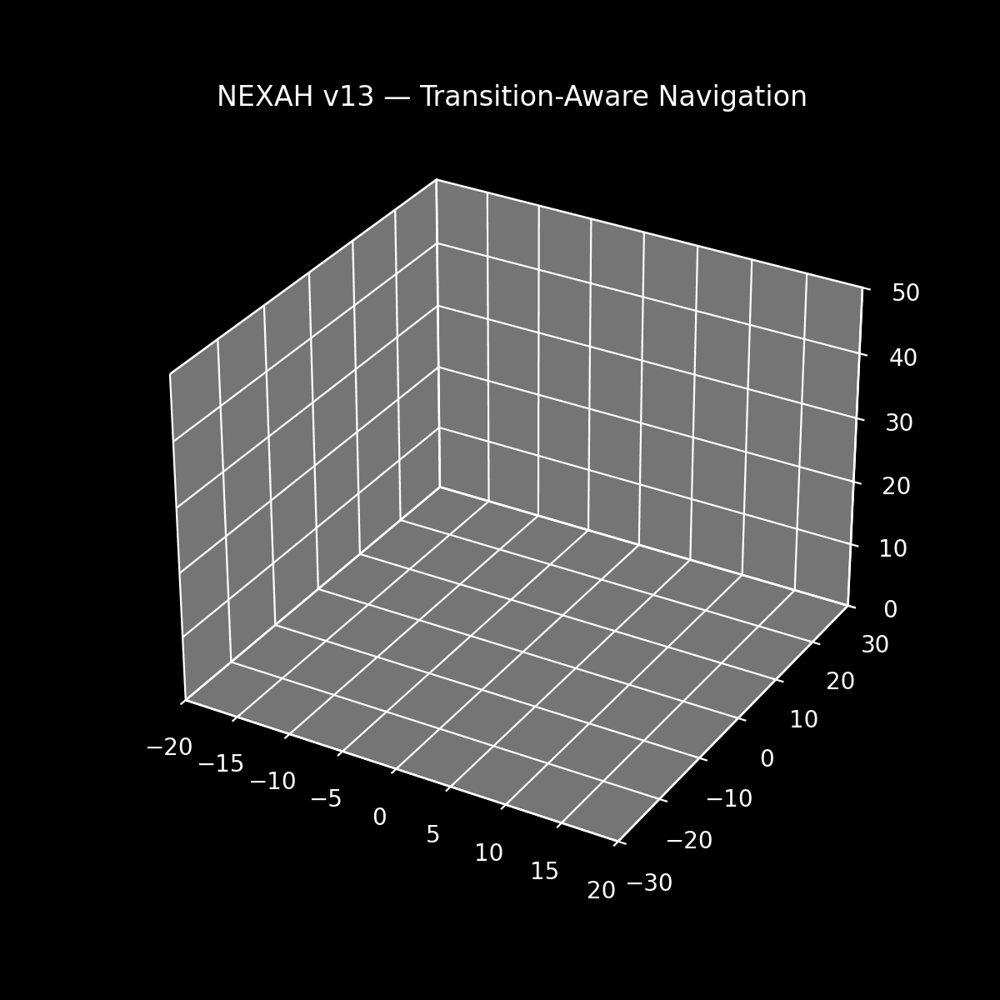

# 🚀 START HERE — NEXAH



---

## ⚡ What you are looking at

At first, it looks like chaos.

But it isn’t.

---

## 🧠 Look again

- the system is not random  
- it repeatedly follows structured pathways  
- transitions occur in specific regions  
- red points mark **actual structural transitions**

👉 this is **structured behavior inside a dynamical system**

---

## 🔥 The key idea

NEXAH does not analyze isolated values.

It reconstructs:

```text
trajectory → structure → field → transitions
```

In other words:

> **how a system moves through its own geometry**

---

## 🧠 What the visualization shows

- line → continuous system motion  
- color → coherence (alignment with system flow)  
- red points → discrete transitions (sheet changes)  

👉 this combines:

```text
continuous dynamics + discrete structure
```

---

## ⚡ Try it (30 seconds)

Run the demonstrator:

```bash
python PROTO_CORE/NEXAH_DEMONSTRATOR/scripts/run_demo.py
```

---

## 🧪 Explore the core experiment

Run the transition-aware navigation:

```bash
python PROTO_CORE/NEXAH_DEMONSTRATOR/scripts/hero/run_transition_navigation_v13.py
```

---

## 🧠 What just happened

You are not simulating chaos.

You are observing:

```text
structure emerging from dynamics
+
transitions occurring within that structure
```

---

## 💡 What this shows

- dynamical systems exhibit geometric structure  
- transitions are not random events  
- behavior follows constrained pathways  
- system evolution can be understood via geometry  

---

## 🧪 Want the minimal system?

👉 Start here:

- [`PROTO_CORE/NEXAH_DEMONSTRATOR/`](PROTO_CORE/NEXAH_DEMONSTRATOR/)
- [`PROTO_CORE/NEXAH_DEMONSTRATOR/README.md`](PROTO_CORE/NEXAH_DEMONSTRATOR/README.md)

This contains a **clean, reproducible implementation** of:

- field construction  
- Gate Operator (instability field)  
- Transition Structure (discrete layer)  
- Navigation Kernel (geometry-aware motion)  

---

## 🧭 Where to go next

- 👉 Overview → [README.md](README.md)  
- 👉 Architecture → [ARCHITECTURE/README.md](ARCHITECTURE/README.md)  
- 👉 Methods → [ARCHITECTURE/METHODS.md](ARCHITECTURE/METHODS.md)  
- 👉 Visuals → [VISUAL_GALLERY.md](VISUAL_GALLERY.md)  

---

## 🔥 One sentence

NEXAH turns dynamical systems into:

> **something you can observe, analyze — and navigate**

---

## 🧠 If you remember one thing

> The system is not random.  
> It follows structure —  
> and that structure can be reconstructed.
