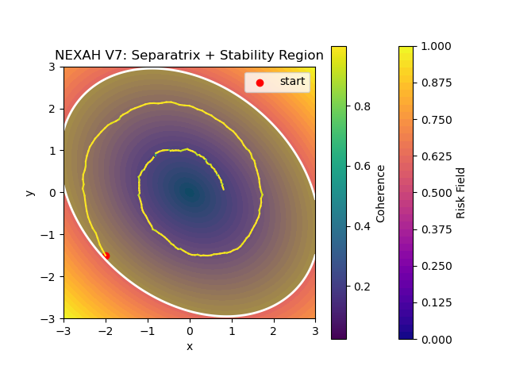

# 🚀 START HERE — NEXAH



**This is not chaos.**  
This is a **stability field**.

---

## 🧠 What you are looking at

A system is moving through:

- stable regions  
- transition zones  
- instability boundaries  

Instead of asking:

> “Will the system become unstable?”

NEXAH shows:

> **Where the system is — and where it is going**

---

## 🌊 The Shift

Classical view:

> systems are unstable or stable  

NEXAH view:

> systems **move through structure**

---

## ⚡ Step 1 — Run the Core Demo

```bash
python ENGINE/run_nexah_demo.py
```

This generates:

- a trajectory (system behavior)  
- a field (how the system moves)  
- regimes (stable / transition / unstable)  
- boundaries between them  

---

## 🔍 What to look for

- where motion slows down → stability  
- where it accelerates → instability  
- where it crosses boundaries → regime change  
- how trajectories follow the field  

---

## 🧩 From Chaos → Structure

At first, systems look like this:


Chaotic. Complex. Hard to interpret.

---

Then structure appears:


You start seeing:

- valleys (stable regions)  
- slopes (transitions)  
- peaks (instability)  

---

And then the key insight:


> Systems do not randomly fail  
> they **cross boundaries**

---

## 🔥 What NEXAH really extracts

Beyond visualization, NEXAH reveals deeper structure:

- symbolic system states  
- transition sequences  
- regime graphs  
- stability patterns over time  
- geometric transition channels  

👉 Example (from Lorenz analysis):


This shows:

- discrete system states (S0–S5)  
- transition probabilities  
- how the system *moves between regimes*  

---

## ⚡ Hidden Structure in Time

Even instability is structured:


Key observation:

> Risk is not random noise  
> it forms **repeating structural patterns**

---

## 🧭 Geometry of Transitions

NEXAH also reveals:


- preferred movement paths  
- transition corridors  
- geometric constraints  

👉 Systems don’t move arbitrarily  
they follow **channels in state space**

---

## ⚡ Step 2 — See it in Action (Lorenz System)

```bash
python APPLICATIONS/core_demos/lorenz/lorenz_meta_control_v6_switch.py
```

Now you will see:

- chaotic dynamics (Lorenz attractor)  
- structured trajectories  
- adaptive behavior  
- regime transitions ("switches")  

---

## 🧠 What changed?

Before:

> the system moved blindly  

Now:

> the system **reacts to structure**

---

## ⚡ Step 3 — Real System (Power Grid)

```bash
PYTHONPATH=. python APPLICATIONS/power_systems/nexah_ieee9/controller/nexah_closed_loop_ieee9_v6.py
```

---

## ⚠️ Important

- NEXAH is a **prototype system**  
- behavior is **locally reliable, not globally predictive**  
- real-world validation is **ongoing**  

---

## 🧠 In one sentence

NEXAH turns complex dynamics into a:

> **structure you can move within**

---

## 🧭 Explore Next

- 🧠 Framework → FRAMEWORK/README.md  
- ⚡ Applications → APPLICATIONS/README.md  
- 🧭 Navigation → NAVIGATOR/CORE/NAVIGATION_ARCHITECTURE.md  

---

## 🧩 Want to experiment?

Open:

```
APPLICATIONS/core_demos/lorenz/lorenz_meta_control_v6_switch.py
```

---

### 🔧 Try this (2 minutes)

Change:

```python
control = -0.30 * dx
```

to:

```python
control = -0.10 * dx
```

or:

```python
control = -0.80 * dx
```

---

### 👀 Observe

- does it stabilize faster?  
- does it become unstable?  
- does it switch more often?  

---

## 🧠 What you are doing

You are not tuning parameters.

You are:

> **changing how a system navigates itself**

---

## 💡 Philosophy

NEXAH is not a black box.

It is meant to be:

> explored, modified, and extended

---

👉 If you change something and observe new behavior,  
you are already contributing to the system.

---

**NEXAH · Thomas K. R. Hofmann · 2026**
