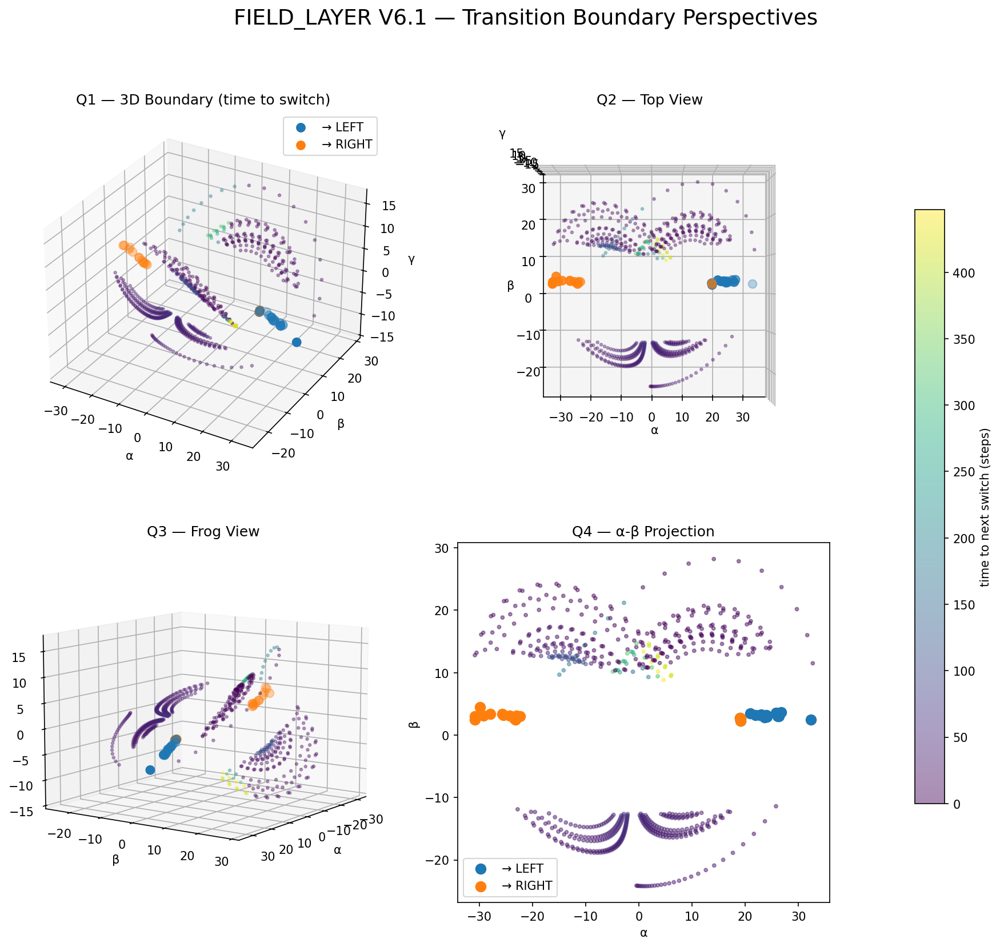

# 🚀 START HERE — NEXAH


**This is not chaos.**  
This is a **stability field**.

---

## 🧠 What you are looking at

A system is moving through:

- stable regions  
- transition zones  
- instability boundaries  

Instead of asking:

> “Will the system become unstable?”

NEXAH shows:

> **Where the system is — and where it is going**

---

## 🌊 The Shift

At first, systems look like this:


Pure signal. Noise. No structure.

---

Then something emerges:


Transitions are no longer random.

---

Then geometry appears:


> The system moves along a **hidden structure**

---

## 🔥 The Breakthrough

Now the system reveals deeper structure:


> Transitions happen in **specific regions**

---


> The system behaves like it is crossing **energy barriers**

---


> The system has **memory and internal feedback**

---

## 🧭 From Structure → Navigation

Now look at this:


> The system is no longer wandering —  
> it is **following structured paths**

---

## 🔬 The System Has Geometry


- curvature  
- rotation (curl)  
- topology  

> The system behaves like a **continuous field with measurable structure**

---

## 🌐 Perspective Matters



Same system.  
Different perspectives.

> Structure is not just visible —  
> it depends on how you **observe the field**

---

## ⚡ Step 1 — Run the Core Demo

```bash
python ENGINE/run_nexah_demo.py
```

This generates:

- a trajectory  
- a field  
- regimes  
- boundaries  

---

## 🔍 What to look for

- where motion slows → stability  
- where it accelerates → instability  
- where it bends → structure  
- where it crosses → regime change  

---

## ⚡ Step 2 — See it in Action (Lorenz)

```bash
python APPLICATIONS/core_demos/lorenz/lorenz_meta_control_v6_switch.py
```

Now you will see:

- chaotic motion  
- structured trajectories  
- adaptive behavior  
- regime switching  

---

## 🧠 What changed?

Before:

> chaos looked random  

Now:

> chaos becomes **navigable**

---

## ⚡ Step 3 — Full Field Navigation


Now everything connects:

- field  
- graph  
- trajectory  
- attractor  

👉 This is the full system.

---

## 🧠 In one sentence

NEXAH turns complex dynamics into a:

> **structure you can move within**

---

## ⚠️ Important

- prototype system  
- locally reliable  
- still under validation  

---

## 🧭 Explore Next

- 🧠 Framework → FRAMEWORK/README.md  
- ⚡ Applications → APPLICATIONS/README.md  
- 🧭 Navigation → NAVIGATOR/CORE/NAVIGATION_ARCHITECTURE.md  

---

## 💡 Final Insight

Systems do not randomly fail.

They:

> **move through structured regions of stability, transition, and collapse**

---

**NEXAH · Thomas K. R. Hofmann · 2026**
