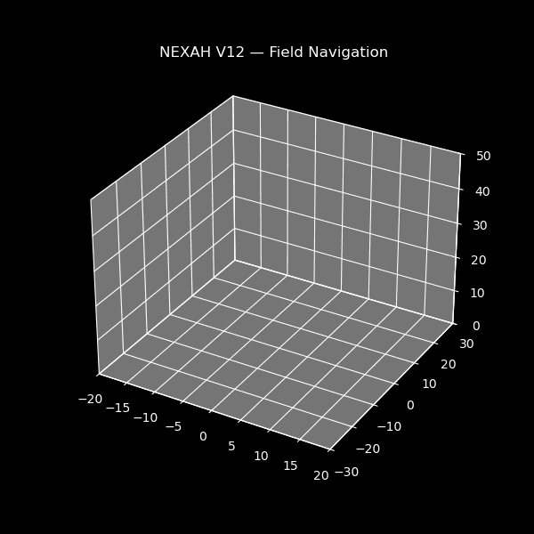

# 🚀 START HERE — NEXAH



---

## ⚡ What you are looking at

At first, it looks like chaos.

But it isn’t.

---

## 🧠 Look again

- the system is not random  
- it moves between recurring regions  
- transitions happen at specific points  

👉 this is **structured behavior inside chaos**

---

## 🔥 The key idea

NEXAH does not analyze values.

It reveals:

> **how a system moves through its own structure**

---

## ⚡ Try it (30 seconds)

Run:

```bash
python APPLICATIONS/core_demos/lorenz/lorenz_meta_control_v6_switch.py
```

---

## 🧪 Now change ONE line

Find:

```python
control = -0.30 * dx
```
Run again.

---

Change to:

```python
control = -0.10 * dx
```
Run again.

--

---

## 🧠 What just happened

You did NOT tune a parameter.

You changed:

> how the system navigates its own dynamics

---

## 💡 What this shows

- chaos contains structure  
- transitions are not random  
- behavior can be influenced via geometry  

---

## 🧭 Where to go next

- 👉 Full overview → [README.md](README.md)  
- 👉 Structure extraction → [DISCOVERY_ENGINE/discovery_core_log.md](DISCOVERY_ENGINE/discovery_core_log.md)  
- 👉 Field construction → [FIELD_LAYER/build_log.md](FIELD_LAYER/build_log.md)  

---

## 🔥 One sentence

NEXAH turns chaotic systems into:

> **something you can observe, understand — and navigate**

