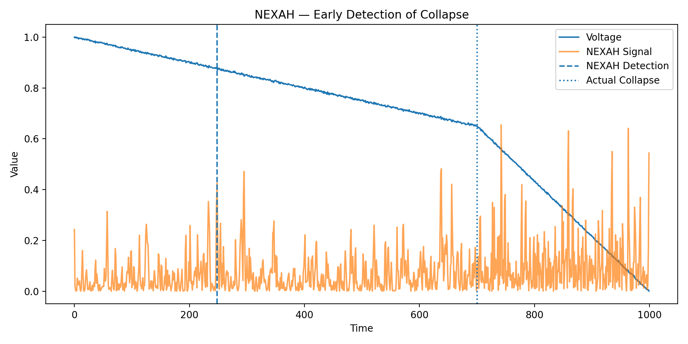
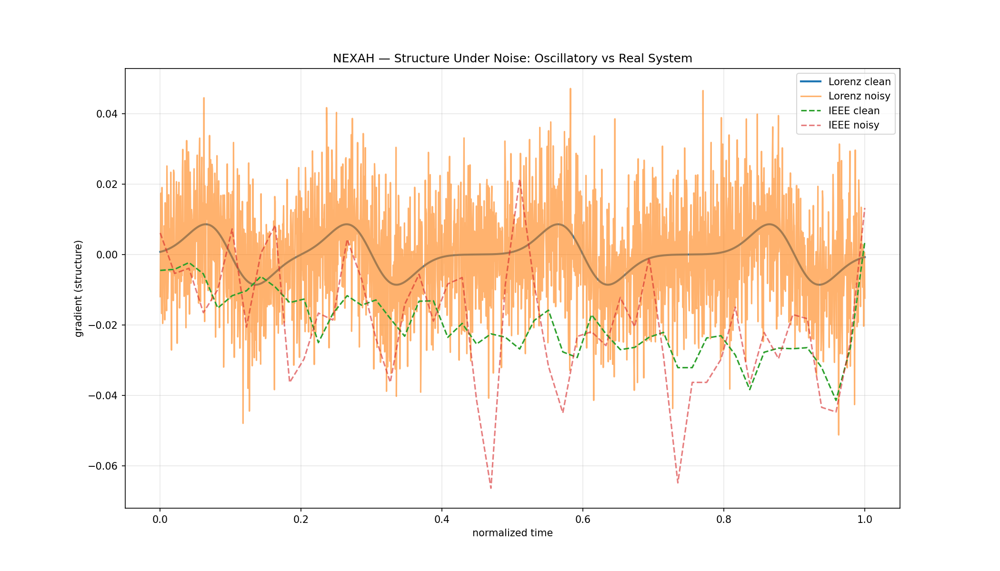
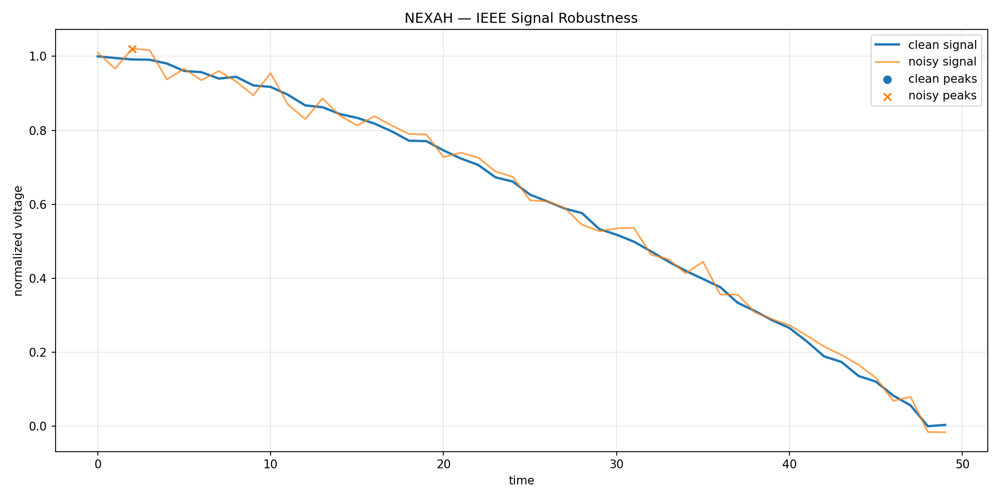

# 🌀 NEXAH — Visual Gallery

This gallery shows how structure emerges from dynamical systems  
and becomes **observable, measurable, and navigable**.

---

# 🧭 How to read this

Each visualization represents a step in the same transformation:

```text
signal → field → geometry → transitions → stability → navigation
```

---

# 🔷 01 — Signal → Field


A real IEEE time series lifted into a spatial field.

```text
signal → geometry
```

→ raw dynamics become a continuous structure  
→ structure can be analyzed spatially  

---

# 🔷 02 — Field → Geometry


The reconstructed field reveals geometric features:

```text
basins, ridges, separatrices
```

→ stability becomes a spatial property  
→ system behavior is constrained by geometry  

---

# 🔷 03 — Geometry → Motion


System trajectories evolve within the field:

```text
motion follows structure
```

→ trajectories are not arbitrary  
→ they align with geometric constraints  

---

# 🔷 04 — Geometry → Transitions


Transitions appear as structured regions:

```text
transitions ≠ events
transitions = regions
```

→ system changes occur within specific areas  
→ not as isolated spikes  

---

# 🔷 05 — Structure inside Chaos


Even chaotic systems exhibit structured transitions.

```text
chaos contains geometry
```

→ transitions occur in consistent regions  
→ behavior is constrained, not random  

---

# 🔷 06 — Stability & Collapse



Instability builds up geometrically:

```text
collapse is spatially prepared
```

→ failure is not sudden  
→ it emerges from field deformation  

---

# 🔷 07 — Robustness under Noise



Structure persists under perturbation:

```text
geometry is stable under noise
```

→ transitions remain detectable  
→ system structure is resilient  

---

# 🔷 08 — Real System under Noise



Applied to real-world systems:

```text
structure survives disturbance
```

→ transition signals remain visible  
→ enables early detection  

---

# 🔑 Core Insight

All visuals show the same principle:

```text
Systems do not evolve randomly.

They move within structured fields
that define:
- where motion is possible
- where transitions occur
- where stability exists
```

---

# 🧠 Interpretation

NEXAH does not detect events.

It reconstructs the structure that produces them.
