# 🌌 NEXAH — Visual Gallery

This gallery presents a curated visual overview of the NEXAH research framework.

It shows how structure emerges from dynamical systems and becomes:

```text
observable → measurable → interpretable → navigable
```

The gallery is intentionally selective.

It does not list every output.  
It highlights the strongest visual evidence across the current NEXAH ecosystem.

---

# 🧭 Structural Orientation Layer


This visual summarizes the larger orientation philosophy behind NEXAH.

It frames the framework not as a replacement for existing disciplines,
but as:

```text
a navigation grammar across complex systems
```

The visual connects:

- dynamical systems
- topology
- control theory
- synchronization
- information geometry
- network theory
- AI / ML
- cartography
- neuroscience
- complex systems research

through a shared structural-navigation perspective.

---

## 🔑 Core Perspective

```text
Specialists build the engines.

NEXAH maps the terrain between them.
```

---

# 🧠 How to Read This Gallery

Each section represents one major visual layer of NEXAH:

```text
dynamics
→ field geometry
→ transition structure
→ phase dynamics
→ synchronization regimes
→ control/navigation
→ cross-system validation
```

---

## 🔥 Featured System Visuals

These visuals currently represent the clearest high-level view of the NEXAH framework.

They summarize:

```text
field structure
→ transition activation
→ regime organization
→ navigation dynamics
```

---

### Transition Activation Framework


Current working interpretation of phase-driven transition activation and directional control interaction.

---

### Interactive Navigation Map

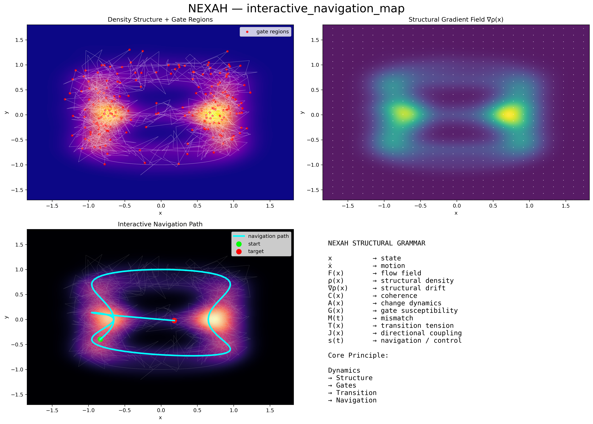

A regime-aware navigation perspective across structured dynamical geometry.

This visual represents one of the current central NEXAH directions:

```text
geometry-aware movement through transition structure
```

rather than isolated state evolution.

---

### Regime Atlas


High-level conceptual map connecting dynamics, synchronization, geometry, transitions, control, and mathematical representations.

---

# 🪞 JANUS — Directional Geometry Layer

One of the newest emerging visual layers inside NEXAH investigates:

```text
directional coherence
recursive transport geometry
aperture structures
and bidirectional organization
```

rather than only local instability.

This JANUS layer studies how systems organize movement through:

- directional overlap
- transport asymmetry
- recursive routing structure
- coherence shells
- transition apertures
- orientation manifolds

---

## 🔷 JANUS Perspective

```text
forward flow
+
backward compatibility
→ directional coherence geometry
```

---

## 🔑 Emerging Interpretation

Transitions may not simply occur where systems become unstable.

They may emerge where:

```text
directional coherence collapses
```

inside structured transport geometry.

---

## 🌌 JANUS Role Inside NEXAH

```text
field
→ coherence
→ directional structure
→ apertures
→ recursive routing
→ transition geometry
```

This layer is still exploratory,
but increasingly important inside the framework.

---

# 🔷 1. Core Field Geometry

These figures show the foundational NEXAH idea:

```text
raw dynamics → field → geometry → structure
```

---

## Unified Transition Architecture


This diagram summarizes the full NEXAH pipeline across systems.

It shows how:

- dynamics generate transitions
- transitions form structure
- phase embeds motion
- flow and topology emerge
- synchronization appears as a global effect

---

## Structural Reduction Pipeline


A visual reduction from continuous dynamics into interpretable structural geometry.

---

## Transition Geometry Extraction


This figure shows how transition pathways emerge from the underlying field structure.

---

## Quantitative Transition Structure


A quantitative view of transition organization and structural consistency.

---

# 🌊 2. Transition Phase Dynamics

This layer is one of the strongest parts of NEXAH.

It studies:

- phase drift
- mismatch
- transition activation
- winding behavior
- angular structure
- cross-system phase consistency

---

## Master Phase Field

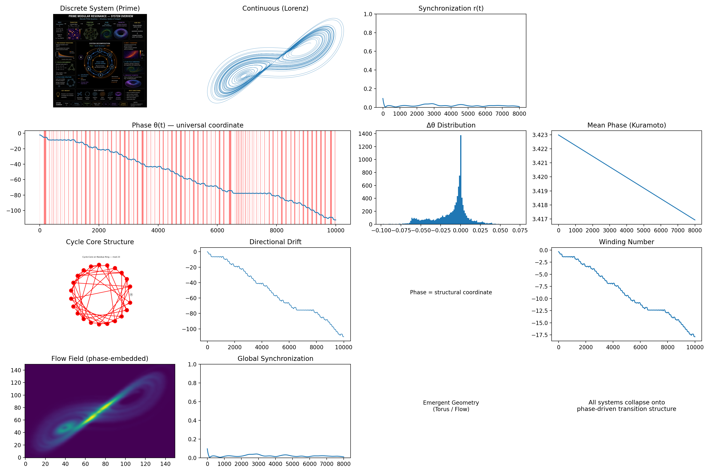

Unified visual summary of phase behavior across multiple systems.

---

## Phase Field Master Visual


A compact view of phase-field structure and transition organization.

---

## Kuramoto Phase Sweep

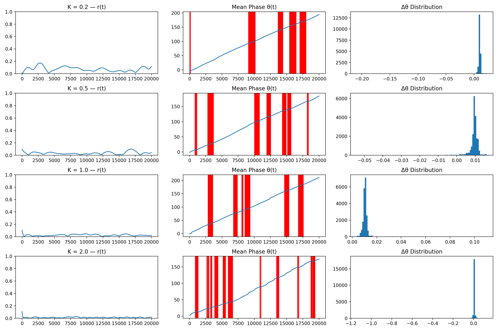

Kuramoto synchronization regimes across changing coupling strength.

---

## Lorenz Phase Unwrapping

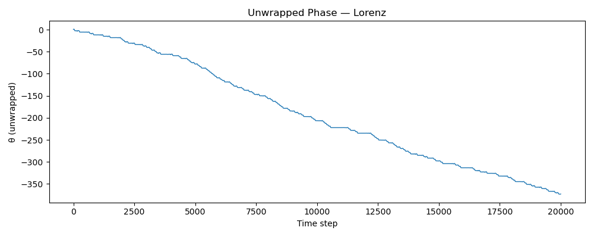

Phase evolution and drift structure in the Lorenz system.

---

# 🔥 3. Kuramoto Regime Structures

Kuramoto is currently one of the clearest systems for showing:

```text
global synchronization ≠ internal stability
```

It reveals:

- synchronization boundaries
- internal phase drift
- transition activity inside ordered regimes
- Lyapunov-linked transition behavior

---

## Kuramoto Field Structure


The primary Kuramoto FIELD_LAYER structure visual.

---

## Final Phase Diagram

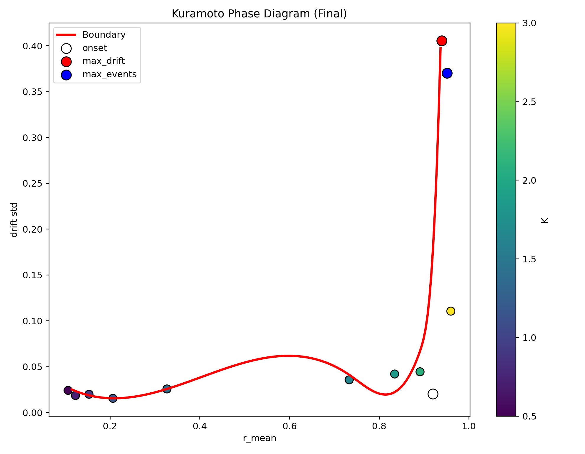

Final synchronization phase diagram with regime structure.

---

## Phase Boundary Detection

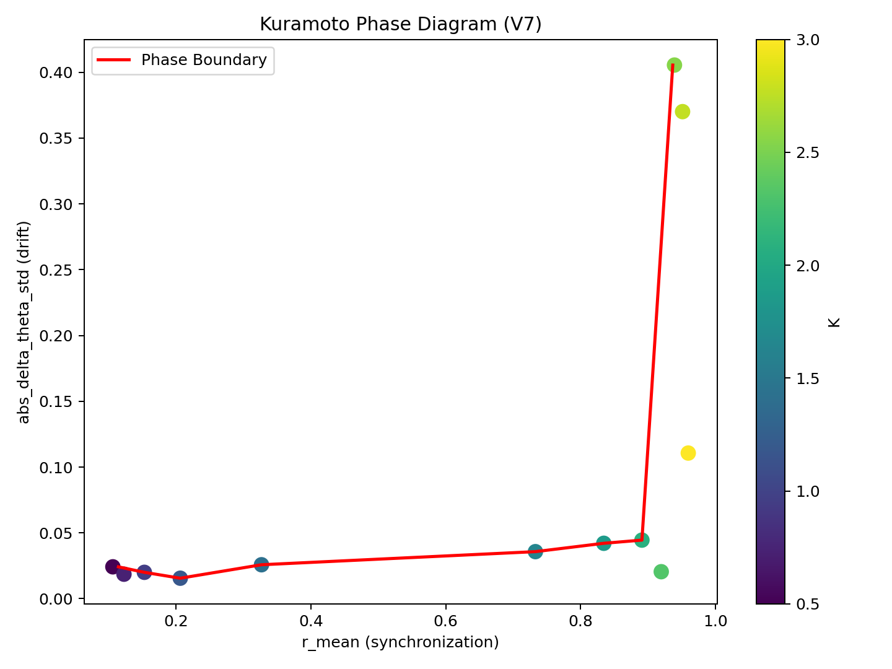

Detected transition boundary between synchronization regimes.

---

## Event Rate vs Lyapunov

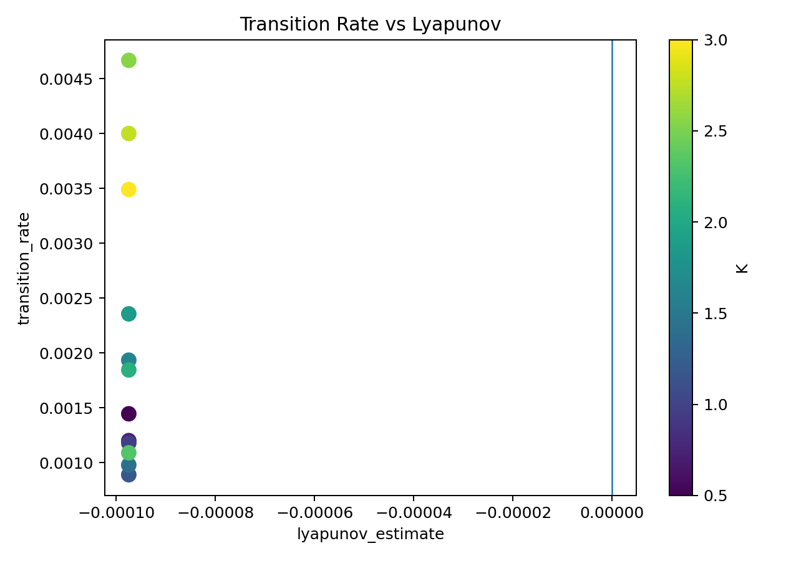

Shows the relationship between instability and transition-event frequency.

---

## Phase Boundary Sweep


Animated sweep showing how synchronization boundaries emerge.

---

# 🌀 4. Fractal Transition Systems

Fractal systems extend NEXAH from intrinsic state-space dynamics into parameter-driven transition dynamics.

Core idea:

```text
parameter motion → structural change Δ → transition probability
```

---

## NEXAH Fractal Transition

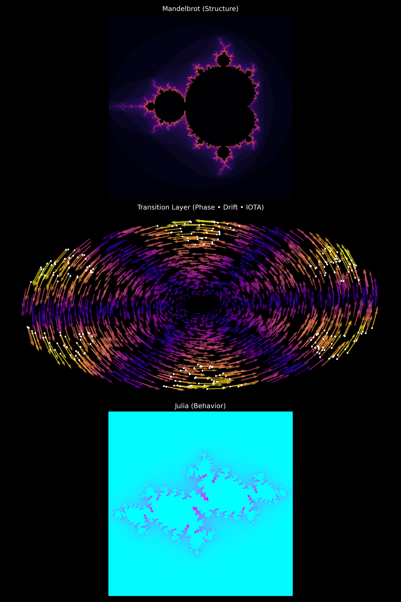

A visual framework for Mandelbrot / Julia transition behavior.

---

## Julia Path Animation

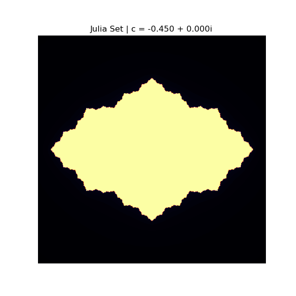

Animated traversal through Julia-set parameter space.

---

## Phase Mismatch Animation


Shows mismatch-like structural change emerging through parameter motion.

---

## Continuous Transition Heatmap


Transition probability landscape derived from Δ and parameter context.

---

## Transition Field Fit


Empirical boundary fit for parameter-driven transition regions.

---

# 🧭 5. Prime Modular Resonance

This section is more exploratory.

It shows how modular arithmetic systems can be visualized as flow fields, transition structures, and resonance geometries.

Important clarification:

```text
This is exploratory / experimental,
not part of the core validated dynamical-systems layer.
```

---

## Unified Flow Torus

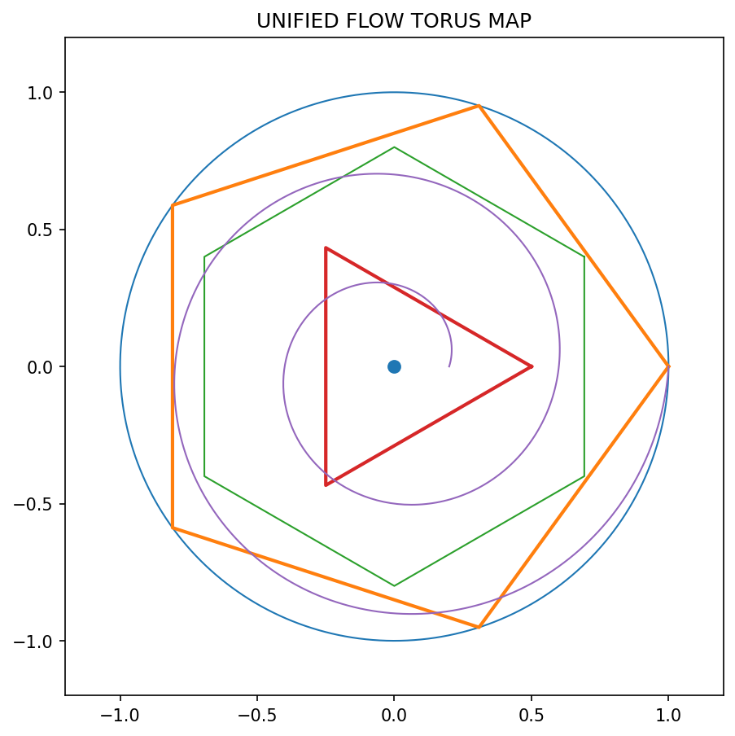

Toroidal view of modular flow organization.

---

## Spectral Flow Projection

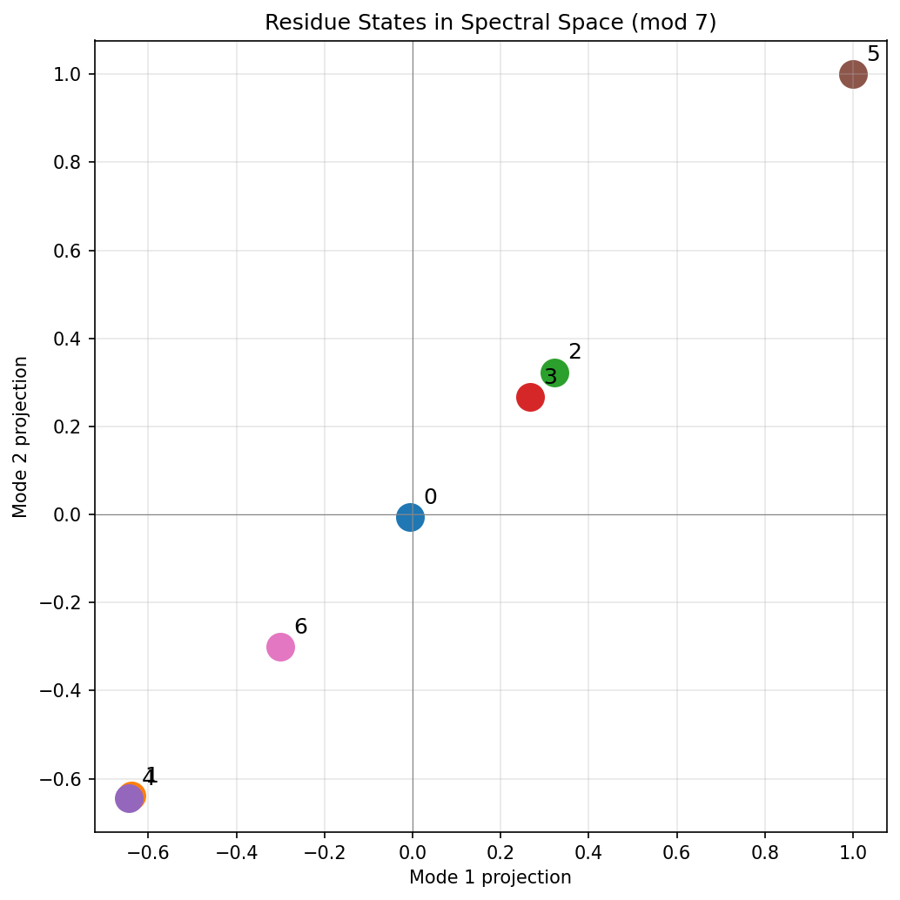

Spectral projection of modular transition structure.

---

## Topology Signature Scan

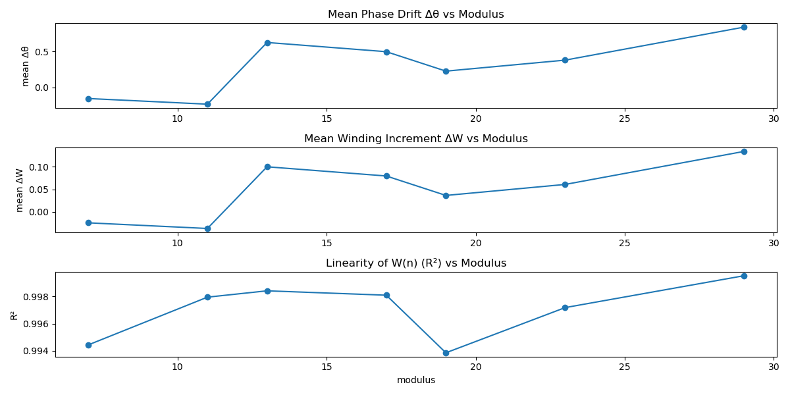

Scan for persistent structural signatures across modular systems.

---

## Mod7 Transition Flow


Animated modular transition flow.

---

## Vortex Field Detection

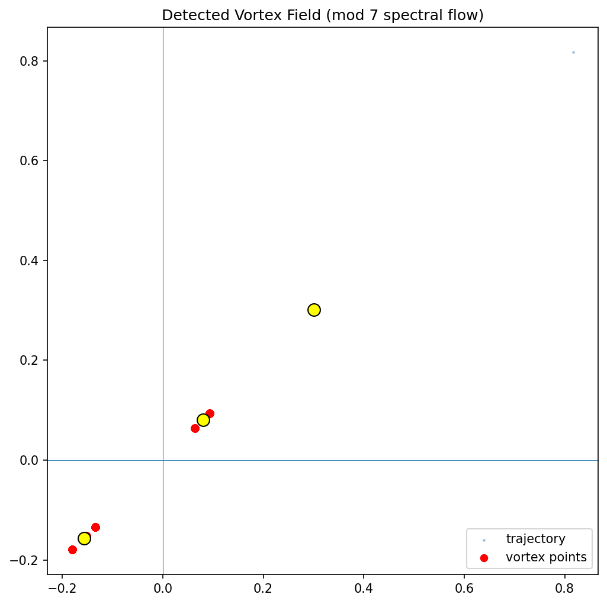

Localized rotational structures in modular state space.

---

# 🎯 6. Control & Navigation Geometry

NEXAH is not only descriptive.

It also explores how systems may be influenced through:

- gate intervention
- target reachability
- transition steering
- phase-aware control
- minimal intervention

---

## Control vs Phase Geometry

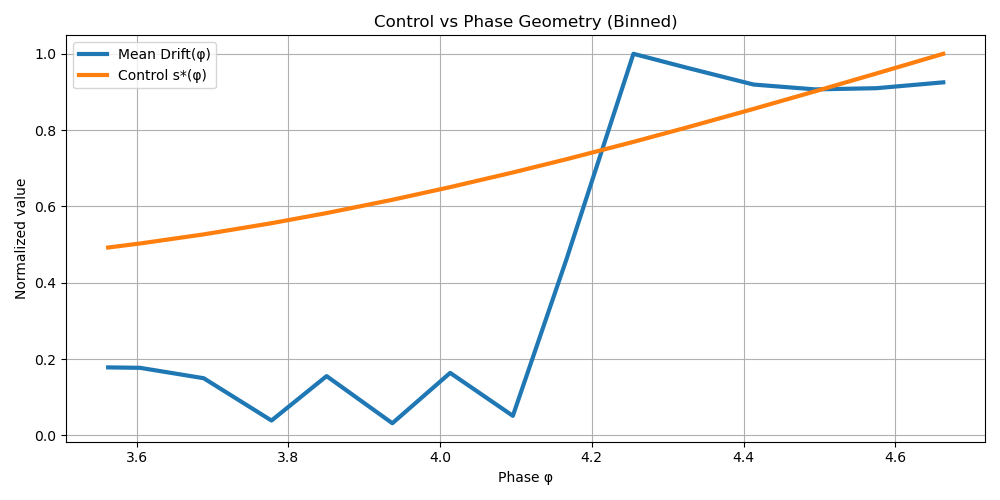

Comparison of control behavior under different phase geometries.

---

## Control Comparison V4


Shows how aligned, inverted, damped, and inverse control modes affect drift and transition events.

---

## Gate Transition Comparison


Controlled vs uncontrolled transition structure.

---

## Gate Region


Localized transition region used for intervention.

---

## Target Reach


Target-reaching behavior under gate-based control.

---

## Minimal Intervention


Low-strength intervention scan across transition regions.

---

# 🌍 7. Cross-System Structural Invariance

NEXAH tests whether transition structures persist across qualitatively different systems.

Current systems include:

- Lorenz
- Rössler
- Duffing
- Kuramoto
- Halvorsen in research phase layers

---

## Cross-System Transition Matrices


Transition matrices from multiple dynamical systems.

---

## Cross-System Distance Matrix


Pairwise transition-structure distances between systems.

---

## Lorenz Transition Field


Continuous transition field extracted from Lorenz dynamics.

---

## Rössler Transition Matrix


Transition structure in the Rössler system.

---

## Duffing Transition Matrix

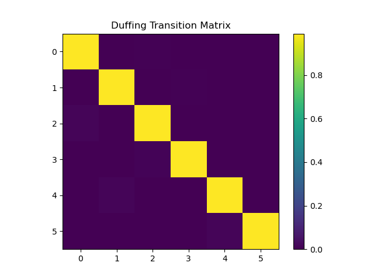

Transition structure in the Duffing system.

---

# 🔬 8. Validation Layer

The validation layer contains the empirical backbone of NEXAH.

It includes:

- multi-run validation
- noise robustness
- transition matrix stability
- partition invariance
- DBSCAN geometry checks
- cross-system validation
- phase and mismatch analysis
- control causality experiments

---

## Validation Summary


A compressed visual overview of the validation stack.

---

## Transition Sensitivity Map


Sensitivity structure of transition probabilities.

---

## Multi-Partition Transition Matrices


Transition matrices under different partition methods.

---

## DBSCAN Partition Sweep


Analysis of clustering limits and continuous geometry.

---

## Noise Comparison


Noise robustness in the Rössler system.

---

# 🧪 9. Demonstrator & Core System Visuals

These visuals come from the executable and demonstrator-facing side of NEXAH.

They are useful for explaining the framework quickly.

---

## Surface Mesh

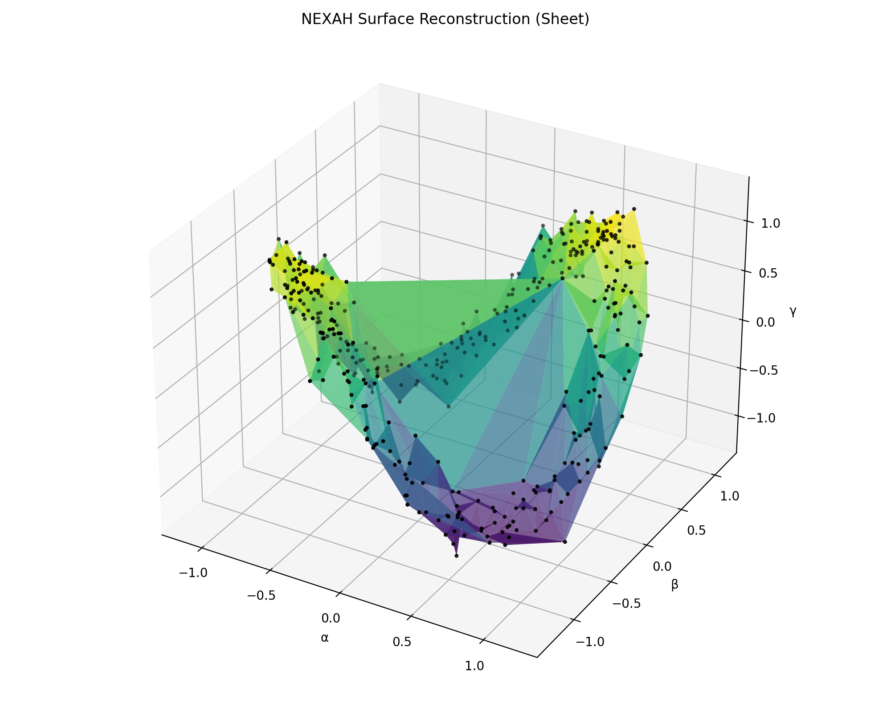

Field reconstruction as surface geometry.

---

## Surface Sheet

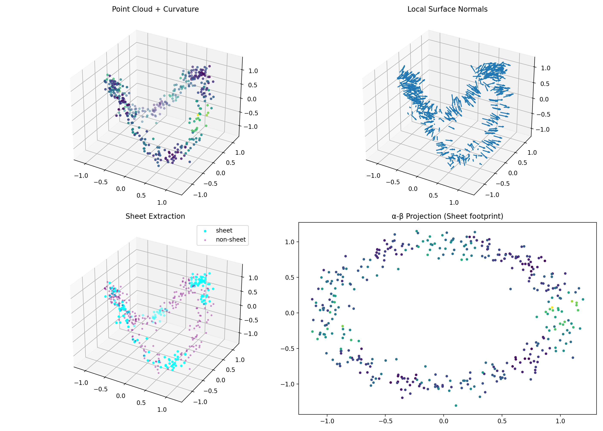

Sheet-like structure emerging from field representation.

---

## Lorenz Transitions


Transition structure in Lorenz dynamics.

---

## Cross-System Noise Robustness


Robustness comparison across systems.

---

## Noise Stress Test


Stress-test visualization of structural persistence under perturbation.

---

# 🧠 Core Observation

Across these visuals, one recurring pattern appears:

```text
systems do not only evolve in time

they move through structured fields
where transitions, stability, and instability
have geometric organization
```

---

# ⚠️ Scope Clarification

This gallery presents visual evidence from an active research framework.

NEXAH currently is:

```text
✔ exploratory
✔ computational
✔ empirical
✔ reproducible in selected modules
✔ supported by validation experiments
```

NEXAH is not yet:

```text
❌ a finalized scientific theory
❌ a production-ready control system
❌ a fully unified runtime kernel
❌ validated across all real-world domains
```

---

# 🧭 Final Orientation

NEXAH should currently be understood as:

> a structured research ecosystem for discovering transition geometry, field organization, and navigation behavior in dynamical systems.

---

Thomas K. R. Hofmann · NEXAH · 2026
