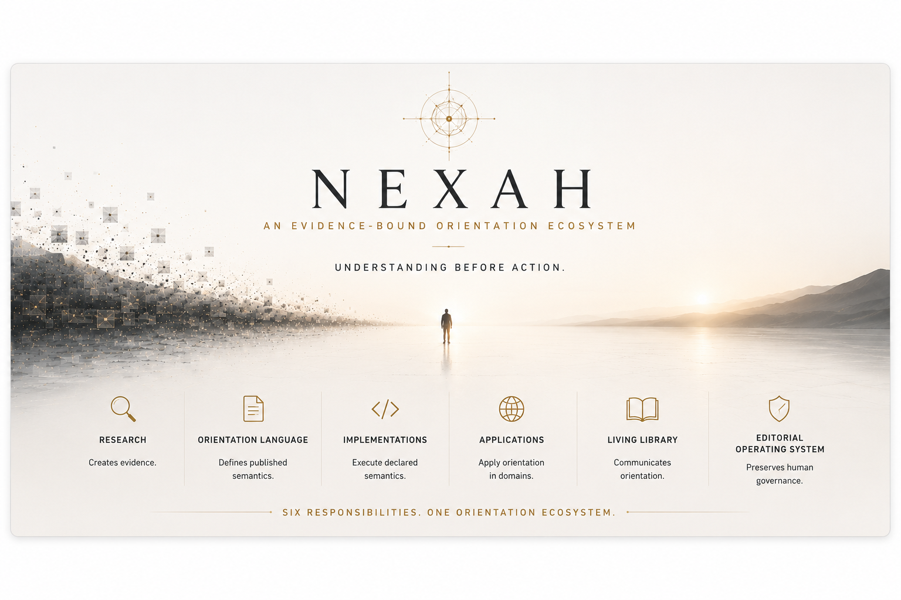

# NEXAH — Visual Index

This page is a quiet index to the visual collections maintained by the
subsystem that owns their meaning. A visual may explain, summarize, or invite
exploration; it does not establish evidence, conformance, or canonical status
by appearance alone.

## Repository orientation



- [Ecosystem responsibility map](assets/readme/nexah-orientation-ecosystem-front-door.png)
- [Detailed infrastructure view](assets/readme/nexah-infrastructure.png)
- [Architecture visual guide](ARCHITECTURE/visuals/README.md)

## Orientation Language

The canonical OLS visual belongs to the published language context:

- [Orientation Language Ecosystem — OLS 1.0](ORIENTATION_LANGUAGE/VISUALS/CANONICAL/orientation-language-ecosystem-ols-1.0.0.png)
- [Orientation Language visual status](ORIENTATION_LANGUAGE/VISUALS/README.md)

## Architecture and research models

- [What is NEXAH? — current repository snapshot](ARCHITECTURE/visuals/current/what-is-nexah-2026-07-16.png)
- [The Orientation Laboratory](ARCHITECTURE/visuals/current/orientation-laboratory.png)
- [Orientation Layer — concave-mirror research model](ARCHITECTURE/visuals/research-models/orientation-layer-concave-mirror.png)

Current-state visuals and research models are intentionally separated in the
[Architecture visual guide](ARCHITECTURE/visuals/README.md).

## Living Library and Editorial Operating System

- [Editorial Operating System](EDITORIAL_OPERATING_SYSTEM/README.md)
- [Editorial visual collection](EDITORIAL_OPERATING_SYSTEM/visuals/)
- [Editorial Explanation Layer](EDITORIAL_OPERATING_SYSTEM/visuals/architecture/editorial_explanation_layer.png)
- [Living Library architecture](EDITORIAL_OPERATING_SYSTEM/visuals/architecture/living_library.png)

Vision images remain in their explicitly marked `vision/` directory and do not
describe implemented capability.

## Constitution review

- [The Wonder Operator — Constitution companion plate](GOVERNANCE/visuals/nexah-constitution-wonder-operator-companion-plate-v1.png)
- [Constitution Review 01](GOVERNANCE/constitution_review_01/README.md)

The companion plate is informative and non-normative. “The Wonder Operator” is
a human disposition, not a canonical Operator or architectural component.

## Research evidence

Research figures remain with their methods, validation records, and claim
boundaries:

- [Research Portal](RESEARCH/README.md)
- [Research Figures](RESEARCH/FIGURES/README.md)
- [Validation Portal](RESEARCH/VALIDATION/README.md)
- [Selected generated outputs](outputs/README.md)

## Reading rule

```text
visual coherence ≠ equal evidence
proximity ≠ identity
sequence ≠ causality
recurrence ≠ universality
```

For current capability and limitations, use
[System State](ARCHITECTURE/SYSTEM_STATE.md), not a visual alone.
