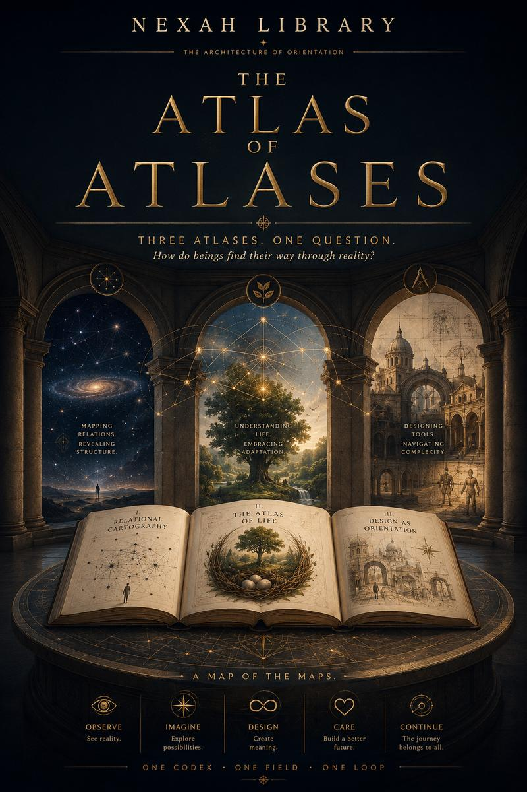

# THE ATLAS OF ATLASES

**The visual entrance hall of the NEXAH Library.**

[](https://www.are.na/block/47625553)

THE ATLAS OF ATLASES is the official visual onboarding guide for the NEXAH
Library. It introduces the Library's architecture before readers encounter its
individual atlas fields, Works, or research volumes.

> A map represents a world.  
> An atlas reveals relations between worlds.  
> A library reveals relations between atlases.

## Why it exists

The NEXAH Library contains many forms and scales of orientation. A title list
can inventory those Works, but it cannot teach a reader how to move among them.
This volume provides that missing entrance: recurring motifs, an atlas grammar,
an architecture map, six bounded fields, explicit transitions, and a Library
appendix.

It is a visual architecture book, not an image gallery. Every page has a place
in a declared reading sequence.

## Relationship to the six atlas fields

The entrance hall prepares six complementary fields:

1. **[Human Orientation Field](volumes/01-human-orientation-field.md)**
2. **[Microscopic Orientation Field](volumes/02-microscopic-orientation-field.md)**
3. **[Cosmic Orientation Field](volumes/03-cosmic-orientation-field.md)**
4. **[Mathematical Orientation Field](volumes/04-mathematical-orientation-field.md)**
5. **[Cultural Orientation Field](volumes/05-cultural-orientation-field.md)**
6. **[Cognitive Orientation Field](volumes/06-cognitive-orientation-field.md)**

The six fields are coordinated perspectives. Their inclusion here does not
collapse their domains, evidence, or meanings into one theory.

## How to read

Use the **[canonical sequence](index.md)** from beginning to end on a first
visit. Each field page links back here and forward to the next field. Returning
readers may enter any field directly.

```text
Entrance Hall
→ Human
→ Microscopic
→ Cosmic
→ Mathematical
→ Cultural
→ Cognitive
→ Library Appendix
```

The public Are.na channel currently contains 72 visual source pages. The
declared onboarding route uses 59 of them. Thirteen alternate, historical, or
supporting pages remain preserved under **[Source supplements](index.md#source-supplements)**
without interrupting the canonical route.

Here, *canonical* means the human-approved reading order for this documentation
volume. It does not create OLS semantic authority, scientific truth, or new
Registry identity.

## Continue afterwards

After the Appendix, continue to the **[NEXAH Library](../../../LIBRARY/README.md)**,
the **[Website Catalog](../../../LIBRARY/catalog/README.md)**, or the
**[public Are.na Library](https://www.are.na/nexah-scarabaeus1031/channels)**.

## Identity and source

- Canonical Library identity: `NX-000009`
- Edition: `NX-000009-E01`
- Public source: [THE ATLAS OF ATLASES on Are.na](https://www.are.na/nexah-scarabaeus1031/the-atlas-of-atlases)
- Local source and checksum record: **[Asset manifest](assets/source_manifest.yaml)**

Are.na remains authoritative for the visual source. The repository copies are
stable presentation assets for documentation and review.
