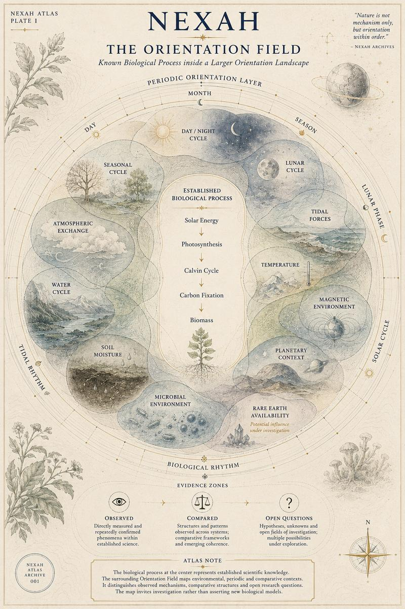
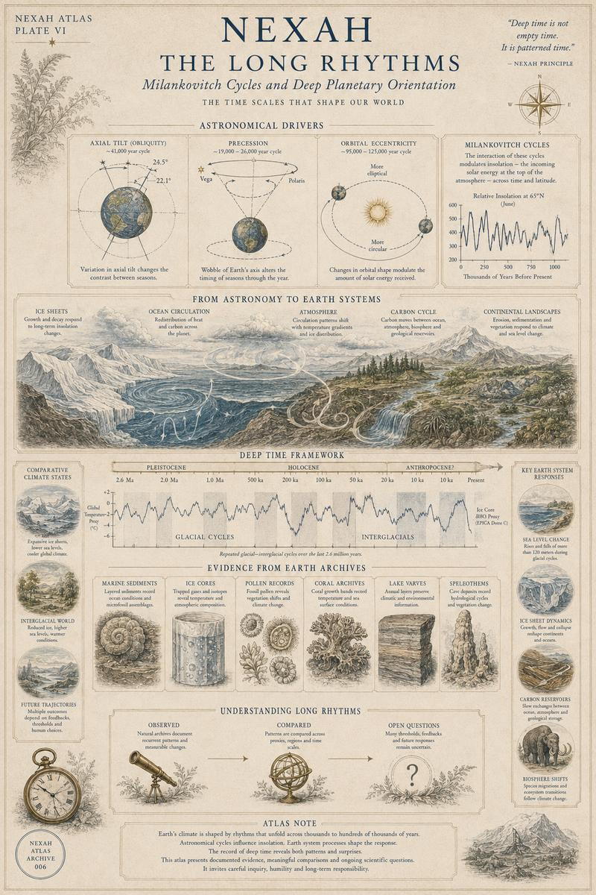
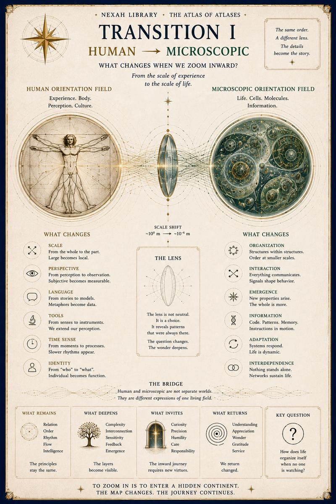

# I — Human Orientation Field

[← Atlas of Atlases](../README.md) · [Canonical index](../index.md) · [Volume II →](02-microscopic-orientation-field.md)

## Plate I

## Plate II

## Plate III

## Plate IV

## Plate V

## Plate VI

## Transition I

[← Atlas of Atlases](../README.md) · [Continue to Volume II →](02-microscopic-orientation-field.md)
