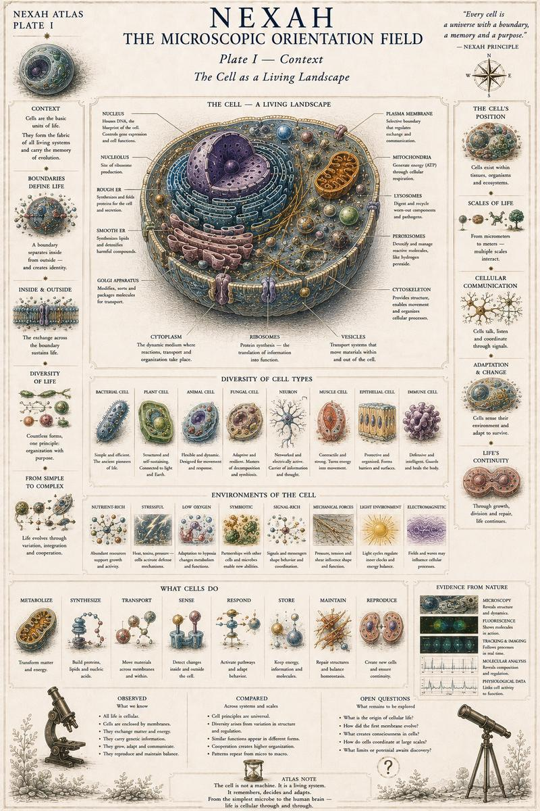
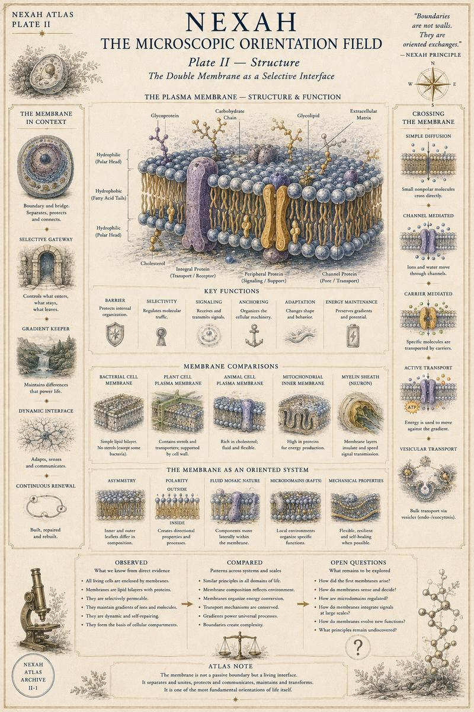
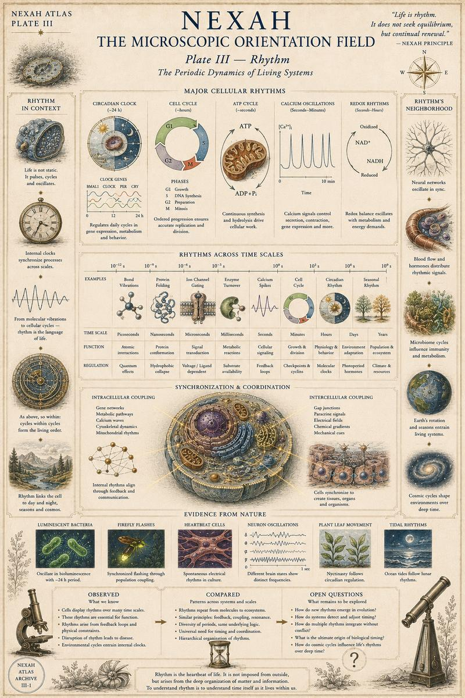
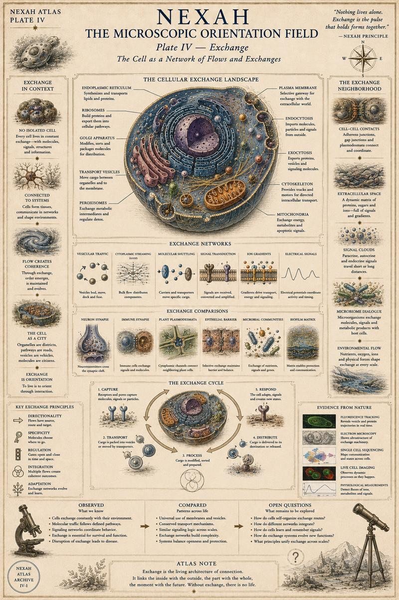
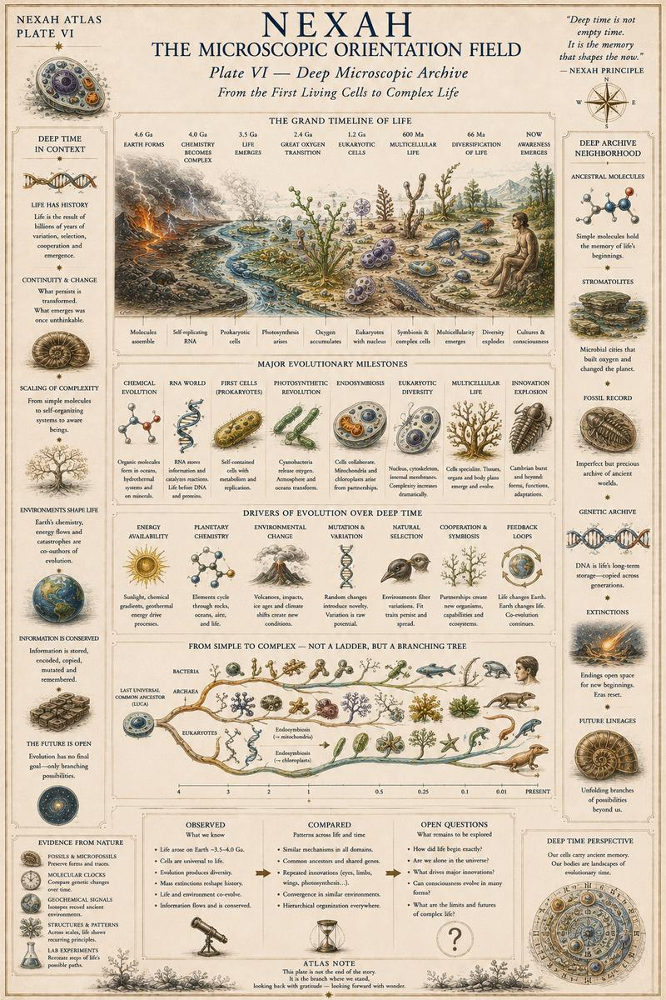
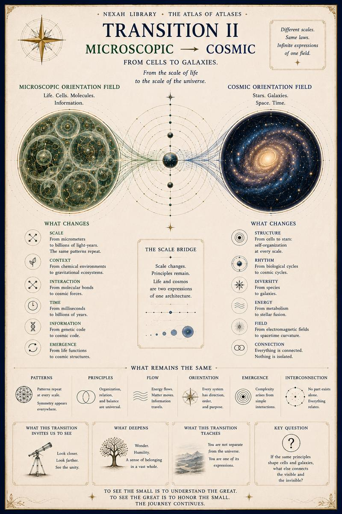

# II — Microscopic Orientation Field

[← Volume I](01-human-orientation-field.md) · [↑ Atlas of Atlases](../README.md) · [Volume III →](03-cosmic-orientation-field.md)

## Plate I

## Plate II

## Plate III

## Plate IV

## Plate V

## Plate VI

## Transition II

[← Volume I](01-human-orientation-field.md) · [↑ Atlas of Atlases](../README.md) · [Continue to Volume III →](03-cosmic-orientation-field.md)
