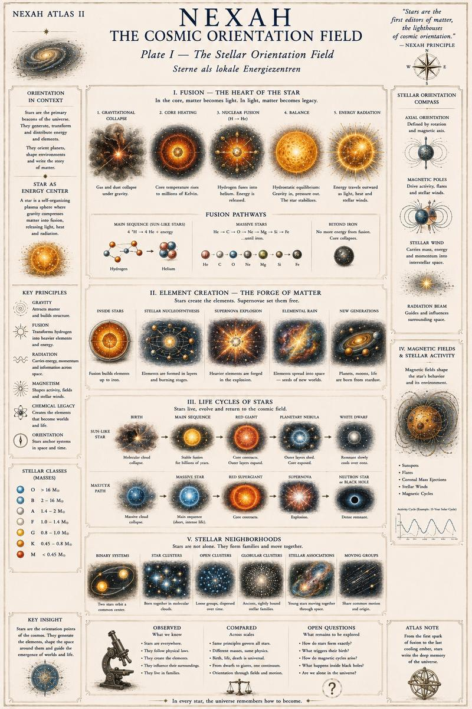
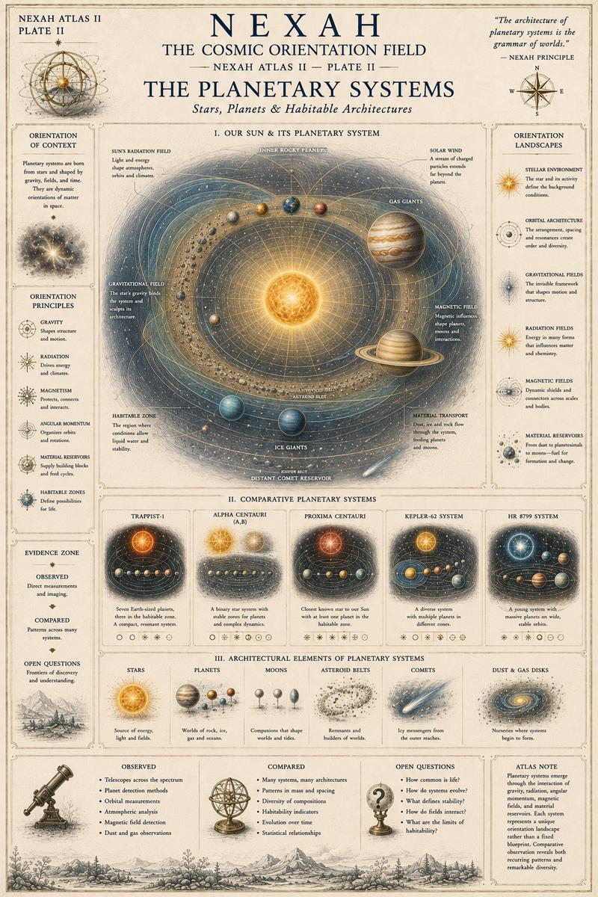
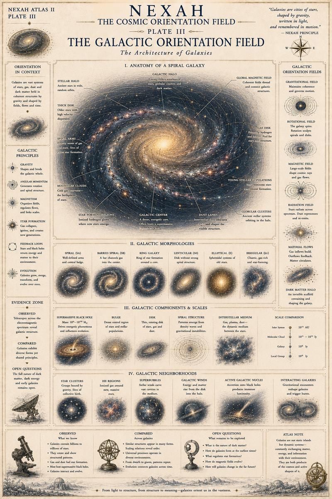
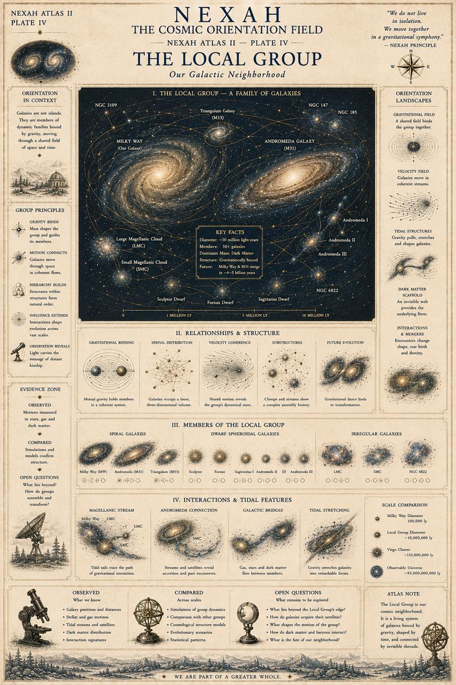
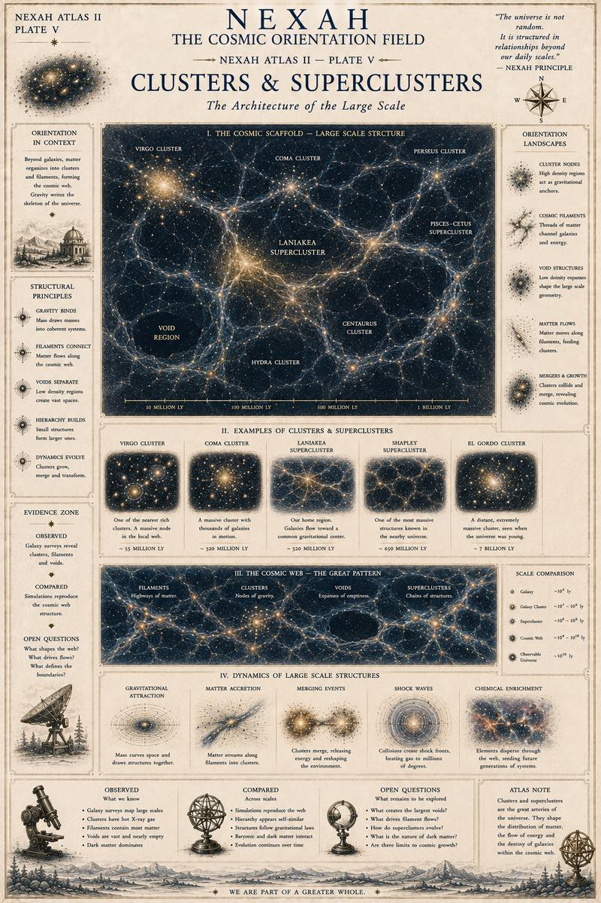
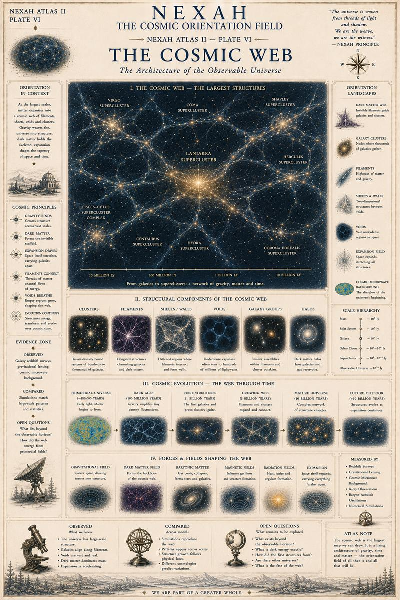
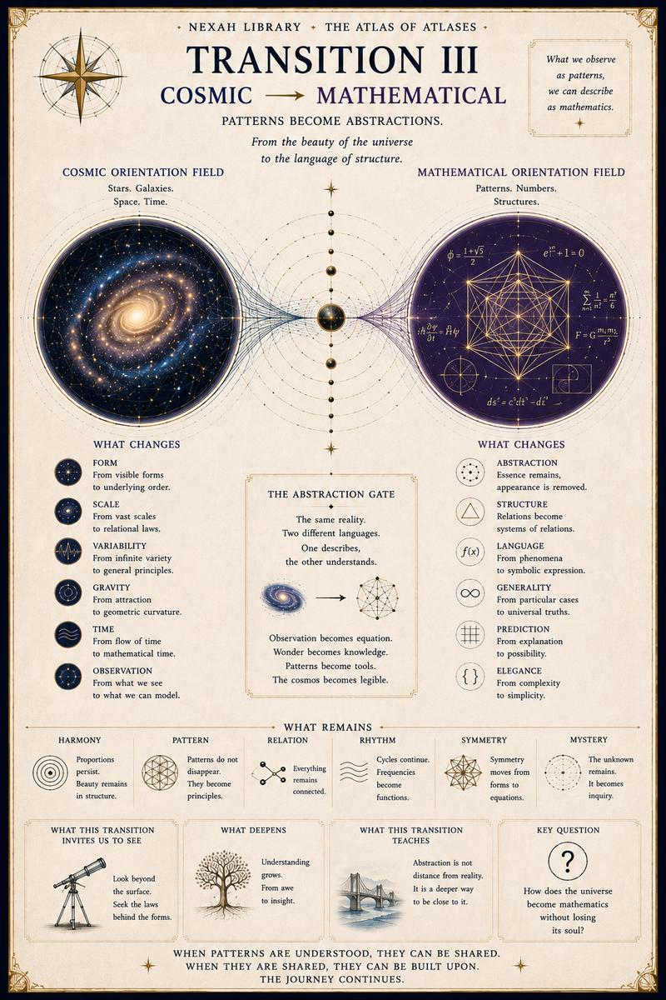

# III — Cosmic Orientation Field

[← Volume II](02-microscopic-orientation-field.md) · [↑ Atlas of Atlases](../README.md) · [Volume IV →](04-mathematical-orientation-field.md)

## Plate I

## Plate II

## Plate III

## Plate IV

## Plate V

## Plate VI

## Transition III

[← Volume II](02-microscopic-orientation-field.md) · [↑ Atlas of Atlases](../README.md) · [Continue to Volume IV →](04-mathematical-orientation-field.md)
