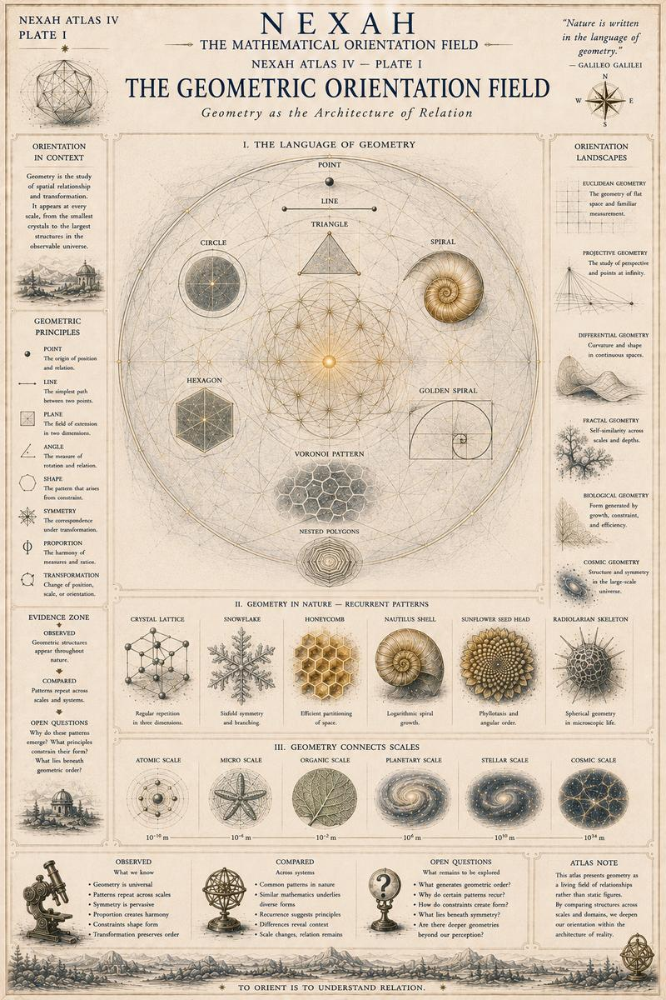
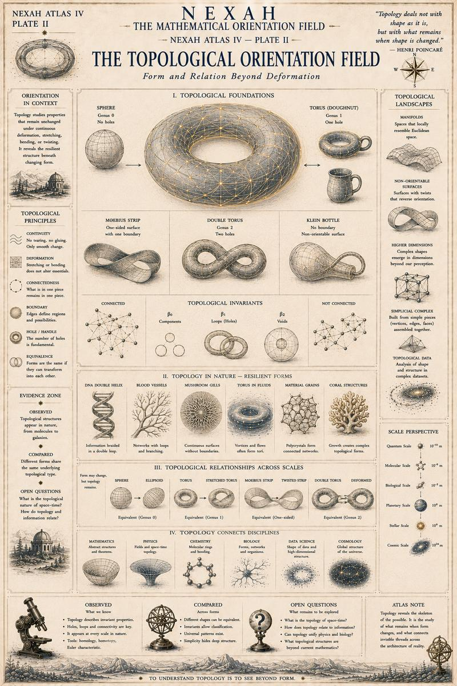
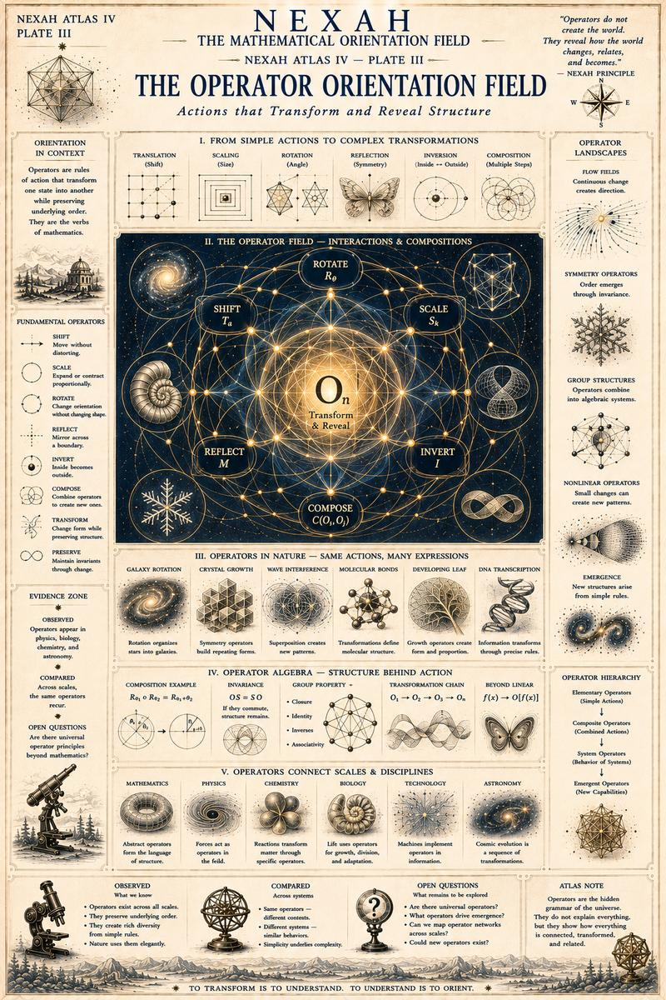
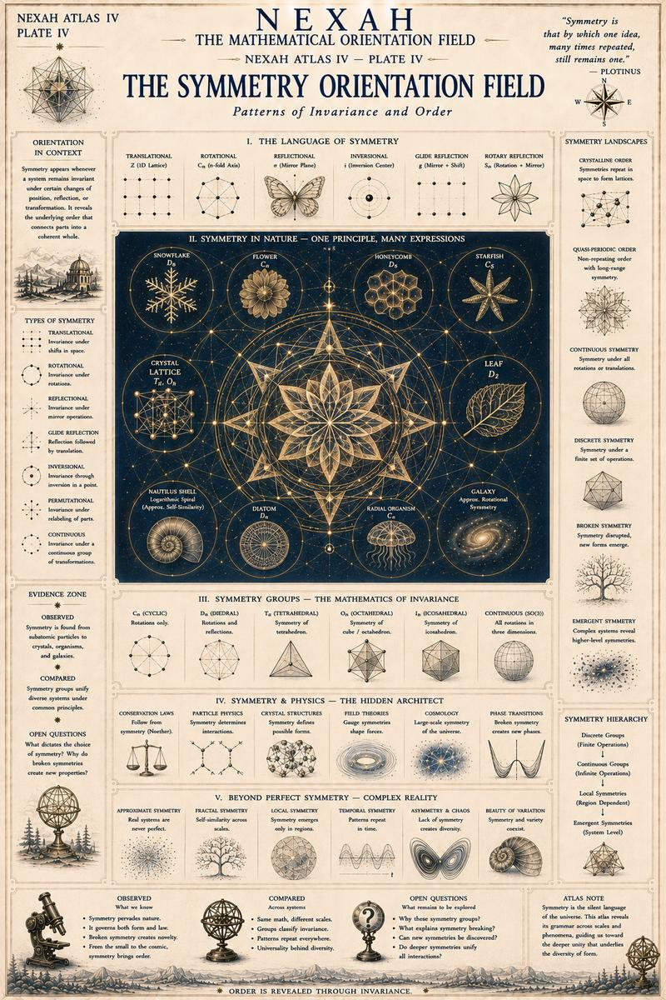
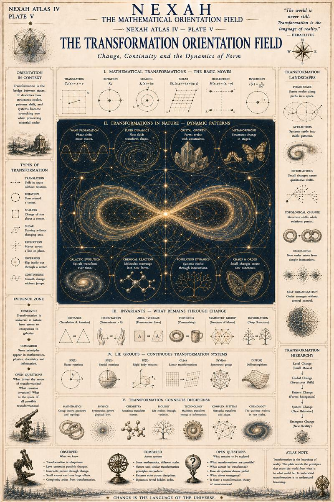
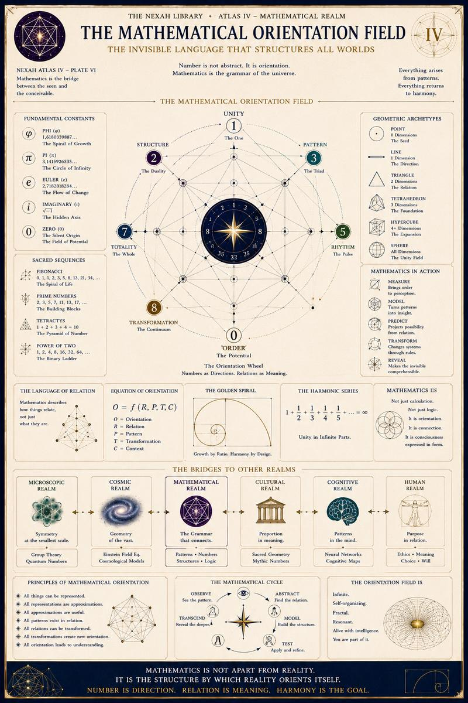
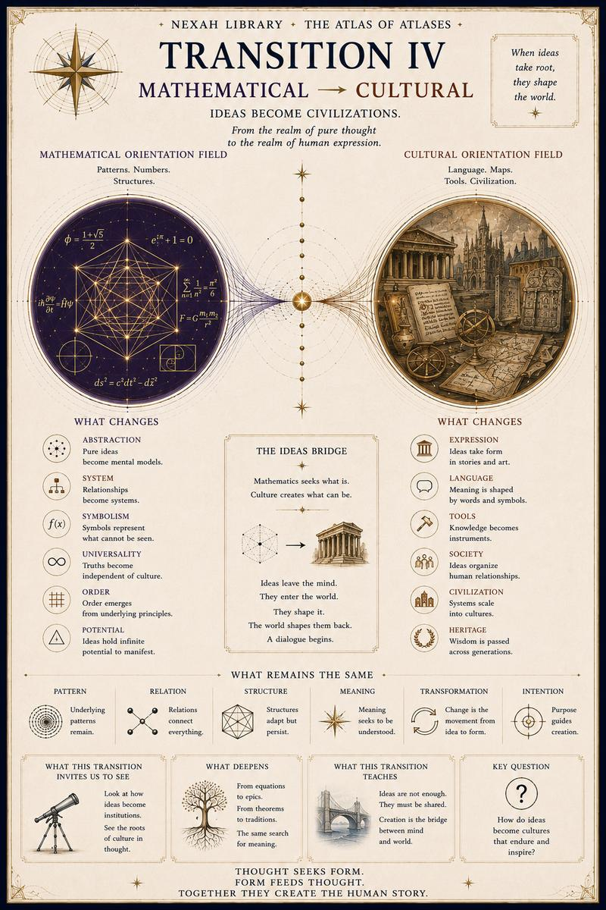

# IV — Mathematical Orientation Field

[← Volume III](03-cosmic-orientation-field.md) · [↑ Atlas of Atlases](../README.md) · [Volume V →](05-cultural-orientation-field.md)

## Plate I

## Plate II

## Plate III

## Plate IV

## Plate V

## Plate VI

## Transition IV

[← Volume III](03-cosmic-orientation-field.md) · [↑ Atlas of Atlases](../README.md) · [Continue to Volume V →](05-cultural-orientation-field.md)
