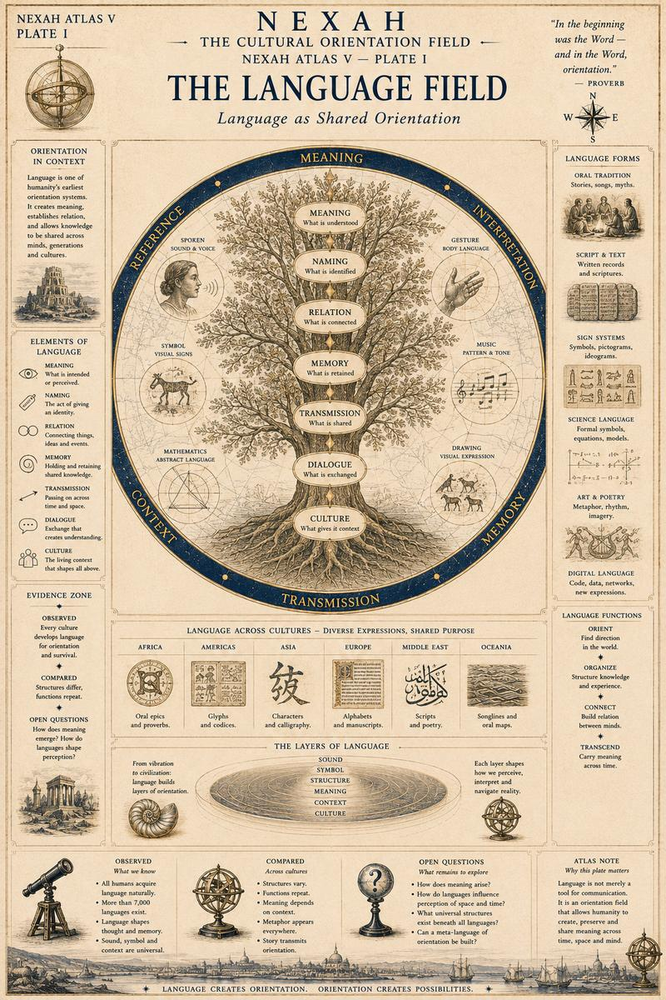
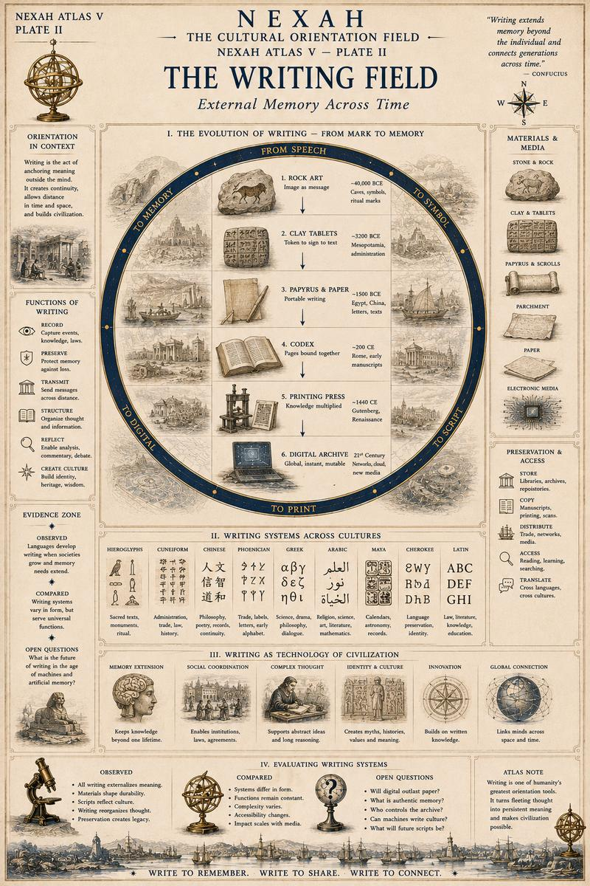
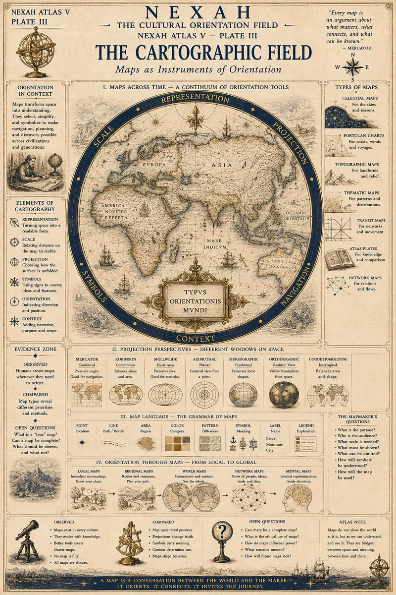
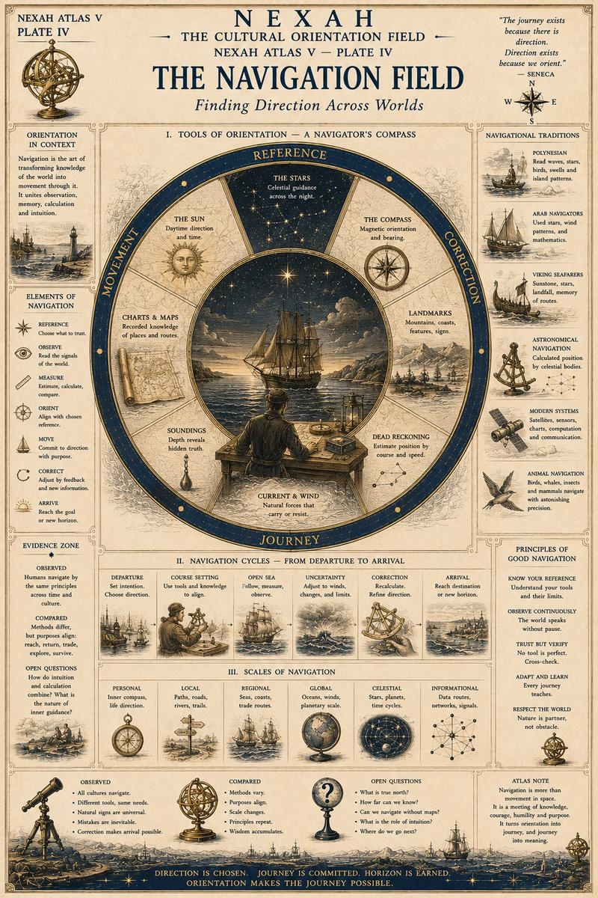
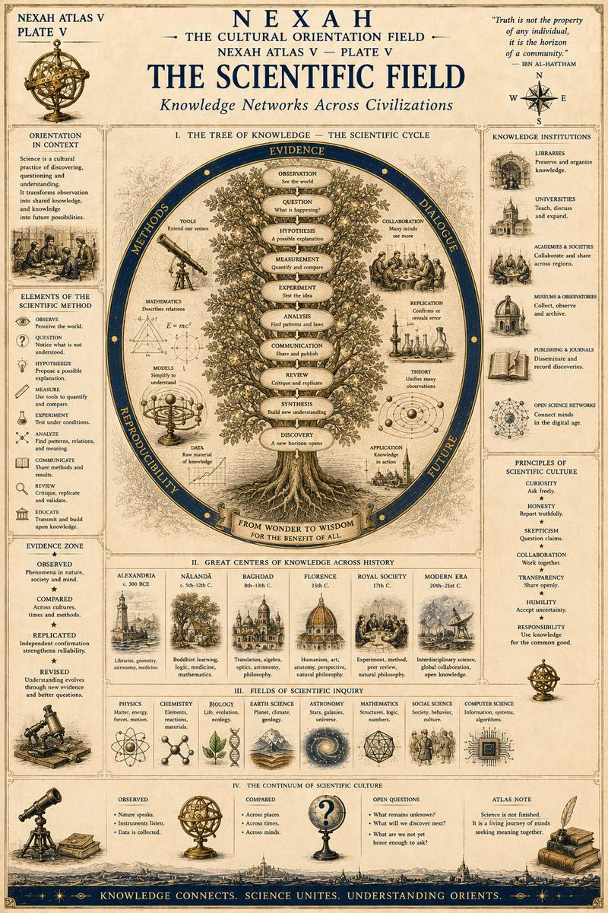
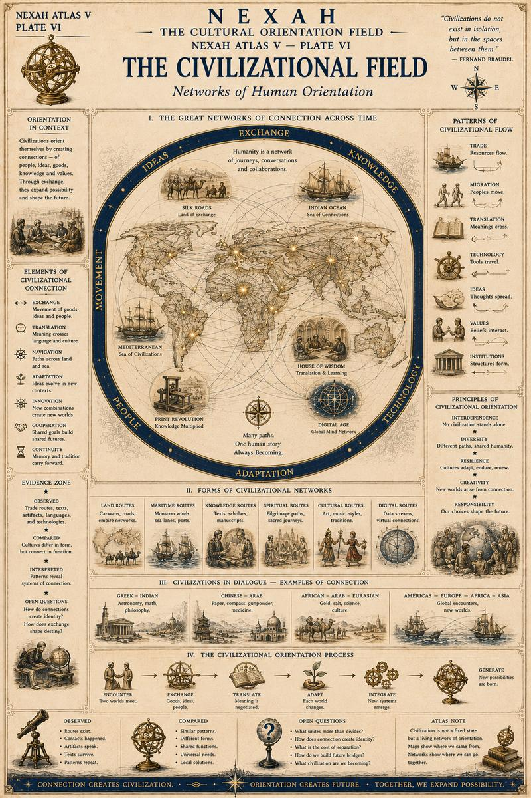
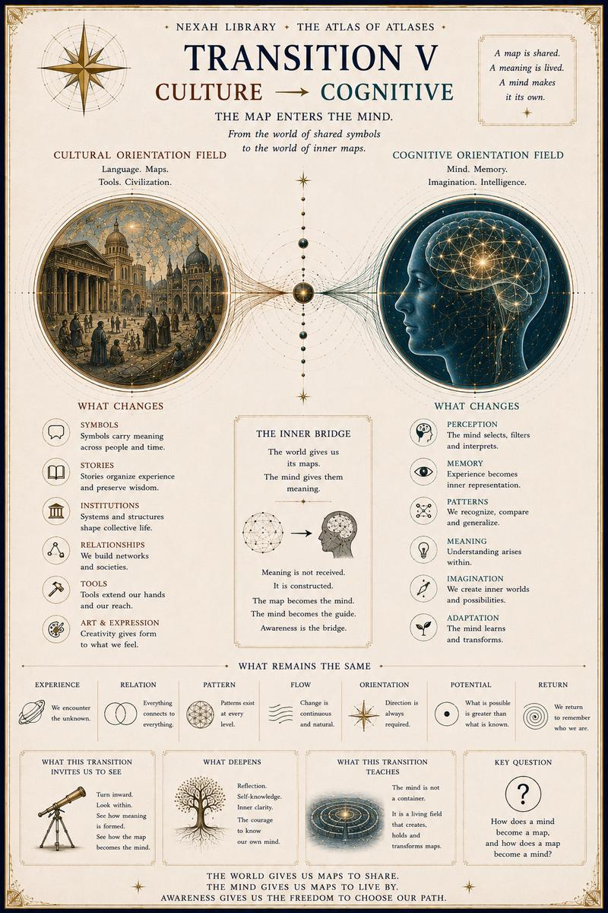

# V — Cultural Orientation Field

[← Volume IV](04-mathematical-orientation-field.md) · [↑ Atlas of Atlases](../README.md) · [Volume VI →](06-cognitive-orientation-field.md)

The public source positions currently place Plates III–VI out of numerical
order. This documentation page follows the declared editorial plate order.

## Plate I

## Plate II

## Plate III

## Plate IV

## Plate V

## Plate VI

## Transition V

[← Volume IV](04-mathematical-orientation-field.md) · [↑ Atlas of Atlases](../README.md) · [Continue to Volume VI →](06-cognitive-orientation-field.md)
