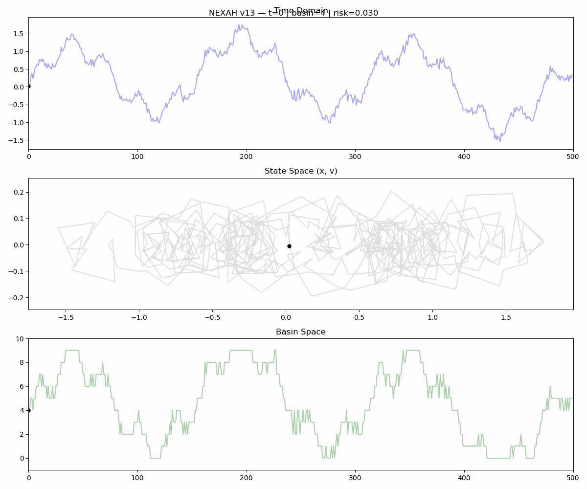
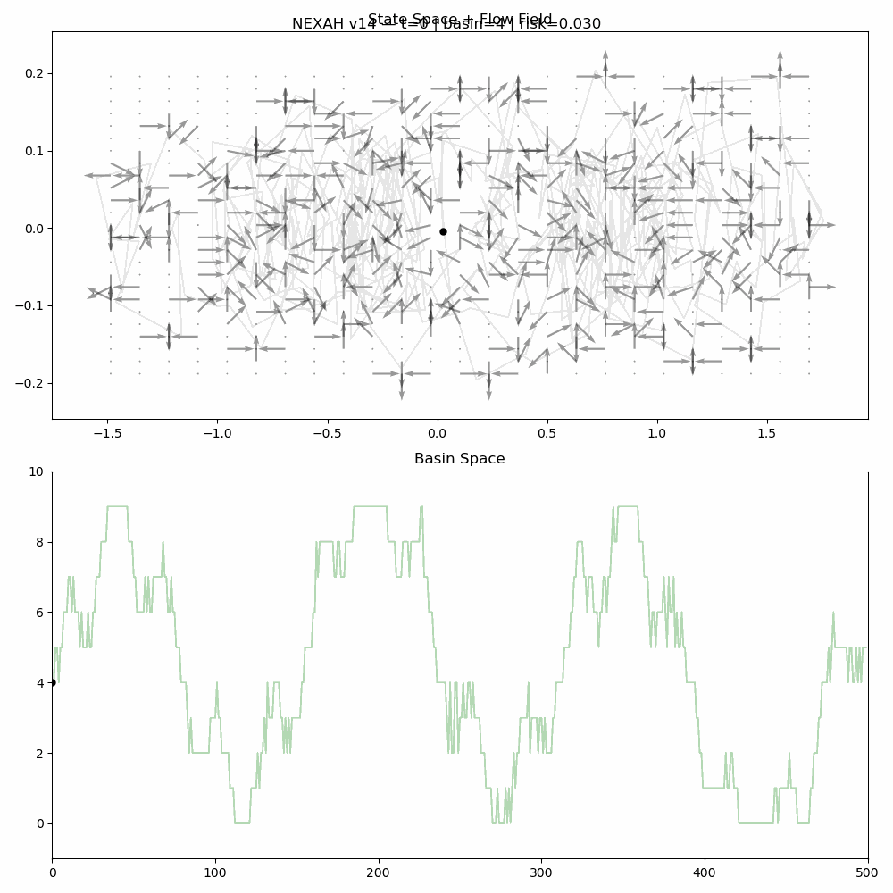
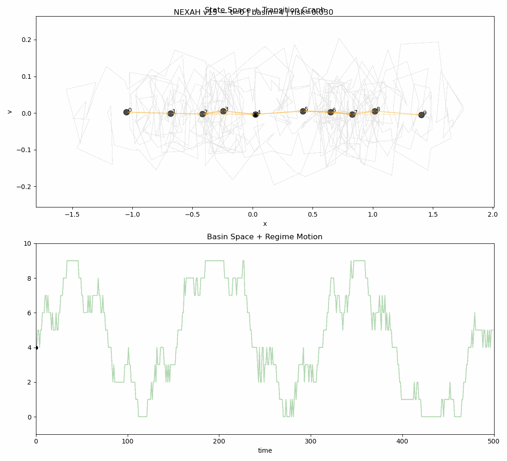
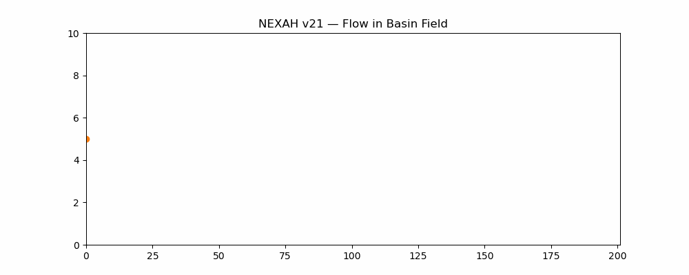

# 🧭 NEXAH — Navigating Dynamical Systems

NEXAH explores a simple but powerful idea:

```text
Can we understand and navigate complex systems
by using their own internal structure?
```

---

# 🧠 What NEXAH does

NEXAH transforms raw system dynamics into:

```text
signal → structure → transitions → motion → field
```

This allows us to:

- detect structural transitions  
- extract hidden movement patterns  
- reconstruct system dynamics  
- simulate motion inside learned structure  

---

# 🔥 Core Insight

```text
Systems do not move randomly.

They move through structured transition channels.
```

---

# 📍 Visual Evidence

These are not illustrations.

They are:

```text
direct observations of motion inside the learned field
```

---

## 🌀 Flow (Time + Basin Dynamics)



---

## 🧭 Field Dynamics



---

## 🔗 Transition Graph Behavior



---

## 🧱 Basin Vector Field Simulation



---

# 🧠 What you are seeing

Across all visualizations:

- motion is structured  
- transitions are local  
- oscillations occur in channels  
- behavior is NOT random  

Most important:

```text
the system behaves as if it follows an internal flow field
```

---

# 🧱 System Structure

NEXAH currently consists of:

```text
Field Layer
→ Signal Layer
→ Basin Segmentation
→ Transition Graph
→ Direction Layer
→ Vector Field
→ Flow Simulation
```

---

# 🧭 What this means

We are not just analyzing systems.

We are:

```text
reconstructing how they move
```

---

# 🚀 Current State

✔ structure extraction works  
✔ transition graph discovered  
✔ motion field reconstructed  
✔ flow simulation working  

---

# ⚠️ What is missing

```text
Navigation
```

We can:

✔ observe  
✔ model  
✔ simulate  

But not yet:

```text
actively guide trajectories
```

---

# 🔥 Next Step

```text
Field Steering
```

→ move WITH the system  
→ not against it  

---

# 🧠 Core Principle

```text
NEXAH is not about controlling systems.

NEXAH is about moving through them correctly.
```

---

# 📂 Project Structure

```text
nexah/
├── field_layer/
├── navigation/
├── outputs/
└── app/
```

---

# ⚡ How to run

Example:

```bash
PYTHONPATH=. python nexah/navigation/flow_animation.py
```

---

# 🧭 Status

NEXAH is currently:

```text
a structure discovery and motion reconstruction system
```

---

# 🔥 Final Insight

```text
We started with signals.

We discovered transitions.

We learned motion.

Next:
we navigate.
```
