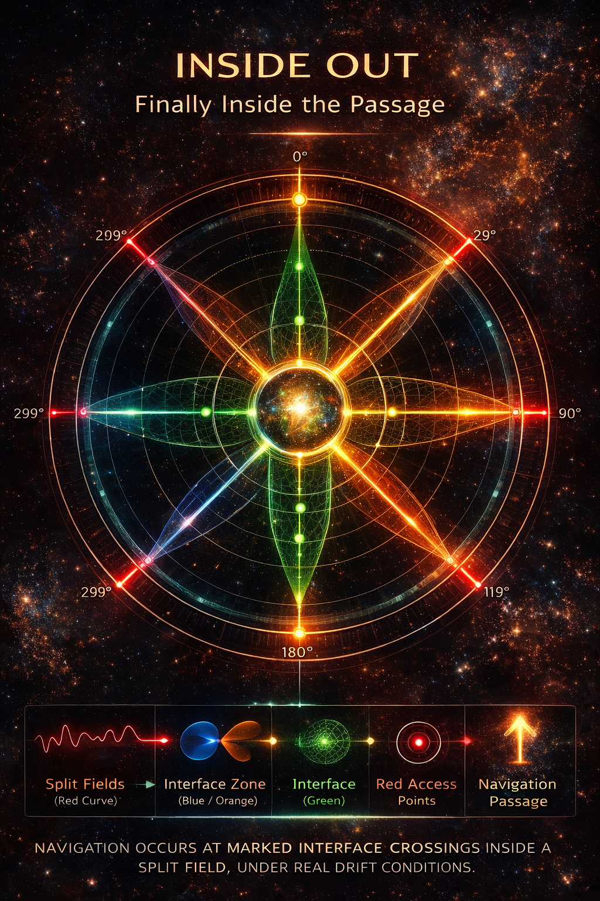

# NEXAH Layer

This directory is the **conceptual and lightweight package layer** of the NEXAH framework.

It does not replace the full `ENGINE/` or `FRAMEWORK/` directories.

Instead, it serves as a more focused layer where the central NEXAH ideas become readable as:

- package entry points
- field abstractions
- identity documents
- navigation primitives
- operational transition notes
- featured visuals

In that sense, `nexah/` is the place where the framework becomes more directly legible as **NEXAH itself**.

---

## What this directory is

The `nexah/` layer acts as a bridge between:

```text
ENGINE
    → computational core

FRAMEWORK
    → architecture and stack logic

NEXAH
    → conceptual, operational, and navigational layer
```

This means the directory has a double role:

1. it provides a lightweight public-facing package surface  
2. it gathers the emerging conceptual and operational language of NEXAH

---

## Position in the repository

Within the larger repository, this layer sits between:

- deep engine implementation
- formal framework architecture
- applied system modules
- the emerging navigation language

A useful reading is:

```text
simulation
    ↓
structure extraction
    ↓
field representation
    ↓
transition geometry
    ↓
navigation language
```

The `nexah/` directory primarily lives in the last three of these layers.

---

## Internal structure

The current `nexah/` directory contains four important components.

### 1. `engine.py`

This provides a minimal high-level access point to core structural functionality.

It exposes simplified entry points such as:

- finite posets
- lattice construction

This makes `nexah/` a lightweight package layer rather than only a documentation folder.

---

### 2. `field_layer/`

The `field_layer/` is the geometric core of the `nexah/` package layer.

It translates evolving system states into a more continuous structural representation.

This layer currently includes:

- field construction
- vector approximation from state sequences
- curvature estimation
- fragmentation metrics
- flow strength metrics

Its central idea is:

> systems are not only sequences of states —  
> they also generate local motion geometry.

The FIELD layer is therefore the bridge between:

- dynamics
- geometry
- navigation

See:

- [`field_layer/core/README.md`](./field_layer/core/README.md)

---

### 3. `identity/`

This folder contains the **identity documents** of NEXAH.

These documents clarify:

- what NEXAH is
- what it is not
- what its strongest current layers are
- how to distinguish core, emerging extensions, and proto structures

This is where the framework’s self-definition becomes explicit.

Current document:

- [`identity/NEXAH_IDENTITY.md`](./identity/NEXAH_IDENTITY.md)

---

### 4. `navigation/`

This folder contains the currently emerging **navigation language** of NEXAH.

These documents define the first explicit vocabulary for how movement through structured fields may be understood.

They currently include:

- navigation primitives
- Zither-Gate logic
- 3 plus 1 completion logic
- split-interface-marker logic

This is where the project begins to move from:

- geometry as description  
toward  
- geometry as passage

Current documents:

- [`navigation/NEXAH_NAVIGATION_PRIMITIVES.md`](./navigation/NEXAH_NAVIGATION_PRIMITIVES.md)
- [`navigation/NEXAH_ZITHER_GATE_MODEL.md`](./navigation/NEXAH_ZITHER_GATE_MODEL.md)
- [`navigation/NEXUS_3_PLUS_1_GATE_NOTE.md`](./navigation/NEXUS_3_PLUS_1_GATE_NOTE.md)
- [`navigation/SPLIT_INTERFACE_MARKERS_NOTE.md`](./navigation/SPLIT_INTERFACE_MARKERS_NOTE.md)

---

### 5. RATH / OLGO-JANUS Layer (neu 2026)

Die jüngste Erweiterung der Navigation-Sprache bildet die **RATH Phi-Lambda Resonance Bridge** mit OLGO-JANUS Six-Sector Gate, v-bands (Breathing Wave + Blinking Pulse) und der 432-440-444 Layer-Verwebung.

Siehe:
- `navigation/RATH_PHI_LAMBDA_RESONANCE_BRIDGE.md`
- `navigation/OLGO_JANUS_SIX_SECTOR_GATE.md`
- `navigation/V_BANDS_BREATHING_WAVE_BLINKING_PULSE.md`

---

### 6. `visuals/`

This folder contains the featured visual layer associated with the current NEXAH concepts.

These visuals are not only decorative.

They serve as:

- conceptual anchors
- navigation diagrams
- field illustrations
- gate and split references
- identity-layer highlights

The visual layer is especially important because much of NEXAH develops through the interaction of:

- computation
- geometry
- conceptual notation
- visual structure

A dedicated gallery should gradually curate the strongest visual pieces from this layer.

---

## Core idea of this directory

If `ENGINE/` is where NEXAH computes,  
and `FRAMEWORK/` is where NEXAH is architecturally described,

then `nexah/` is where NEXAH becomes:

- readable
- nameable
- geometric
- navigable

Its main purpose is to gather the emerging layer in which:

> structure becomes field,  
> field becomes geometry,  
> geometry becomes passage.

---

## Relationship to the NEXAH stack

A useful placement of this directory inside the stack is:

```text
META
    → relational structure

ARCHY
    → system and regime dynamics

FIELD
    → flow geometry

MESO
    → risk geometry

NEXAH
    → navigation language

MEVA
    → execution
```

The `nexah/` directory currently sits most strongly across:

- FIELD
- the transition into MESO
- the emerging NEXAH navigation layer

---

## Current maturity

At present, this directory contains a mixture of:

- lightweight implementation
- conceptual stabilization
- emerging navigation grammar
- visual language

This means it should be read as:

- partly operational
- partly conceptual
- actively evolving

It is not yet a closed subsystem, but it is already a highly meaningful layer of the repository.

---

## Why this matters

The existence of this directory reflects a broader shift inside the project.

NEXAH is no longer only:

- an engine
- a framework architecture
- a collection of experiments

It is also becoming a distinct language for describing:

- field structure
- transition logic
- coherence
- split geometry
- gate activation
- navigable passage

That is exactly what this layer is meant to hold.

---

## Suggested reading path

A useful reading order inside this directory is:

1. [`identity/NEXAH_IDENTITY.md`](./identity/NEXAH_IDENTITY.md)  
2. [`field_layer/core/README.md`](./field_layer/core/README.md)  
3. [`navigation/NEXAH_NAVIGATION_PRIMITIVES.md`](./navigation/NEXAH_NAVIGATION_PRIMITIVES.md)  
4. [`navigation/NEXAH_ZITHER_GATE_MODEL.md`](./navigation/NEXAH_ZITHER_GATE_MODEL.md)  
5. [`navigation/NEXUS_3_PLUS_1_GATE_NOTE.md`](./navigation/NEXUS_3_PLUS_1_GATE_NOTE.md)  
6. [`navigation/SPLIT_INTERFACE_MARKERS_NOTE.md`](./navigation/SPLIT_INTERFACE_MARKERS_NOTE.md)  

This path moves from:

```text
identity
    ↓
field
    ↓
navigation primitives
    ↓
gate logic
    ↓
split passage
```

---

## Visual teaser

One current teaser image for this layer is:



This image points toward the current transition from:

- split field logic
- interface marking
- gate activation
- passage geometry

A dedicated visual gallery is the natural next step for this layer.

---

## Summary

The `nexah/` directory is the place where the NEXAH framework becomes its own conceptual and operational layer.

It connects:

- lightweight package access
- field representation
- identity clarification
- navigation grammar
- visual synthesis

In short:

> `nexah/` is where NEXAH begins to speak in its own language.
