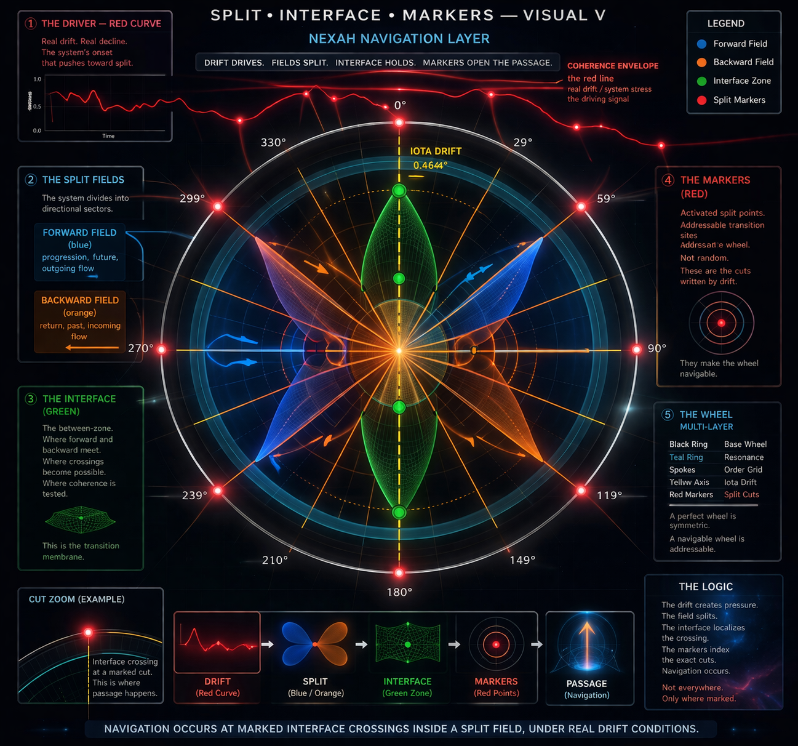
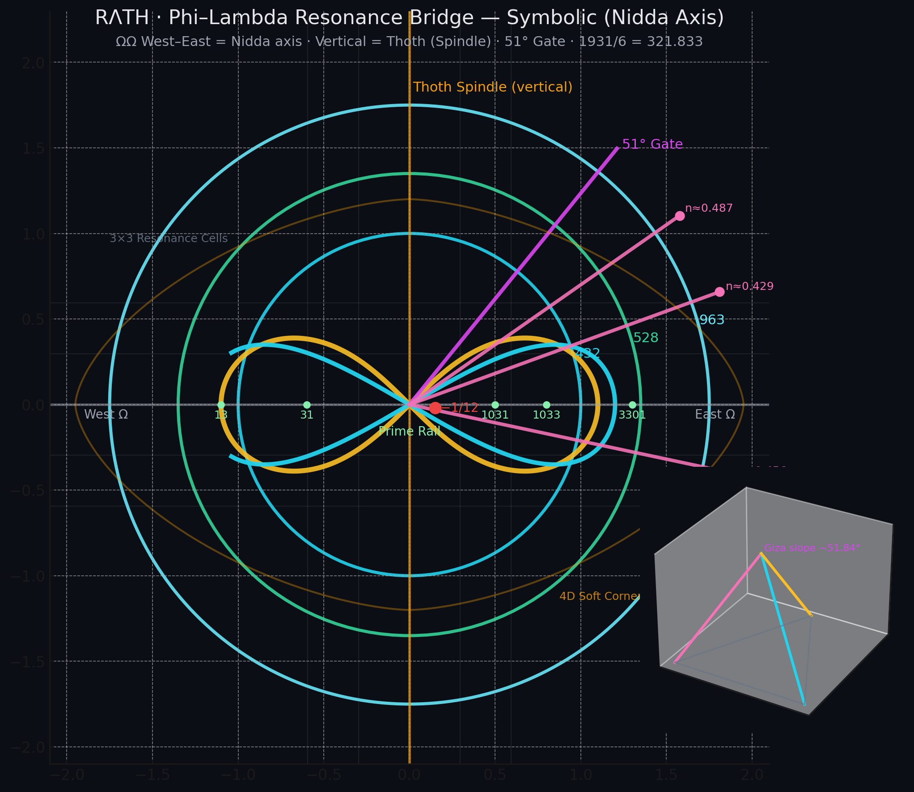
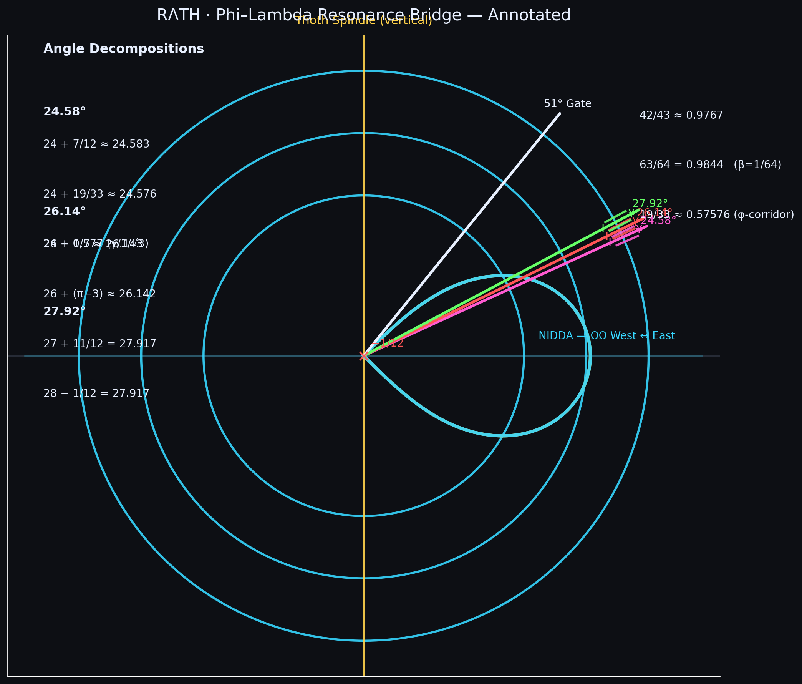
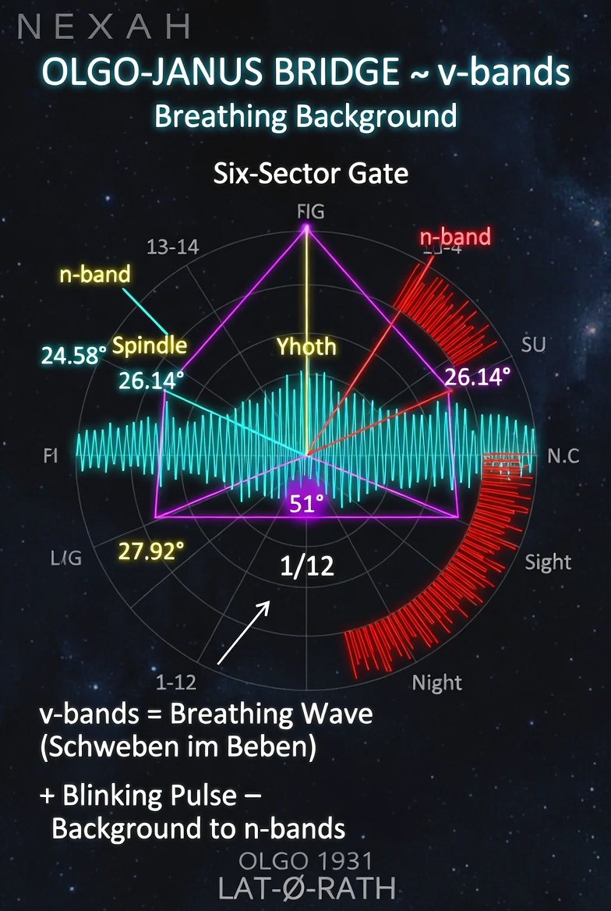
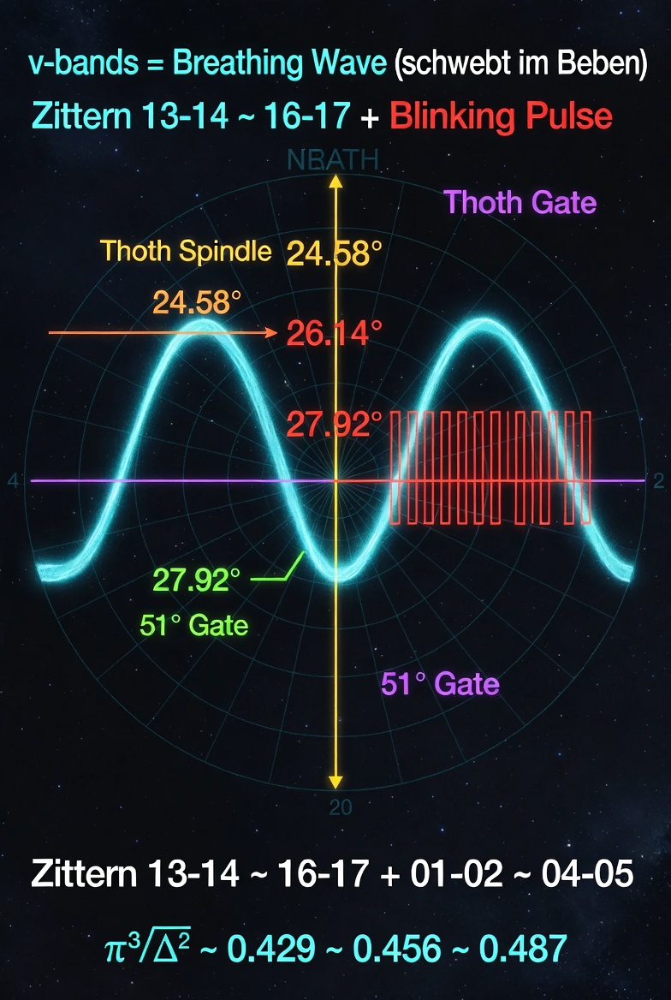
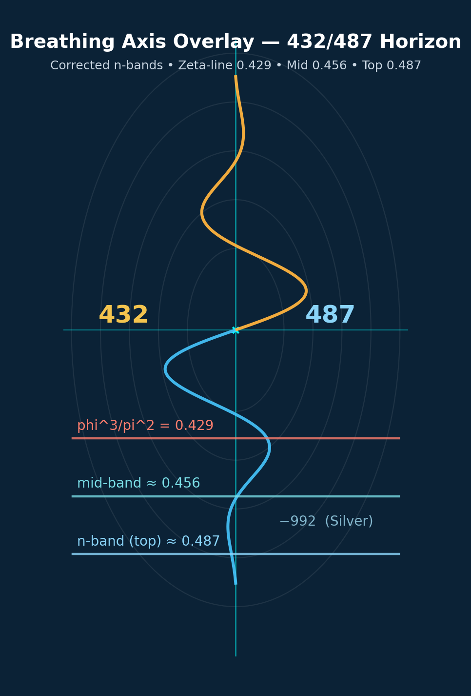

# NEXAH Visual Gallery

This gallery collects a first set of featured visuals from the `nexah/visuals/` layer.

These images are not included as decoration only.

They serve as visual anchors for the emerging NEXAH language of: 

- field structure
- transition geometry
- split logic
- interface zones
- gate activation
- navigable passage

The gallery is intentionally selective.

It highlights images that reflect the current conceptual and operational center of gravity of NEXAH.

---

## 1. Inside Out — Finally Inside the Passage


This visual represents one of the strongest recent insights in NEXAH:

> the transition is not only a line or a marker —  
> it has an interior.

The image combines:

- split fields
- interface structure
- red access points
- passage geometry
- a central inside-out reading of the transition space

It serves as a visual summary of the shift from:

- warning
- to passage
- from boundary
- to enterable geometry

---

## 2. Cosmic Visualization of the 3 Plus 1 Gate


This image presents the **3 plus 1 gate model** as an operational architecture.

Its main idea is:

- three carrier layers organize the code
- one additional term opens the gate

The visual corresponds to the internal NEXAH reading of:

- Prime Zither
- Triple-6 Zither
- Binary 4er Zither
- plus one completion / activation

It should be read together with:

- `navigation/NEXUS_3_PLUS_1_GATE_NOTE.md`
- `navigation/NEXAH_ZITHER_GATE_MODEL.md`

---

## 3. NEXAH Visual V — Markers


This image marks an important step in the formalization of the split logic.

It brings together:

- wheel geometry
- drift
- field split
- interface
- marker activation

The key claim behind this visual is:

> the system becomes navigable when the split is marked.

This image is one of the clearest expressions of the current NEXAH navigation layer.

---

## 4. Split Interface Markers — Visual V



This visual focuses more explicitly on the structural relation between:

- the red curve as driver
- blue and orange field sectors
- the green interface zone
- marked transition cuts

It should be understood as a diagram of **localized passage logic**.

Its conceptual summary is:

- drift drives
- the split separates direction
- the interface holds the crossing
- the markers make the passage addressable

It corresponds directly to:

- `navigation/SPLIT_INTERFACE_MARKERS_NOTE.md`

---

## 5. Exploring the NEXAH Framework


This visual acts as a broader framework teaser.

It belongs less to a single operational submodel and more to the overall emerging identity of NEXAH as a system that connects:

- structure
- field
- geometry
- navigation

This image is useful as a featured entry visual for the conceptual layer.

---

## 6. Navigating the NEXAH System


This image emphasizes the navigational reading of the framework.

It should be viewed as a transition image between:

- structure discovery
- field logic
- operational navigation

It is especially useful for presenting NEXAH not merely as analysis, but as an orientation system.

---

## 7. Exploring NEXAH’s Digital Universe


This visual captures the broader imaginative horizon of the project.

While more atmospheric than strictly technical, it still belongs in the gallery because it reflects an important aspect of NEXAH:

- the project develops not only through equations and code
- but also through visual synthesis and spatial intuition

This image therefore functions as a conceptual horizon image.

---
## 8. RATH Phi-Lambda Resonance Bridge — v3.3



This visual introduces the **RATH Phi-Lambda Resonance Bridge** as a central geometric construction.

It combines:

- Thoth Spindle (vertical axis)
- Scarab Wing as lemniscate form
- Three n-bands (24.58°, 26.14°, 27.92°)
- The 51° Gate
- West-Ω ↔ East-Ω axis (Nidda Axis)

The core idea is that the bridge is not a simple transition, but a resonant system of multiple angular bands that enables precise passage between different phases and frequencies.

---

## 9. RATH Phi-Lambda Bridge — Annotated



The annotated version makes the mathematical relationships explicit:

- Decompositions of the n-band angles (e.g. 24 + 7/12, 26 + 0/3/7, 27 + 11/12)
- Connection to φ³/π² ≈ 0.429 · 0.456 · 0.487
- Central 1/12 point
- Nidda Axis (West-East)

This image serves as the technical reference for the precise definition of the bridge.

---

## 10. OLGO-JANUS Six-Sector Gate



This visual introduces the **OLGO-JANUS Six-Sector Gate** — a six-sector extension of the previous gate logic.

It shows:

- Six symmetric sectors
- LAT-Φ-RATH Counter-Phase
- V-Axis (528 + 432 = 960)
- φ ≈ ±0.017 rad

The Six-Sector Gate forms the operational framework in which the v-bands act as dynamic background oscillation.

---

## 11. v-bands – Breathing Wave + Blinking Pulse



This image visualizes the **v-bands** as a living, oscillating background to the n-band structure:

- Cyan **Breathing Wave** — the slow, floating tremor between sectors 13-14 ↔ 16-17 and 1-2 ↔ 4-5
- Red **Blinking Pulse** — the sharp rectangular pulses on the same sectors

The v-bands represent the “floating in the trembling” and form the breathing substrate on which the precise n-bands operate.

---

## 12. Breathing Axis Overlay – 432/487 Horizon



This visual shows the vertical **Breathing Axis** between 432 and 487 with the corrected n-bands:

- Zeta-Line ≈ 0.429
- Mid-Band ≈ 0.456
- Top n-band ≈ 0.487

It directly connects the numerical layer (432-440-444) with the dynamic oscillation of the v-bands.

---

### Updated Reading Guide

A useful way to read the gallery is:

### Layer 1 — Identity and framework atmosphere
- Exploring the NEXAH Framework
- Navigating the NEXAH System
- Exploring NEXAH’s Digital Universe

### Layer 2 — Gate and activation logic
- Cosmic Visualization of 3 Plus 1 Gate

### Layer 3 — Split, interface, and passage
- NEXAH Visual V — Markers
- Split Interface Markers — Visual V
- Inside Out — Finally Inside the Passage

### Layer 4 — RATH / OLGO-JANUS & v-bands (April 2026)
- RATH Phi-Lambda Resonance Bridge
- OLGO-JANUS Six-Sector Gate
- v-bands Breathing Wave + Blinking Pulse
- Breathing Axis Overlay

This new layer expands navigation from static gate and split logic toward a **dynamic, breathing resonance geometry** with v-bands as background oscillation.


This sequence reflects the current internal movement of NEXAH:

```text
framework identity
    ↓
gate logic
    ↓
split and interface
    ↓
passage geometry
```
