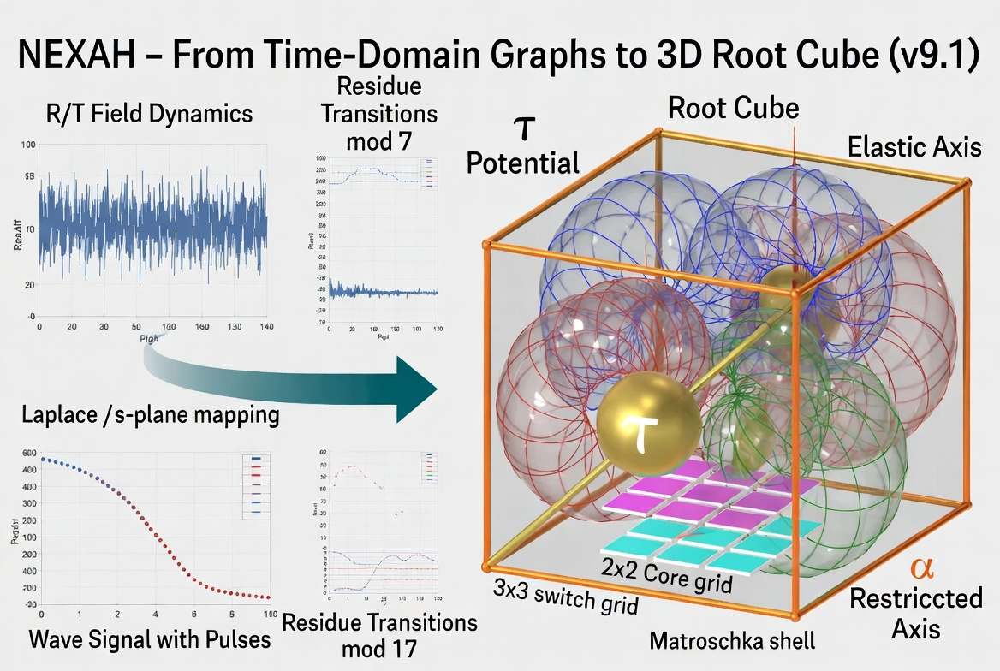

# NEXAH Visual Gallery

This gallery collects the most important featured visuals from the `nexah/visuals/` and `nexah/urf_axial_space/visuals/` layers.

These images are visual anchors for the emerging NEXAH language of:
- field structure
- transition geometry
- split logic
- interface zones
- gate activation
- resonance constructs
- navigable 3D passage (URF Axial Space + Root Bridge)

---

## 1. Inside Out — Finally Inside the Passage


---

## 2. Cosmic Visualization of the 3 Plus 1 Gate


---

## 3. NEXAH Visual V — Markers


---

## 4. Split Interface Markers — Visual V


---

## 5. Exploring the NEXAH Framework


---

## 6. Navigating the NEXAH System


---

## 7. Exploring NEXAH’s Digital Universe


---

## 8. RATH Phi-Lambda Resonance Bridge — v3.3


---

## 9. RATH Phi-Lambda Bridge — Annotated


---

## 10. OLGO-JANUS Six-Sector Gate


---

## 11. v-bands – Breathing Wave + Blinking Pulse


---

## 12. Breathing Axis Overlay – 432/487 Horizon


---

## 13. New 3D Geometric Reference Layer (v9.1)

### Root Cube (neutral core)


### URF Axial Space – White Cube


### URF Axial Space – Black Cube


### From Graphs to Root Cube (v9.1)



### Triple Spiral + Root Bridge Interaction


---

**NEXAH Visual Gallery**  
Structure becomes visible.  
Geometry becomes navigable.  
The Root Bridge makes it 3D.
---

## 9. RATH Phi-Lambda Bridge — Annotated


Mathematical relationships (Zeta-Line ≈ 0.429, Mid-Band ≈ 0.456, Top n-band ≈ 0.487).

---

## 10. OLGO-JANUS Six-Sector Gate


Six-sector symmetry with v-bands background.

---

## 11. v-bands – Breathing Wave + Blinking Pulse


The living, oscillating background of the navigation layer.

---

## 12. Breathing Axis Overlay – 432/487 Horizon


Vertical Breathing Axis with Zeta-Line ≈ 0.429, Mid-Band ≈ 0.456, Top n-band ≈ 0.487.

---

## 13. New 3D Geometric Reference Layer (v9.1) ← neu

### Root Cube (neutral core)


The stable 3D reference core (Zeta-Line / Root Cube).

### URF Axial Space – White Cube


Full 3D view with Matroschka nesting and Switch Grid.

### URF Axial Space – Black Cube


High-contrast variant.


## From Graphs to Root Cube (v9.1)


This visual shows the direct bridge from the old 2D time-domain graphs (R/T Field Dynamics, Wave Signals, mod 7/17 residues) to the new 3D Root Cube.

It is the central connection between the previous 2D navigation layer and the new URF Axial Space + Root Bridge.

### Triple Spiral + Root Bridge Interaction


The complete 3D integration of Triple Spiral Coupling inside the Root Bridge.

---

### Updated Reading Guide

**Layer 1 – Framework identity**  
Exploring the NEXAH Framework, Navigating the NEXAH System, Exploring NEXAH’s Digital Universe

**Layer 2 – Gate & activation logic**  
3 Plus 1 Gate, Zither-Gate visuals

**Layer 3 – Split, interface & passage**  
Markers, Split Interface, Inside Out

**Layer 4 – Resonance constructs**  
RATH Bridge, OLGO-JANUS, v-bands, Breathing Axis Overlay

**Layer 5 – 3D Geometric Reference (v9.1)**  
Root Cube, URF Axial Space, From-Graphs-to-Root-Cube, Triple-Spiral-Root-Bridge

This sequence shows the current evolution of NEXAH:

```text
framework identity → gate logic → split & passage → resonance → 3D navigable geometry
```

## NEXAH Visual Gallery
```text

Structure becomes visible.
Geometry becomes navigable.
The Root Bridge makes it 3D.
```

