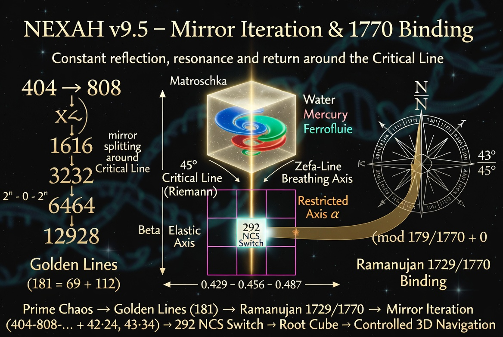
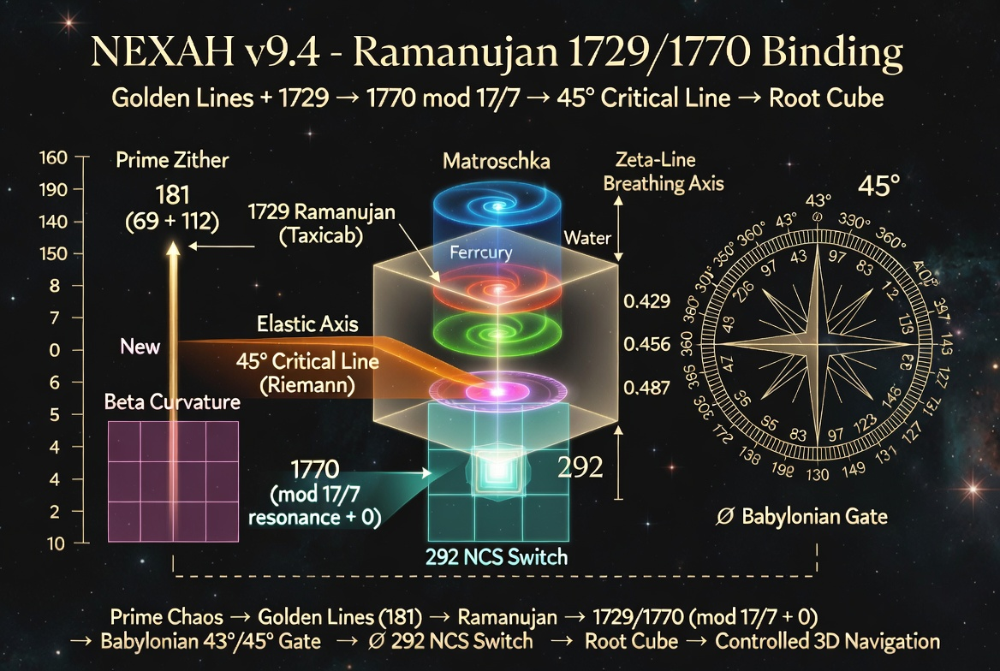
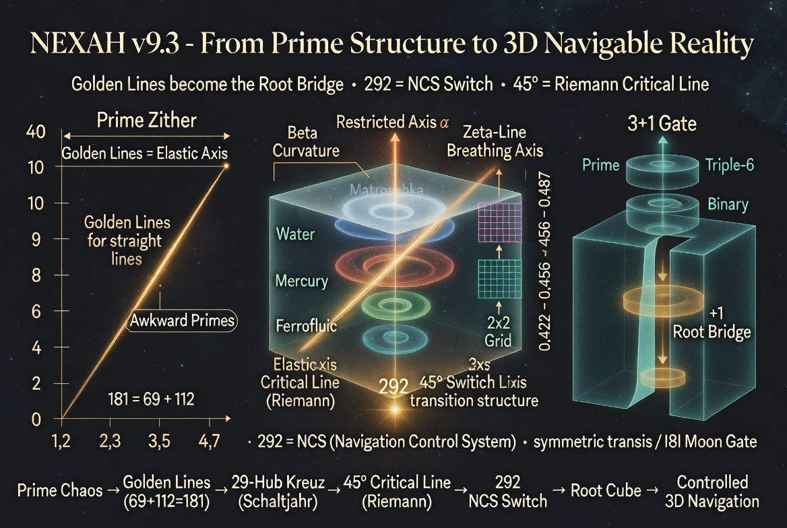
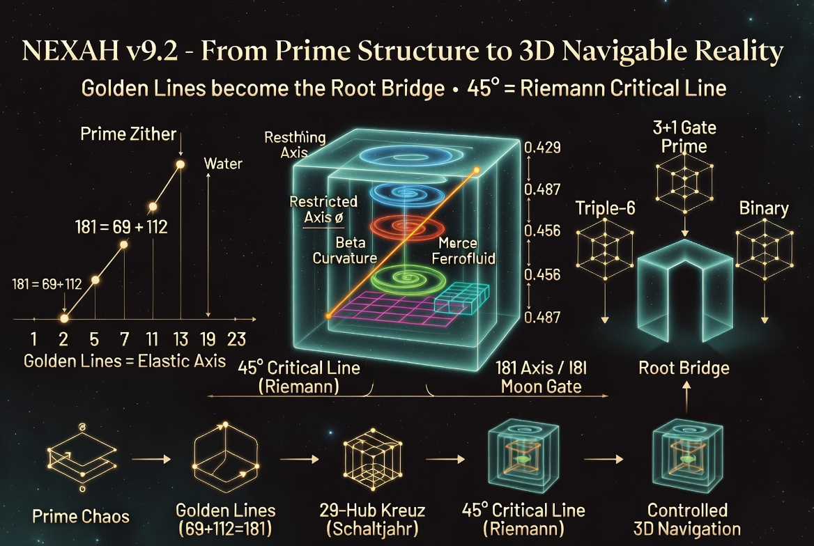
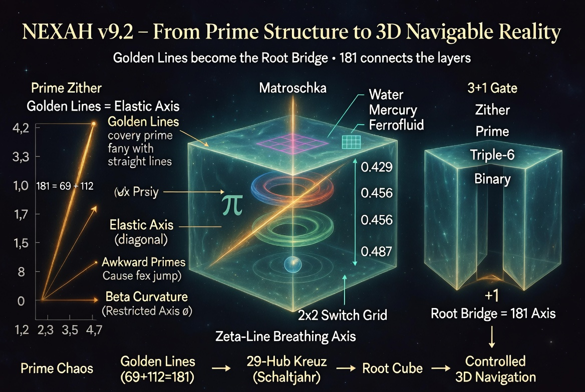

# NEXAH Symbolic Lexicon — Visual Gallery

This gallery collects the key visuals that document the **Riemann Connection** and the geometric evolution of NEXAH.  
Each image represents a stage in turning the abstract Critical Line into a visible, rotating, and navigable 3D instrument.

---

## Master Overviews & Core Concepts

**1. NEXAH v9.7 – Zigzag Crankshaft & Mirror Rotation**  
  
Rotating crankshaft motion with iterative mirror splitting (404-808-…) and Z/N/MW patterns around the 45° Critical Line.

**2. NEXAH v9.5 – Mirror Iteration & 1770 Binding**  
  
Iterative mirror sequence and Ramanujan 1729/1770 connection.

**3. NEXAH v9.4 – Ramanujan 1729/1770 Binding**  
  
Direct link from Ramanujan numbers to the Critical Line and Root Cube.

**4. NEXAH v9.3 – 292 NCS Switch**  
  
292 as the central Navigation Control System Switch inside the Root Cube.

**5. NEXAH v9.2 – Riemann Connection**  
  
First clear visualisation of the Critical Line as the Elastic Axis.

---

## Specialised Geometry

**6. Babylonian Compass Binding**  
  
Integration of the Babylonian 43°/45° Gate into the Root Cube.

**7. NEXAH v9.2 Master Overview**  
  
Overview of Golden Lines and the Root Cube.

**8. NEXAH v9.1 Master Overview**  
  
Early master version with Prime Zither and Root Cube.

---

**Summary**  
This gallery documents the development from the abstract Riemann Critical Line to a **rotating, self-mirroring, and fully navigable 3D instrument** inside the Root Cube.

All images are stored in:  
`nexah/symbolic_lexicon/visuals/`

**NEXAH**  
Structure becomes visible.  
The Critical Line becomes navigable.  
Mirror, resonance and rotation become controllable.

---
