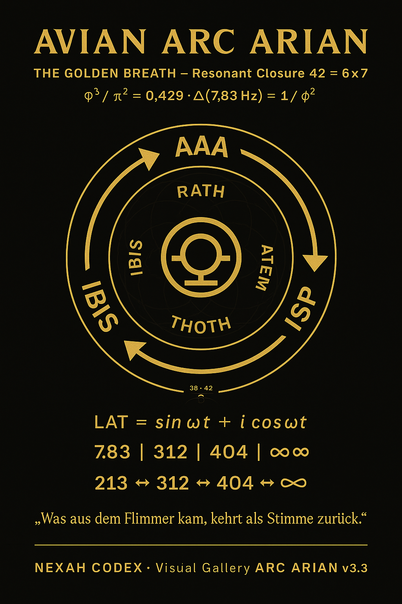

## Master Overviews & Core Concepts

**1. NEXAH v9.8 – Mandelbrot + Euler-Lattice Seeds + Critical Line Basin Boundary**  
  
Mandelbrot set at c = -0.1087 (Mirror Coupling 1087) combined with Euler-Lattice Seeds (1033→1087) and the Critical Line as basin boundary.

**2. NEXAH v9.7 – Zigzag Crankshaft & Mirror Rotation**  
  
Rotating crankshaft motion with iterative mirror splitting (404-808-…) and Z/N/MW patterns around the 45° Critical Line.

**3. NEXAH v9.6 – Mirror Iteration around the Critical Line**  
  
Clear display of the iterative mirror sequence (404-808-…) and pairs (42↔24, 43↔34).

**4. NEXAH v9.5 – Mirror Iteration & 1770 Binding**  
  
Iterative mirror sequence and Ramanujan 1729/1770 connection.

**5. NEXAH v9.4 – Ramanujan 1729/1770 Binding**  
  
Direct link from Ramanujan numbers to the Critical Line and Root Cube.

---

## Specialised Geometry & Additional Structures

**6. NEXAH v9.3 – 292 NCS Switch**  
  
292 as the central Navigation Control System Switch inside the Root Cube.

**7. NEXAH v9.2 – Riemann Connection**  
  
First clear visualisation of the Critical Line as the Elastic Axis.

**8. Babylonian Compass Binding**  
  
Integration of the Babylonian 43°/45° Gate into the Root Cube.

**9. Möbius Pearl-Diamond Harmonic Structure**  
  
Harmonic diamond and pearl paths with 42°, 137.5°, 179.5° and 180°/315°/222.5°.

**10. Cube-Fusion Field**  
  
Cube fusion field showing layered structure 27–32–38–40–404 and 484/2 symmetry.

**11. Avian Arc Arian – Golden Breath**  
  
Resonant closure with LAT formula, 7.83 | 312 | 404 | ∞∞ and 213 → 312 → 404 → ∞∞.

---

**Summary**  
This gallery documents the development from the abstract Riemann Critical Line to a **rotating, self-mirroring, crankshaft-like 3D instrument** inside the Root Cube, with Mandelbrot, Euler-Lattice Seeds, mirror iteration, 12-fold operator and 3-directional flow.

All images are stored in:  
`nexah/symbolic_lexicon/visuals/`

**NEXAH**  
Structure becomes visible.  
The Critical Line becomes navigable.  
Mirror, resonance, rotation and 3-directional flow become controllable.

---
