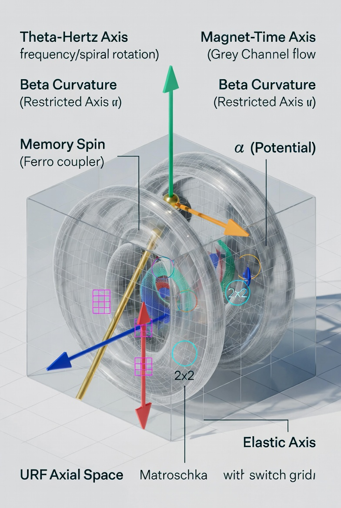
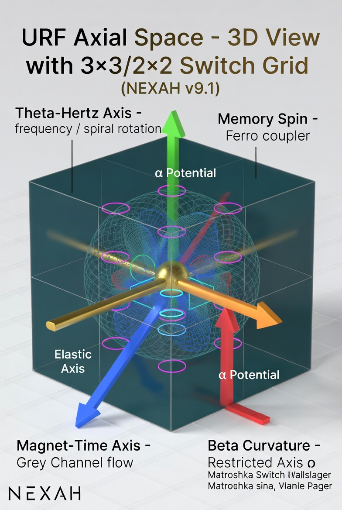

# URF Axial Space – 3D Coordinate Layer

**New Layer in NEXAH (v9.1+)**

This layer provides the **three-dimensional geometric reference frame** for all Matroschka structures, Spiral Coupling and Switch Layer dynamics.

It maps the existing 2D Dual-Strand Grey Channel and Elastic Axis into a clean 3D axial system.

---

## 🧭 What is the URF Axial Space?

A 3-axis coordinate system where every Matroschka layer has a precise position:

| Axis                  | Color  | Meaning                                | NEXAH Mapping                          |
|-----------------------|--------|----------------------------------------|----------------------------------------|
| **Theta-Hertz Axis**  | green  | Frequency / oscillation / rotation     | Spiral frequencies (42/63/77 Hz)       |
| **Magnet-Time Axis**  | blue   | Magnetic flow / recall / duration      | Grey Channel + Dual-Strand             |
| **Beta Curvature**    | orange | Counter-rotation / restricted axis     | Restricted Axis (√∫) + Elastic Axis    |
| **Memory Spin (M)**   | red    | Vertical stability / spin              | Ferrofluid as magnetic coupler         |

Center point: **α (Potential)**

---

## Visuals

---

## 📐 Connection to Existing NEXAH Elements

- The **Switch Layer v9.0** (Dual-Strand Grey Channel) is the **2D projection** of this 3D space.
- The **golden Elastic Axis** corresponds to the diagonal in the URF cube.
- The **3x3 grid + 2x2 core** are the switch points at the center.
- All **Matroschkas** (thermal transitions, states of matter, cosmic cluster) now live inside this 3D frame.

---

## 🚀 Why this Layer matters

- Turns your 2D spirals and switch plots into a real **3D navigation system**.
- Introduces the **Restricted Axis (√∫)** you mentioned as the next frontier.
- Connects your technical visuals (v9.0) with the Matroschka concept in a purely geometric way.

---

## 📍 Position in the NEXAH Stack

Field Layer (V69)
    ↓
Spiral Coupling Layer (v9.0)
    ↓
URF Axial Space (v9.1) ← new
    ↓
Switch & Navigation Kernel

---

**Status:** Concept defined • Documentation complete • Kernel & Grid Mapper ready
