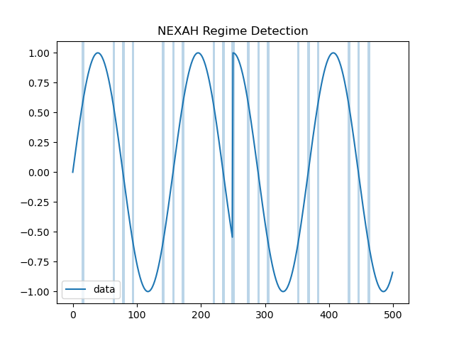
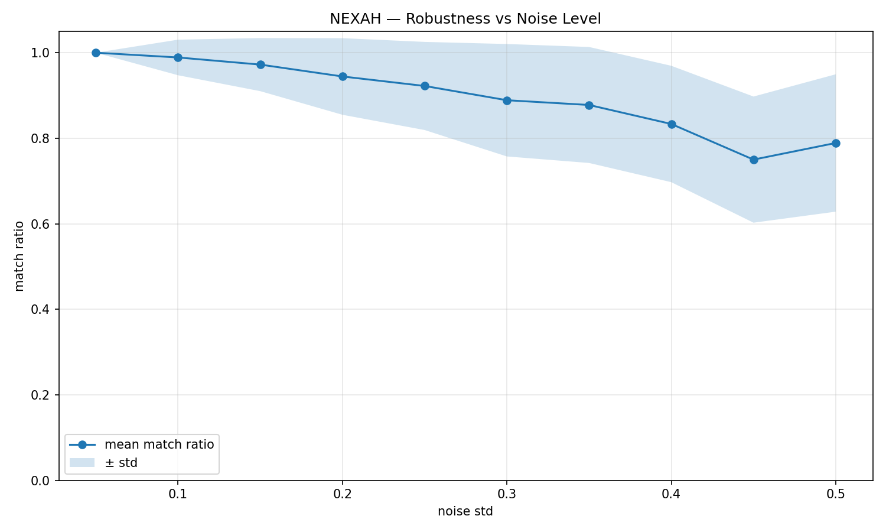

# 🌀 NEXAH Outputs – Visual Gallery

This directory contains all generated artifacts from the NEXAH system.

It documents the transition:

```text
signals → structure → transitions → motion → control
```

## 📁 Structure Overview

```
outputs/

├── demos/                → curated visuals for presentation
│   ├── gifs/             → (legacy, deprecated)
│   └── images/           → core static visuals

├── experiments_archive/  → full experiment runs (raw + results)

├── ieee/                 → IEEE grid experiments
│   └── gates/

├── kernel/               → current kernel outputs
│   ├── plots/
│   └── runs/

├── research/             → structured research outputs
│   ├── figures/
│   ├── iota_law/
│   └── phase_control/

└── plots/                → temporary / legacy plots
```

## 🧠 Kernel Output Example

### Regime Detection (Core Behavior)



Interpretation:

- highlighted regions → structural transition zones  
- stable regions → persistent system behavior  
- transitions are NOT random → they follow structure  

---

## 🧪 Core Visuals (Static)

### Noise Stress Test



### Cross-System Robustness


### Lorenz System Transitions


---

## ⚡ IEEE Experiments

Located in:

```
outputs/ieee/gates/
```

Includes:

- control response behavior  
- system turning dynamics  
- structural gate transitions  

---

## 🔬 Research Modules

### IOTA Law

```
outputs/research/iota_law/
```

Includes:

- structural type classification  
- shape extraction  
- probabilistic transition behavior  
- minimal energy control  

---

### Phase Control

```
outputs/research/phase_control/
```

Advanced control experiments on system dynamics.

---

## 🧪 Experiment Archive

```
outputs/experiments_archive/run_*
```

Each run contains:

- generated figures  
- structured outputs  
- JSON result data  

---

## 🧠 Interpretation

```
systems are not random

they exhibit:

→ stable basins  
→ structured transitions  
→ constrained motion  
→ navigable pathways
```

---

## 🔥 Key Insight

```
NEXAH does not generate visuals.

It reveals structure that already exists in the system.
```

---

## 🧭 Usage Context

These outputs are used for:

- validation of system behavior  
- research analysis  
- visualization of dynamics  
- control experimentation  
- publication and presentation  

---

## 🚀 Status

✔ kernel validated  
✔ structure extraction working  
✔ regime detection working  
✔ visualization layer active  

Next:

```
→ navigation (active control)
→ real-world deployment
```

