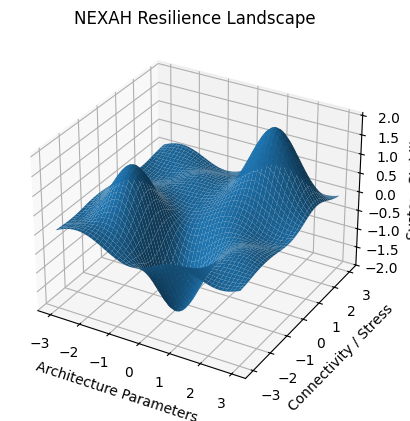

# NEXAH Resilience Architecture Engine

NEXAH explores the stability landscape of complex architectures.

Systems evolve across regimes of stability, collapse, and transition.
The NEXAH engine maps this landscape and discovers universal laws
governing resilient system design.# NEXAH Tools

## Overview

The `tools/` directory contains the computational infrastructure used by the **NEXAH Simulation Environment**.

These tools form the experimental engine of the NEXAH project and support:

- architecture exploration  
- resilience analysis  
- topology mapping  
- evolutionary architecture search  
- symbolic law discovery  
- system visualization  

Together they implement a **simulation laboratory for resilient architectures**.

The goal of this framework is to explore how **system topology influences resilience** and to discover structural patterns that lead to stable systems.

---

# NEXAH Simulation Engine

The NEXAH tools follow a structured discovery pipeline:

Architecture Generation
↓
System Evolution
↓
Resilience Analysis
↓
Landscape Mapping
↓
Phase Transition Detection
↓
Law Discovery
↓
Universal Validation
↓
Research Transition

This pipeline allows automated exploration of thousands of architectures and the discovery of **emergent resilience laws**.

---

# Tool Architecture Map

The tool ecosystem is organized into several functional clusters.

---

# Main Tool Categories

## 1. System Analysis

Tools that analyze system architectures and compute resilience metrics.

Examples:

- `resilience_analyzer.py`
- `system_stress_test.py`
- `catastrophe_detector.py`
- `risk_landscape.py`

Functions:

- resilience scoring  
- failure propagation analysis  
- system perturbation testing  

---

## 2. Architecture Exploration

Tools that generate and evolve system architectures.

Examples:

- `system_designer.py`
- `system_evolver.py`
- `system_evolver_population.py`
- `resilience_architecture_evolver.py`
- `resilience_architecture_optimizer.py`
- `auto_stabilizer.py`

Capabilities:

- architecture mutation  
- evolutionary search  
- automatic stabilization  

---

## 3. Landscape Mapping

These tools map the **resilience landscape** across architecture space.

Examples:

- `resilience_landscape.py`
- `resilience_3d_landscape.py`
- `phase_space_map.py`
- `resilience_phase_space_explorer.py`
- `global_resilience_map.py`
- `global_resilience_scan.py`

Outputs include:

- phase diagrams  
- attractor landscapes  
- resilience heatmaps  

---

## 4. Phase Transition Detection

These tools search for **critical transitions** in architecture topology.

Examples:

- `resilience_phase_diagram.py`
- `resilience_phase_transition_detector.py`
- `resilience_topology_phase_transition_detector.py`
- `resilience_critical_point_finder.py`
- `resilience_ridge_detector.py`

They detect structural thresholds where systems shift from:

fragile → stable
stable → unstable

---

## 5. Law Discovery Engine

These tools attempt to discover **universal laws of resilience**.

Examples:

- `resilience_symbolic_equation_search.py`
- `resilience_field_equation_discovery.py`
- `resilience_universal_architecture_law.py`
- `resilience_universal_scaling_law_detector.py`
- `resilience_law_discovery.py`
- `resilience_symbolic_law_finder.py`

Capabilities:

- symbolic regression  
- scaling law detection  
- structural equation discovery  

---

## 6. Validation and Theory Construction

These tools test candidate theories and validate discovered laws.

Examples:

- `resilience_universal_law_validator.py`
- `resilience_constant_validator.py`
- `resilience_universal_constant_search.py`
- `resilience_universal_constant_finder.py`
- `resilience_meta_learning_engine.py`
- `resilience_unified_theory_builder.py`
- `resilience_theory_builder.py`

---

## 7. Visualization Tools

These tools visualize system structures and simulation results.

Examples:

- `visualize_system.py`
- `animate_system.py`
- `evolution_visualizer.py`
- `resilience_graph_visualizer.py`
- `resilience_dashboard.py`
- `architecture_map.py`
- `architecture_diff.py`
- `resilience_architecture_evolver_plot.py`

These tools help interpret architecture dynamics and simulation outcomes.

---

# Discovery Pipeline (Simulation Phase)

During the recent development session, a complete **resilience law discovery pipeline** was constructed.

Key components include:

resilience_phase_diagram.py
resilience_ridge_detector.py
resilience_universal_architecture_law.py
resilience_topology_phase_transition_detector.py
resilience_renormalization_detector.py
resilience_universal_constant_search.py
resilience_field_equation_discovery.py
resilience_symbolic_equation_search.py
resilience_universal_law_validator.py

This pipeline enables automated exploration of architecture space and identification of **emergent structural principles**.

---

# Simulation Status

Current project phase:

Simulation Phase: COMPLETE
Research Phase: PLANNED

The next stage will transition from simulation experiments to **empirical validation on real-world networks**, including:

- internet topology  
- brain connectomes  
- power grid networks  
- biological interaction networks  
- financial networks  

---

# Summary

The `tools/` directory represents the **computational laboratory of the NEXAH project**.

It enables:

- large-scale architecture exploration  
- resilience landscape mapping  
- discovery of structural laws  
- validation of emergent theories  

This infrastructure forms the bridge between **simulation-driven discovery and scientific research**.

