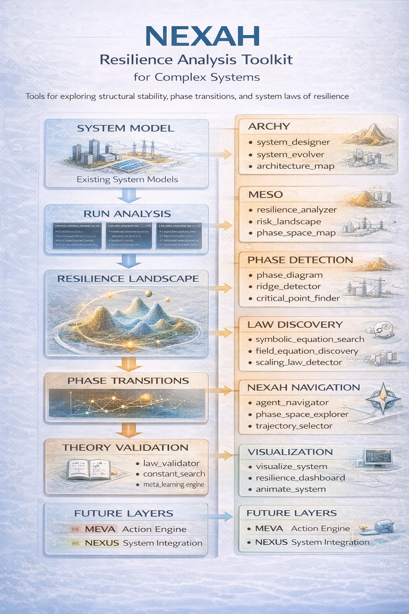
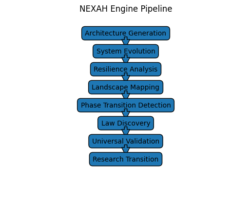
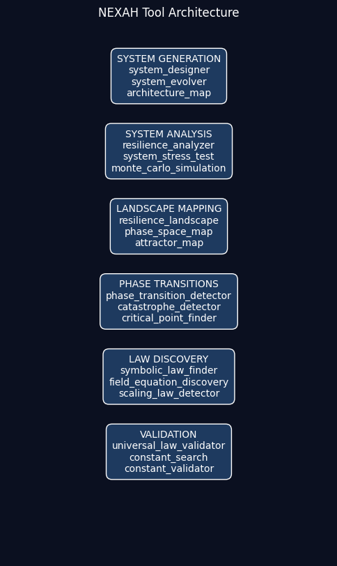

# NEXAH — Resilience Architecture Engine

NEXAH is a research framework for exploring the stability and resilience of complex systems.

It provides computational tools for:

• architecture generation  
• resilience analysis  
• phase transition detection  
• structural law discovery  
• theory validation  

The framework enables large-scale exploration of architecture spaces and the discovery of structural principles governing resilient systems.

NEXAH combines simulation, topology analysis, and symbolic discovery to investigate how **system structure influences stability across complex networks**.

---

# NEXAH Tools

## Overview

The `tools/` directory contains the computational infrastructure of the **NEXAH Simulation Environment**.

These tools form the experimental engine of the NEXAH project and support:

- architecture exploration  
- resilience analysis  
- topology mapping  
- evolutionary architecture search  
- symbolic law discovery  
- system visualization  

Together they implement a **simulation laboratory for resilient architectures**.

The central research question of the framework is:

> How does system topology influence stability, resilience, and phase transitions in complex systems?

By exploring large architecture spaces, NEXAH aims to discover **structural patterns and universal principles** underlying stable system design.

---

# NEXAH Discovery Engine

The NEXAH tools follow a structured discovery pipeline:

Architecture Generation  
↓  
System Evolution  
↓  
Resilience Analysis  
↓  
Resilience Landscape Mapping  
↓  
Phase Transition Detection  
↓  
Structural Law Discovery  
↓  
Theory Validation  
↓  
Research Transition  

This pipeline allows automated exploration of thousands of architectures and supports the discovery of **emergent resilience laws**.

---

# Tool Architecture Map

The NEXAH tool ecosystem is organized into functional clusters that together implement the discovery pipeline.

---

# Main Tool Categories

## 1. System Analysis

Tools that analyze system architectures and compute resilience metrics.

Examples:

- `resilience_analyzer.py`
- `system_stress_test.py`
- `catastrophe_detector.py`
- `risk_landscape.py`

Core functions:

- resilience scoring  
- failure propagation analysis  
- system perturbation testing  

---

## 2. Architecture Exploration

Tools that generate and evolve system architectures.

Examples:

- `system_designer.py`
- `system_evolver.py`
- `system_evolver_population.py`
- `resilience_architecture_evolver.py`
- `resilience_architecture_optimizer.py`
- `auto_stabilizer.py`

Capabilities:

- architecture mutation  
- evolutionary search  
- automatic stabilization  

---

## 3. Landscape Mapping

These tools map the **resilience landscape** across architecture space.

Examples:

- `resilience_landscape.py`
- `resilience_3d_landscape.py`
- `phase_space_map.py`
- `resilience_phase_space_explorer.py`
- `global_resilience_map.py`
- `global_resilience_scan.py`

Outputs include:

- phase diagrams  
- attractor landscapes  
- resilience heatmaps  

---

## 4. Phase Transition Detection

These tools detect **critical structural transitions** in architecture topology.

Examples:

- `resilience_phase_diagram.py`
- `resilience_phase_transition_detector.py`
- `resilience_topology_phase_transition_detector.py`
- `resilience_critical_point_finder.py`
- `resilience_ridge_detector.py`

These tools identify structural thresholds where systems shift between regimes:

fragile → stable  
stable → unstable  

---

## 5. Law Discovery Engine

These tools search for **universal laws of resilience**.

Examples:

- `resilience_symbolic_equation_search.py`
- `resilience_field_equation_discovery.py`
- `resilience_universal_architecture_law.py`
- `resilience_universal_scaling_law_detector.py`
- `resilience_law_discovery.py`
- `resilience_symbolic_law_finder.py`

Capabilities include:

- symbolic regression  
- scaling law detection  
- structural equation discovery  

---

## 6. Validation and Theory Construction

These tools test candidate theories and validate discovered laws.

Examples:

- `resilience_universal_law_validator.py`
- `resilience_constant_validator.py`
- `resilience_universal_constant_search.py`
- `resilience_universal_constant_finder.py`
- `resilience_meta_learning_engine.py`
- `resilience_unified_theory_builder.py`
- `resilience_theory_builder.py`

---

## 7. Visualization Tools

These tools visualize architectures and simulation results.

Examples:

- `visualize_system.py`
- `animate_system.py`
- `evolution_visualizer.py`
- `resilience_graph_visualizer.py`
- `resilience_dashboard.py`
- `architecture_map.py`
- `architecture_diff.py`
- `resilience_architecture_evolver_plot.py`

Visualization tools support interpretation of architecture dynamics and simulation outcomes.

---

# Discovery Pipeline (Simulation Phase)

A complete **resilience law discovery pipeline** has been constructed during the simulation phase.

Core components include:

resilience_phase_diagram.py  
resilience_ridge_detector.py  
resilience_universal_architecture_law.py  
resilience_topology_phase_transition_detector.py  
resilience_renormalization_detector.py  
resilience_universal_constant_search.py  
resilience_field_equation_discovery.py  
resilience_symbolic_equation_search.py  
resilience_universal_law_validator.py  

Together these components enable automated exploration of architecture space and identification of **emergent structural principles**.

---

# Simulation Status

Current project phase:

Simulation Phase: COMPLETE  
Research Phase: PLANNED  

The next stage will transition from simulation experiments to **empirical validation on real-world networks**, including:

- internet topology  
- brain connectomes  
- power grid networks  
- biological interaction networks  
- financial networks  

---

# Summary

The `tools/` directory represents the **computational laboratory of the NEXAH project**.

It enables:

- large-scale architecture exploration  
- resilience landscape mapping  
- discovery of structural laws  
- validation of emergent theories  

This infrastructure forms the bridge between **simulation-driven discovery and scientific research**.
